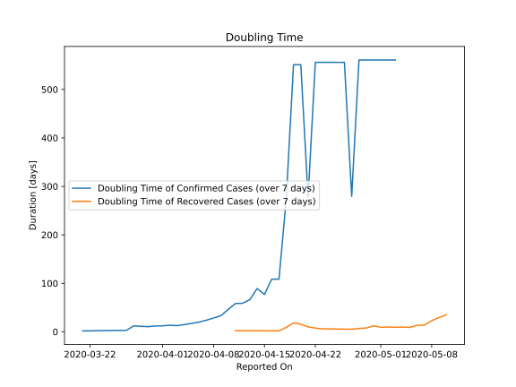

# Country Figures: New Infections in Previous 7 Days per 100,000 Population for Trinidadand Tobago 

<!--  --> 

| Reported On | &Delta; Confirmed (on the day) | &Delta; Confirmed (last 7 days) | New Cases in Previous 7 Days per 100,000 Population |
|-------------|--------------------------------|---------------------------------|-----------------------------------------------------|
| 2020-05-10 |  None  |  None  |  None  |
| 2020-05-09 |  None  |  None  |  None  |
| 2020-05-08 |  None  |  None  |  None  |
| 2020-05-07 |  None  |  None  |  None  |
| 2020-05-06 |  None  |  None  |  None  |
| 2020-05-05 |  None  |  None  |  None  |
| 2020-05-04 |  None  |  None  |  None  |
| 2020-05-03 |  None  |  1  |  0.072  |
| 2020-05-02 |  None  |  1  |  0.072  |
| 2020-05-01 |  None  |  1  |  0.072  |
| 2020-04-30 |  None  |  1  |  0.072  |
| 2020-04-29 |  None  |  1  |  0.072  |
| 2020-04-28 |  None  |  1  |  0.072  |
| 2020-04-27 |  1  |  2  |  0.144  |
| 2020-04-26 |  None  |  1  |  0.072  |
| 2020-04-25 |  None  |  1  |  0.072  |
| 2020-04-24 |  None  |  1  |  0.072  |
| 2020-04-23 |  None  |  1  |  0.072  |
| 2020-04-22 |  None  |  1  |  0.072  |
| 2020-04-21 |  1  |  2  |  0.144  |
| 2020-04-20 |  None  |  1  |  0.072  |
| 2020-04-19 |  None  |  1  |  0.072  |
| 2020-04-18 |  None  |  2  |  0.144  |
| 2020-04-17 |  None  |  5  |  0.360  |
| 2020-04-16 |  None  |  5  |  0.360  |
| 2020-04-15 |  1  |  7  |  0.504  |
| 2020-04-14 |  None  |  6  |  0.432  |
| 2020-04-13 |  None  |  8  |  0.576  |
| 2020-04-12 |  1  |  9  |  0.648  |
| 2020-04-11 |  3  |  9  |  0.648  |
| 2020-04-10 |  None  |  11  |  0.791  |
| 2020-04-09 |  2  |  15  |  1.079  |
| 2020-04-08 |  None  |  17  |  1.223  |
| 2020-04-07 |  2  |  20  |  1.439  |
| 2020-04-06 |  1  |  23  |  1.655  |
| 2020-04-05 |  1  |  26  |  1.871  |
| 2020-04-04 |  5  |  29  |  2.087  |
| 2020-04-03 |  4  |  32  |  2.302  |
| 2020-04-02 |  4  |  29  |  2.087  |
| 2020-04-01 |  3  |  30  |  2.158  |
| 2020-03-31 |  5  |  30  |  2.158  |
| 2020-03-30 |  4  |  31  |  2.230  |
| 2020-03-29 |  4  |  28  |  2.015  |
| 2020-03-28 |  8  |  25  |  1.799  |
| 2020-03-27 |  1  |  57  |  4.101  |
| 2020-03-26 |  5  |  56  |  4.029  |
| 2020-03-25 |  3  |  53  |  3.813  |
| 2020-03-24 |  6  |  52  |  3.741  |
| 2020-03-23 |  1  |  47  |  3.382  |
| 2020-03-22 |  1  |  48  |  3.454  |
| 2020-03-21 |  40  |  47  |  3.382  |
| 2020-03-20 |  None  |  7  |  0.504  |
| 2020-03-19 |  2  |  7  |  0.504  |
| 2020-03-18 |  2  |  5  |  0.360  |
| 2020-03-17 |  1  |  3  |  0.216  |
| 2020-03-16 |  2  |  2  |  0.144  |
| 2020-03-15 |  None  |  None  |  None  |
| 2020-03-14 |  None  |  None  |  None  |

