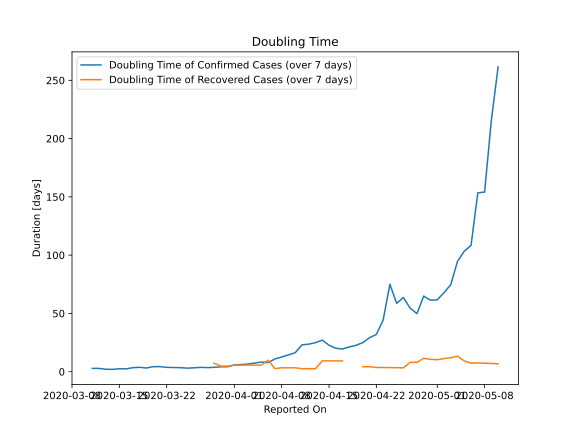

# Country Figures: New Infections in Previous 7 Days per 100,000 Population for Tunisia 

<!--  --> 

| Reported On | &Delta; Confirmed (on the day) | &Delta; Confirmed (last 7 days) | New Cases in Previous 7 Days per 100,000 Population |
|-------------|--------------------------------|---------------------------------|-----------------------------------------------------|
| 2020-05-10 |  None  |  19  |  0.164  |
| 2020-05-09 |  2  |  23  |  0.199  |
| 2020-05-08 |  4  |  32  |  0.277  |
| 2020-05-07 |  1  |  32  |  0.277  |
| 2020-05-06 |  3  |  45  |  0.389  |
| 2020-05-05 |  4  |  47  |  0.406  |
| 2020-05-04 |  5  |  51  |  0.441  |
| 2020-05-03 |  4  |  64  |  0.553  |
| 2020-05-02 |  11  |  70  |  0.605  |
| 2020-05-01 |  4  |  76  |  0.657  |
| 2020-04-30 |  14  |  76  |  0.657  |
| 2020-04-29 |  5  |  71  |  0.614  |
| 2020-04-28 |  8  |  91  |  0.787  |
| 2020-04-27 |  18  |  83  |  0.718  |
| 2020-04-26 |  10  |  70  |  0.605  |
| 2020-04-25 |  17  |  75  |  0.648  |
| 2020-04-24 |  4  |  58  |  0.502  |
| 2020-04-23 |  9  |  96  |  0.830  |
| 2020-04-22 |  25  |  129  |  1.115  |
| 2020-04-21 |  None  |  137  |  1.185  |
| 2020-04-20 |  5  |  158  |  1.366  |
| 2020-04-19 |  15  |  172  |  1.487  |
| 2020-04-18 |  None  |  179  |  1.548  |
| 2020-04-17 |  42  |  193  |  1.669  |
| 2020-04-16 |  42  |  179  |  1.548  |
| 2020-04-15 |  33  |  152  |  1.314  |
| 2020-04-14 |  21  |  124  |  1.072  |
| 2020-04-13 |  19  |  130  |  1.124  |
| 2020-04-12 |  22  |  133  |  1.150  |
| 2020-04-11 |  14  |  132  |  1.141  |
| 2020-04-10 |  28  |  176  |  1.522  |
| 2020-04-09 |  15  |  188  |  1.626  |
| 2020-04-08 |  5  |  205  |  1.773  |
| 2020-04-07 |  27  |  229  |  1.980  |
| 2020-04-06 |  22  |  284  |  2.456  |
| 2020-04-05 |  21  |  262  |  2.265  |
| 2020-04-04 |  58  |  275  |  2.378  |
| 2020-04-03 |  40  |  268  |  2.317  |
| 2020-04-02 |  32  |  258  |  2.231  |
| 2020-04-01 |  29  |  250  |  2.162  |
| 2020-03-31 |  82  |  280  |  2.421  |
| 2020-03-30 |  None  |  223  |  1.928  |
| 2020-03-29 |  34  |  237  |  2.049  |
| 2020-03-28 |  51  |  218  |  1.885  |
| 2020-03-27 |  30  |  173  |  1.496  |
| 2020-03-26 |  24  |  158  |  1.366  |
| 2020-03-25 |  59  |  144  |  1.245  |
| 2020-03-24 |  25  |  90  |  0.778  |
| 2020-03-23 |  14  |  69  |  0.597  |
| 2020-03-22 |  15  |  57  |  0.493  |
| 2020-03-21 |  6  |  42  |  0.363  |
| 2020-03-20 |  15  |  38  |  0.329  |
| 2020-03-19 |  10  |  32  |  0.277  |
| 2020-03-18 |  5  |  22  |  0.190  |
| 2020-03-17 |  4  |  19  |  0.164  |
| 2020-03-16 |  2  |  18  |  0.156  |
| 2020-03-15 |  None  |  16  |  0.138  |
| 2020-03-14 |  2  |  17  |  0.147  |
| 2020-03-13 |  9  |  15  |  0.130  |
| 2020-03-12 |  None  |  6  |  0.052  |
| 2020-03-11 |  2  |  6  |  0.052  |
| 2020-03-10 |  3  |  4  |  0.035  |
| 2020-03-09 |  None  |  1  |  0.009  |
| 2020-03-08 |  1  |  1  |  0.009  |
| 2020-03-07 |  None  |  None  |  None  |
| 2020-03-06 |  None  |  None  |  None  |
| 2020-03-05 |  None  |  None  |  None  |
| 2020-03-04 |  None  |  None  |  None  |

