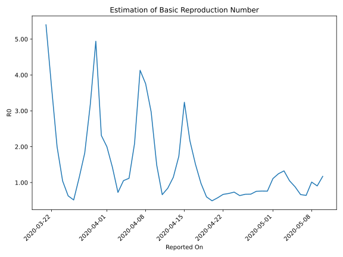

# Country Figures: Time Series for Basic Reproduction Number of Uzbekistan 

| Reported On | &Delta; Confirmed | Total &Delta; Confirmed First Interval | Total &Delta; Confirmed Second Interval | Estimated Basic Reproduction Number R0 | 
|-------------|-------------------|----------------------------------------|-----------------------------------------|---------------------------------------------------|
| 2020-05-10 | 69 |  142  |  121  |  1.17  | 
| 2020-05-09 | 24 |  136  |  150  |  0.91  | 
| 2020-05-08 | 27 |  149  |  147  |  1.01  | 
| 2020-05-07 | 65 |  115  |  179  |  0.64  | 
| 2020-05-06 | 26 |  121  |  182  |  0.66  | 
| 2020-05-05 | 18 |  150  |  170  |  0.88  | 
| 2020-05-04 | 40 |  147  |  140  |  1.05  | 
| 2020-05-03 | 31 |  179  |  135  |  1.33  | 
| 2020-05-02 | 32 |  182  |  146  |  1.25  | 
| 2020-05-01 | 47 |  170  |  153  |  1.11  | 
| 2020-04-30 | 37 |  140  |  184  |  0.76  | 
| 2020-04-29 | 63 |  135  |  177  |  0.76  | 
| 2020-04-28 | 35 |  146  |  193  |  0.76  | 
| 2020-04-27 | 35 |  153  |  226  |  0.68  | 
| 2020-04-26 | 7 |  184  |  273  |  0.67  | 
| 2020-04-25 | 58 |  177  |  278  |  0.64  | 
| 2020-04-24 | 46 |  193  |  263  |  0.73  | 
| 2020-04-23 | 42 |  226  |  325  |  0.70  | 
| 2020-04-22 | 38 |  273  |  407  |  0.67  | 
| 2020-04-21 | 51 |  278  |  484  |  0.57  | 
| 2020-04-20 | 62 |  263  |  535  |  0.49  | 
| 2020-04-19 | 75 |  325  |  541  |  0.60  | 
| 2020-04-18 | 85 |  407  |  416  |  0.98  | 
| 2020-04-17 | 56 |  484  |  320  |  1.51  | 
| 2020-04-16 | 47 |  535  |  247  |  2.17  | 
| 2020-04-15 | 137 |  541  |  167  |  3.24  | 
| 2020-04-14 | 167 |  416  |  240  |  1.73  | 
| 2020-04-13 | 133 |  320  |  279  |  1.15  | 
| 2020-04-12 | 98 |  247  |  293  |  0.84  | 
| 2020-04-11 | 143 |  167  |  252  |  0.66  | 
| 2020-04-10 | 42 |  240  |  161  |  1.49  | 
| 2020-04-09 | 37 |  279  |  94  |  2.97  | 
| 2020-04-08 | 25 |  293  |  78  |  3.76  | 
| 2020-04-07 | 63 |  252  |  61  |  4.13  | 
| 2020-04-06 | 115 |  161  |  77  |  2.09  | 
| 2020-04-05 | 76 |  94  |  84  |  1.12  | 
| 2020-04-04 | 39 |  78  |  74  |  1.05  | 
| 2020-04-03 | 22 |  61  |  84  |  0.73  | 
| 2020-04-02 | 24 |  77  |  54  |  1.43  | 
| 2020-04-01 | 9 |  84  |  42  |  2.00  | 
| 2020-03-31 | 23 |  74  |  32  |  2.31  | 
| 2020-03-30 | 5 |  84  |  17  |  4.94  | 
| 2020-03-29 | 40 |  54  |  17  |  3.18  | 
| 2020-03-28 | 16 |  42  |  23  |  1.83  | 
| 2020-03-27 | 13 |  32  |  28  |  1.14  | 
| 2020-03-26 | 15 |  17  |  33  |  0.52  | 
| 2020-03-25 | 10 |  17  |  27  |  0.63  | 
| 2020-03-24 | 4 |  23  |  22  |  1.05  | 
| 2020-03-23 | 3 |  28  |  14  |  2.00  | 
| 2020-03-22 | 0 |  33  |  9  |  3.67  | 
| 2020-03-21 | 10 |  27  |  5  |  5.40  | 
| 2020-03-20 | 10 |  22  |  None  |  None  | 
| 2020-03-19 | 8 |  14  |  None  |  None  | 
| 2020-03-18 | 5 |  9  |  None  |  None  | 
| 2020-03-17 | 4 |  5  |  None  |  None  | 
| 2020-03-16 | 5 |  None  |  None  |  None  | 
| 2020-03-15 | None |  None  |  None  |  None  | 

