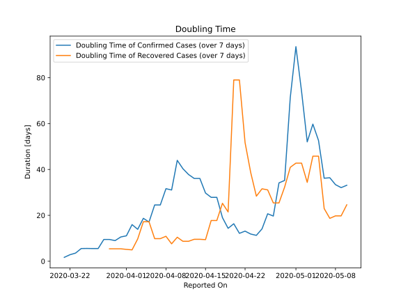

# Country Figures: New Infections in Previous 7 Days per 100,000 Population for Venezuela 

<!--  --> 

| Reported On | &Delta; Confirmed (on the day) | &Delta; Confirmed (last 7 days) | New Cases in Previous 7 Days per 100,000 Population |
|-------------|--------------------------------|---------------------------------|-----------------------------------------------------|
| 2020-05-10 |  12  |  57  |  0.197  |
| 2020-05-09 |  14  |  57  |  0.197  |
| 2020-05-08 |  7  |  53  |  0.184  |
| 2020-05-07 |  2  |  48  |  0.166  |
| 2020-05-06 |  18  |  48  |  0.166  |
| 2020-05-05 |  4  |  32  |  0.111  |
| 2020-05-04 |  None  |  28  |  0.097  |
| 2020-05-03 |  12  |  32  |  0.111  |
| 2020-05-02 |  10  |  22  |  0.076  |
| 2020-05-01 |  2  |  17  |  0.059  |
| 2020-04-30 |  2  |  22  |  0.076  |
| 2020-04-29 |  2  |  43  |  0.149  |
| 2020-04-28 |  None  |  44  |  0.152  |
| 2020-04-27 |  4  |  73  |  0.253  |
| 2020-04-26 |  2  |  69  |  0.239  |
| 2020-04-25 |  5  |  96  |  0.333  |
| 2020-04-24 |  7  |  114  |  0.395  |
| 2020-04-23 |  23  |  107  |  0.371  |
| 2020-04-22 |  3  |  91  |  0.315  |
| 2020-04-21 |  29  |  96  |  0.333  |
| 2020-04-20 |  None  |  67  |  0.232  |
| 2020-04-19 |  29  |  75  |  0.260  |
| 2020-04-18 |  23  |  52  |  0.180  |
| 2020-04-17 |  None  |  33  |  0.114  |
| 2020-04-16 |  7  |  33  |  0.114  |
| 2020-04-15 |  8  |  30  |  0.104  |
| 2020-04-14 |  None  |  24  |  0.083  |
| 2020-04-13 |  8  |  24  |  0.083  |
| 2020-04-12 |  6  |  22  |  0.076  |
| 2020-04-11 |  4  |  20  |  0.069  |
| 2020-04-10 |  None  |  18  |  0.062  |
| 2020-04-09 |  4  |  25  |  0.087  |
| 2020-04-08 |  2  |  24  |  0.083  |
| 2020-04-07 |  None  |  30  |  0.104  |
| 2020-04-06 |  6  |  30  |  0.104  |
| 2020-04-05 |  4  |  40  |  0.139  |
| 2020-04-04 |  2  |  36  |  0.125  |
| 2020-04-03 |  7  |  46  |  0.159  |
| 2020-04-02 |  3  |  39  |  0.135  |
| 2020-04-01 |  8  |  52  |  0.180  |
| 2020-03-31 |  None  |  51  |  0.177  |
| 2020-03-30 |  16  |  58  |  0.201  |
| 2020-03-29 |  None  |  49  |  0.170  |
| 2020-03-28 |  12  |  49  |  0.170  |
| 2020-03-27 |  None  |  65  |  0.225  |
| 2020-03-26 |  16  |  65  |  0.225  |
| 2020-03-25 |  7  |  55  |  0.191  |
| 2020-03-24 |  7  |  51  |  0.177  |
| 2020-03-23 |  7  |  60  |  0.208  |
| 2020-03-22 |  None  |  60  |  0.208  |
| 2020-03-21 |  28  |  68  |  0.236  |
| 2020-03-20 |  None  |  40  |  0.139  |
| 2020-03-19 |  6  |  40  |  0.139  |
| 2020-03-18 |  3  |  34  |  0.118  |
| 2020-03-17 |  16  |  31  |  0.107  |
| 2020-03-16 |  7  |  15  |  0.052  |
| 2020-03-15 |  8  |  8  |  0.028  |
| 2020-03-14 |  None  |  None  |  None  |

