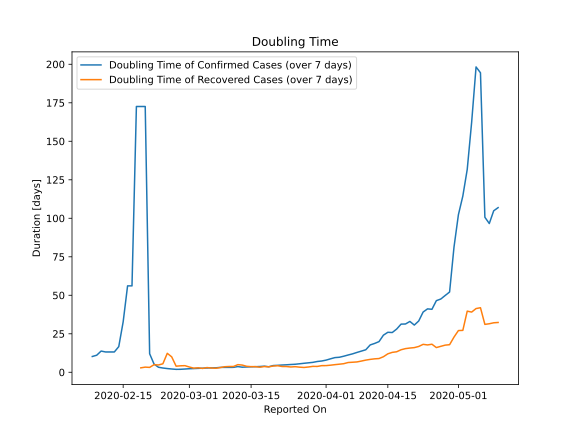

# Country Figures: New Infections in Previous 7 Days per 100,000 Population for Schengen Area 

<!--  --> 

| Reported On | &Delta; Confirmed (on the day) | &Delta; Confirmed (last 7 days) | New Cases in Previous 7 Days per 100,000 Population |
|-------------|--------------------------------|---------------------------------|-----------------------------------------------------|
| 2020-05-10 |  4536  |  47021  |  11.085  |
| 2020-05-09 |  5549  |  47714  |  11.249  |
| 2020-05-08 |  8082  |  51440  |  12.127  |
| 2020-05-07 |  7702  |  49029  |  11.559  |
| 2020-05-06 |  9711  |  25439  |  5.997  |
| 2020-05-05 |  6511  |  24725  |  5.829  |
| 2020-05-04 |  4930  |  29937  |  7.058  |
| 2020-05-03 |  5229  |  36601  |  8.629  |
| 2020-05-02 |  9275  |  41823  |  9.860  |
| 2020-05-01 |  5671  |  46231  |  10.899  |
| 2020-04-30 |  -15888  |  57561  |  13.570  |
| 2020-04-29 |  8997  |  89907  |  21.196  |
| 2020-04-28 |  11723  |  92972  |  21.918  |
| 2020-04-27 |  11594  |  96138  |  22.665  |
| 2020-04-26 |  10451  |  97046  |  22.879  |
| 2020-04-25 |  13683  |  108519  |  25.583  |
| 2020-04-24 |  17001  |  106296  |  25.059  |
| 2020-04-23 |  16458  |  109586  |  25.835  |
| 2020-04-22 |  12062  |  125311  |  29.542  |
| 2020-04-21 |  14889  |  133588  |  31.493  |
| 2020-04-20 |  12502  |  122597  |  28.902  |
| 2020-04-19 |  21924  |  126844  |  29.903  |
| 2020-04-18 |  11460  |  123975  |  29.227  |
| 2020-04-17 |  20291  |  135268  |  31.889  |
| 2020-04-16 |  32183  |  142597  |  33.617  |
| 2020-04-15 |  20339  |  136277  |  32.127  |
| 2020-04-14 |  3898  |  142138  |  33.509  |
| 2020-04-13 |  16749  |  168134  |  39.638  |
| 2020-04-12 |  19055  |  173753  |  40.962  |
| 2020-04-11 |  22753  |  177435  |  41.830  |
| 2020-04-10 |  27620  |  203634  |  48.007  |
| 2020-04-09 |  25863  |  206307  |  48.637  |
| 2020-04-08 |  26200  |  209611  |  49.416  |
| 2020-04-07 |  29894  |  214131  |  50.481  |
| 2020-04-06 |  22368  |  214935  |  50.671  |
| 2020-04-05 |  22737  |  219557  |  51.761  |
| 2020-04-04 |  48952  |  222541  |  52.464  |
| 2020-04-03 |  30293  |  206476  |  48.677  |
| 2020-04-02 |  29167  |  207626  |  48.948  |
| 2020-04-01 |  30720  |  210417  |  49.606  |
| 2020-03-31 |  30698  |  207082  |  48.820  |
| 2020-03-30 |  26990  |  197851  |  46.643  |
| 2020-03-29 |  25721  |  195056  |  45.984  |
| 2020-03-28 |  32887  |  186904  |  44.063  |
| 2020-03-27 |  31443  |  174000  |  41.020  |
| 2020-03-26 |  31958  |  161322  |  38.032  |
| 2020-03-25 |  27385  |  147215  |  34.706  |
| 2020-03-24 |  21467  |  132514  |  31.240  |
| 2020-03-23 |  24195  |  121573  |  28.661  |
| 2020-03-22 |  17569  |  107600  |  25.367  |
| 2020-03-21 |  19983  |  98330  |  23.181  |
| 2020-03-20 |  18765  |  86068  |  20.291  |
| 2020-03-19 |  17851  |  80877  |  19.067  |
| 2020-03-18 |  12684  |  63717  |  15.021  |
| 2020-03-17 |  10526  |  55964  |  13.194  |
| 2020-03-16 |  10222  |  48715  |  11.485  |
| 2020-03-15 |  8299  |  41221  |  9.718  |
| 2020-03-14 |  7721  |  35369  |  8.338  |
| 2020-03-13 |  13574  |  29745  |  7.012  |
| 2020-03-12 |  691  |  17869  |  4.213  |
| 2020-03-11 |  4931  |  18539  |  4.371  |
| 2020-03-10 |  3277  |  14537  |  3.427  |
| 2020-03-09 |  2728  |  11872  |  2.799  |
| 2020-03-08 |  2447  |  9658  |  2.277  |
| 2020-03-07 |  2097  |  7934  |  1.870  |
| 2020-03-06 |  1698  |  6203  |  1.462  |
| 2020-03-05 |  1361  |  4784  |  1.128  |
| 2020-03-04 |  929  |  3684  |  0.869  |
| 2020-03-03 |  612  |  2911  |  0.686  |
| 2020-03-02 |  514  |  2402  |  0.566  |
| 2020-03-01 |  723  |  1962  |  0.463  |
| 2020-02-29 |  366  |  1332  |  0.314  |
| 2020-02-28 |  279  |  1008  |  0.238  |
| 2020-02-27 |  261  |  746  |  0.176  |
| 2020-02-26 |  156  |  485  |  0.114  |
| 2020-02-25 |  103  |  329  |  0.078  |
| 2020-02-24 |  74  |  226  |  0.053  |
| 2020-02-23 |  93  |  152  |  0.036  |
| 2020-02-22 |  42  |  59  |  0.014  |
| 2020-02-21 |  17  |  18  |  0.004  |
| 2020-02-20 |  None  |  1  |  0.000  |
| 2020-02-19 |  None  |  1  |  0.000  |
| 2020-02-18 |  None  |  1  |  0.000  |
| 2020-02-17 |  None  |  3  |  0.001  |
| 2020-02-16 |  None  |  3  |  0.001  |
| 2020-02-15 |  1  |  5  |  0.001  |
| 2020-02-14 |  None  |  9  |  0.002  |
| 2020-02-13 |  None  |  11  |  0.003  |
| 2020-02-12 |  None  |  11  |  0.003  |
| 2020-02-11 |  2  |  11  |  0.003  |
| 2020-02-10 |  None  |  10  |  0.002  |
| 2020-02-09 |  2  |  12  |  0.003  |
| 2020-02-08 |  5  |  12  |  0.003  |
| 2020-02-07 |  2  |  12  |  0.003  |
| 2020-02-06 |  None  |  14  |  0.003  |
| 2020-02-05 |  None  |  14  |  0.003  |
| 2020-02-04 |  1  |  16  |  0.004  |
| 2020-02-03 |  2  |  20  |  0.005  |
| 2020-02-02 |  2  |  18  |  0.004  |
| 2020-02-01 |  5  |  16  |  0.004  |
| 2020-01-31 |  4  |  12  |  0.003  |
| 2020-01-30 |  None  |  8  |  0.002  |
| 2020-01-29 |  2  |  8  |  0.002  |
| 2020-01-28 |  5  |  6  |  0.001  |
| 2020-01-27 |  None  |  1  |  0.000  |
| 2020-01-26 |  None  |  1  |  0.000  |
| 2020-01-25 |  1  |  1  |  0.000  |
| 2020-01-24 |  None  |  None  |  None  |

