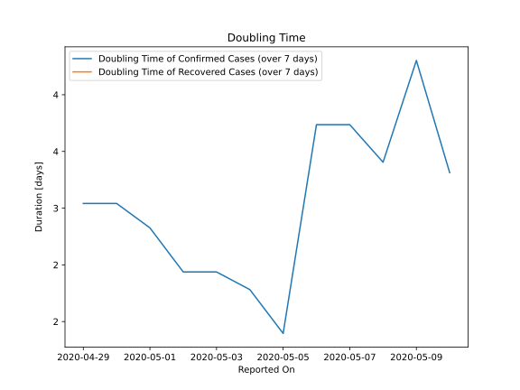

# Country Figures: New Infections in Previous 7 Days per 100,000 Population for Yemen 

<!--  --> 

| Reported On | &Delta; Confirmed (on the day) | &Delta; Confirmed (last 7 days) | New Cases in Previous 7 Days per 100,000 Population |
|-------------|--------------------------------|---------------------------------|-----------------------------------------------------|
| 2020-05-10 |  17  |  41  |  0.144  |
| 2020-05-09 |  None  |  24  |  0.084  |
| 2020-05-08 |  9  |  27  |  0.095  |
| 2020-05-07 |  None  |  19  |  0.067  |
| 2020-05-06 |  3  |  19  |  0.067  |
| 2020-05-05 |  10  |  21  |  0.074  |
| 2020-05-04 |  2  |  11  |  0.039  |
| 2020-05-03 |  None  |  9  |  0.032  |
| 2020-05-02 |  3  |  9  |  0.032  |
| 2020-05-01 |  1  |  6  |  0.021  |
| 2020-04-30 |  None  |  5  |  0.018  |
| 2020-04-29 |  5  |  5  |  0.018  |
| 2020-04-28 |  None  |  None  |  None  |
| 2020-04-27 |  None  |  None  |  None  |
| 2020-04-26 |  None  |  None  |  None  |
| 2020-04-25 |  None  |  None  |  None  |
| 2020-04-24 |  None  |  None  |  None  |
| 2020-04-23 |  None  |  None  |  None  |
| 2020-04-22 |  None  |  None  |  None  |
| 2020-04-21 |  None  |  None  |  None  |
| 2020-04-20 |  None  |  None  |  None  |
| 2020-04-19 |  None  |  None  |  None  |
| 2020-04-18 |  None  |  None  |  None  |
| 2020-04-17 |  None  |  None  |  None  |
| 2020-04-16 |  None  |  None  |  None  |
| 2020-04-15 |  None  |  None  |  None  |
| 2020-04-14 |  None  |  None  |  None  |
| 2020-04-13 |  None  |  None  |  None  |
| 2020-04-12 |  None  |  None  |  None  |
| 2020-04-11 |  None  |  None  |  None  |
| 2020-04-10 |  None  |  None  |  None  |

