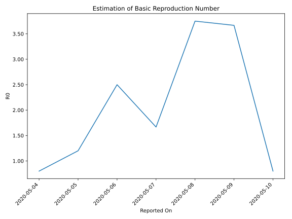

# Country Figures: Time Series for Basic Reproduction Number of Yemen 

| Reported On | &Delta; Confirmed | Total &Delta; Confirmed First Interval | Total &Delta; Confirmed Second Interval | Estimated Basic Reproduction Number R0 | 
|-------------|-------------------|----------------------------------------|-----------------------------------------|---------------------------------------------------|
| 2020-05-10 | 17 |  12  |  15  |  0.80  | 
| 2020-05-09 | 0 |  22  |  6  |  3.67  | 
| 2020-05-08 | 9 |  15  |  4  |  3.75  | 
| 2020-05-07 | 0 |  15  |  9  |  1.67  | 
| 2020-05-06 | 3 |  15  |  6  |  2.50  | 
| 2020-05-05 | 10 |  6  |  5  |  1.20  | 
| 2020-05-04 | 2 |  4  |  5  |  0.80  | 
| 2020-05-03 | 0 |  9  |  None  |  None  | 
| 2020-05-02 | 3 |  6  |  None  |  None  | 
| 2020-05-01 | 1 |  5  |  None  |  None  | 
| 2020-04-30 | 0 |  5  |  None  |  None  | 
| 2020-04-29 | 5 |  None  |  None  |  None  | 
| 2020-04-28 | 0 |  None  |  None  |  None  | 
| 2020-04-27 | 0 |  None  |  None  |  None  | 
| 2020-04-26 | 0 |  None  |  None  |  None  | 
| 2020-04-25 | 0 |  None  |  None  |  None  | 
| 2020-04-24 | 0 |  None  |  None  |  None  | 
| 2020-04-23 | 0 |  None  |  None  |  None  | 
| 2020-04-22 | 0 |  None  |  None  |  None  | 
| 2020-04-21 | 0 |  None  |  None  |  None  | 
| 2020-04-20 | 0 |  None  |  None  |  None  | 
| 2020-04-19 | 0 |  None  |  None  |  None  | 
| 2020-04-18 | 0 |  None  |  None  |  None  | 
| 2020-04-17 | 0 |  None  |  None  |  None  | 
| 2020-04-16 | 0 |  None  |  None  |  None  | 
| 2020-04-15 | 0 |  None  |  None  |  None  | 
| 2020-04-14 | 0 |  None  |  None  |  None  | 
| 2020-04-13 | 0 |  None  |  None  |  None  | 
| 2020-04-12 | 0 |  None  |  None  |  None  | 
| 2020-04-11 | 0 |  None  |  None  |  None  | 
| 2020-04-10 | None |  None  |  None  |  None  | 

