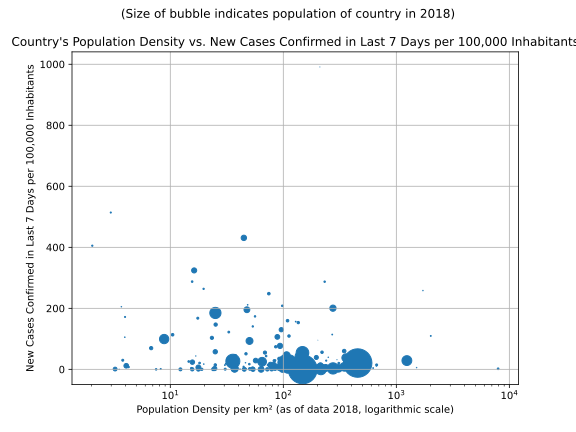

# Most Recent Figures: Highest Rate of New Confirmed Cases over Last 7 Days per 100,000 Inhabitants

| Country | Confirmed Cases in Last 7 days | Confirmed Cases in last 7 Days per 100,000 Population |
|---------|--------------------------------|-------------------------------------------------------|
| [Qatar](./perCountry/QAT_confirmed7daysper100kpop.md) (QAT) |   6105 | 219.472 | 
| [SanMarino](./perCountry/SMR_confirmed7daysper100kpop.md) (SMR) |     43 | 127.275 | 
| [SaoTome and Principe](./perCountry/STP_confirmed7daysper100kpop.md) (STP) |    192 | 90.983 | 
| [Singapore](./perCountry/SGP_confirmed7daysper100kpop.md) (SGP) |   4606 | 81.686 | 
| [Bahrain](./perCountry/BHR_confirmed7daysper100kpop.md) (BHR) |   1274 | 81.176 | 
| [Kuwait](./perCountry/KWT_confirmed7daysper100kpop.md) (KWT) |   2831 | 68.426 | 
| [Peru](./perCountry/PER_confirmed7daysper100kpop.md) (PER) |  21388 | 66.860 | 
| [Belarus](./perCountry/BLR_confirmed7daysper100kpop.md) (BLR) |   6184 | 65.195 | 
| [US](./perCountry/USA_confirmed7daysper100kpop.md) (USA) | 180468 | 55.161 | 
| [UnitedKingdom](./perCountry/GBR_confirmed7daysper100kpop.md) (GBR) |  33944 | 51.052 | 
| [Russia](./perCountry/RUS_confirmed7daysper100kpop.md) (RUS) |  73428 | 50.823 | 
| [Maldives](./perCountry/MDV_confirmed7daysper100kpop.md) (MDV) |    253 | 49.060 | 
| [Chile](./perCountry/CHL_confirmed7daysper100kpop.md) (CHL) |   8964 | 47.861 | 
| [UnitedArab Emirates](./perCountry/ARE_confirmed7daysper100kpop.md) (ARE) |   3755 | 38.989 | 
| [Sweden](./perCountry/SWE_confirmed7daysper100kpop.md) (SWE) |   3745 | 36.776 | 
| [Ireland](./perCountry/IRL_confirmed7daysper100kpop.md) (IRL) |   1708 | 35.191 | 
| [SaudiArabia](./perCountry/SAU_confirmed7daysper100kpop.md) (SAU) |  11335 | 33.635 | 
| [Panama](./perCountry/PAN_confirmed7daysper100kpop.md) (PAN) |   1350 | 32.321 | 
| [Canada](./perCountry/CAN_confirmed7daysper100kpop.md) (CAN) |  11331 | 30.576 | 
| [Armenia](./perCountry/ARM_confirmed7daysper100kpop.md) (ARM) |    881 | 29.846 | 
| [Brazil](./perCountry/BRA_confirmed7daysper100kpop.md) (BRA) |  54692 | 26.110 | 
| [Belgium](./perCountry/BEL_confirmed7daysper100kpop.md) (BEL) |   2979 | 26.081 | 
| [Moldova](./perCountry/MDA_confirmed7daysper100kpop.md) (MDA) |    748 | 21.095 | 
| [Spain](./perCountry/ESP_confirmed7daysper100kpop.md) (ESP) |   9422 | 20.165 | 
| [CaboVerde](./perCountry/CPV_confirmed7daysper100kpop.md) (CPV) |    108 | 19.861 | 
| [DominicanRepublic](./perCountry/DOM_confirmed7daysper100kpop.md) (DOM) |   2088 | 19.648 | 
| [Portugal](./perCountry/PRT_confirmed7daysper100kpop.md) (PRT) |   1917 | 18.645 | 
| [Guinea-Bissau](./perCountry/GNB_confirmed7daysper100kpop.md) (GNB) |    337 | 17.980 | 
| [Gabon](./perCountry/GAB_confirmed7daysper100kpop.md) (GAB) |    344 | 16.232 | 
| [Italy](./perCountry/ITA_confirmed7daysper100kpop.md) (ITA) |   9757 | 16.146 | 
| [Turkey](./perCountry/TUR_confirmed7daysper100kpop.md) (TUR) |  13177 | 16.007 | 
| [Denmark](./perCountry/DNK_confirmed7daysper100kpop.md) (DNK) |    907 | 15.645 | 
| [Ecuador](./perCountry/ECU_confirmed7daysper100kpop.md) (ECU) |   2482 | 14.528 | 
| [Oman](./perCountry/OMN_confirmed7daysper100kpop.md) (OMN) |    665 | 13.770 | 
| [Serbia](./perCountry/SRB_confirmed7daysper100kpop.md) (SRB) |    934 | 13.377 | 
| [Netherlands](./perCountry/NLD_confirmed7daysper100kpop.md) (NLD) |   2303 | 13.365 | 
| [France](./perCountry/FRA_confirmed7daysper100kpop.md) (FRA) |   8897 | 13.282 | 
| [Finland](./perCountry/FIN_confirmed7daysper100kpop.md) (FIN) |    687 | 12.450 | 
| [European Union 27](./perCountry/EUE_confirmed7daysper100kpop.md) (EUE) |  55027 | 12.322 | 
| [Schengen Area](./perCountry/XXS_confirmed7daysper100kpop.md) (XXS) |  51440 | 12.127 | 
| [Romania](./perCountry/ROU_confirmed7daysper100kpop.md) (ROU) |   2244 | 11.523 | 
| [Luxembourg](./perCountry/LUX_confirmed7daysper100kpop.md) (LUX) |     69 | 11.354 | 
| [Iran](./perCountry/IRN_confirmed7daysper100kpop.md) (IRN) |   9045 | 11.057 | 
| [Honduras](./perCountry/HND_confirmed7daysper100kpop.md) (HND) |    967 | 10.086 | 
| [EquatorialGuinea](./perCountry/GNQ_confirmed7daysper100kpop.md) (GNQ) |    124 | 9.473 | 
| [Bolivia](./perCountry/BOL_confirmed7daysper100kpop.md) (BOL) |   1037 | 9.134 | 
| [Andorra](./perCountry/AND_confirmed7daysper100kpop.md) (AND) |      7 | 9.090 | 
| [Bosniaand Herzegovina](./perCountry/BIH_confirmed7daysper100kpop.md) (BIH) |    289 | 8.695 | 
| [Mexico](./perCountry/MEX_confirmed7daysper100kpop.md) (MEX) |  10783 | 8.545 | 
| [Germany](./perCountry/GER_confirmed7daysper100kpop.md) (GER) |   6511 | 7.864 | 
| [Ukraine](./perCountry/UKR_confirmed7daysper100kpop.md) (UKR) |   3334 | 7.472 | 
| [Kazakhstan](./perCountry/KAZ_confirmed7daysper100kpop.md) (KAZ) |   1237 | 6.768 | 
| [Ghana](./perCountry/GHA_confirmed7daysper100kpop.md) (GHA) |   1938 | 6.511 | 
| [Colombia](./perCountry/COL_confirmed7daysper100kpop.md) (COL) |   3045 | 6.133 | 
| [Poland](./perCountry/POL_confirmed7daysper100kpop.md) (POL) |   2261 | 5.953 | 
| [Switzerland](./perCountry/CHE_confirmed7daysper100kpop.md) (CHE) |    502 | 5.894 | 
| [Norway](./perCountry/NOR_confirmed7daysper100kpop.md) (NOR) |    287 | 5.400 | 
| [SouthAfrica](./perCountry/ZAF_confirmed7daysper100kpop.md) (ZAF) |   2944 | 5.095 | 
| [ElSalvador](./perCountry/SLV_confirmed7daysper100kpop.md) (SLV) |    318 | 4.953 | 
| [Eswatini](./perCountry/SWZ_confirmed7daysper100kpop.md) (SWZ) |     53 | 4.665 | 
| [Malta](./perCountry/MLT_confirmed7daysper100kpop.md) (MLT) |     22 | 4.550 | 
| [Bulgaria](./perCountry/BGR_confirmed7daysper100kpop.md) (BGR) |    317 | 4.513 | 
| [NorthMacedonia](./perCountry/MKD_confirmed7daysper100kpop.md) (MKD) |     92 | 4.417 | 
| [Azerbaijan](./perCountry/AZE_confirmed7daysper100kpop.md) (AZE) |    425 | 4.275 | 
| [Djibouti](./perCountry/DJI_confirmed7daysper100kpop.md) (DJI) |     38 | 3.963 | 
| [Pakistan](./perCountry/PAK_confirmed7daysper100kpop.md) (PAK) |   8321 | 3.921 | 
| [Afghanistan](./perCountry/AFG_confirmed7daysper100kpop.md) (AFG) |   1443 | 3.882 | 
| [Guinea](./perCountry/GIN_confirmed7daysper100kpop.md) (GIN) |    472 | 3.802 | 
| [Israel](./perCountry/ISR_confirmed7daysper100kpop.md) (ISR) |    335 | 3.771 | 
| [Senegal](./perCountry/SEN_confirmed7daysper100kpop.md) (SEN) |    527 | 3.324 | 
| [Paraguay](./perCountry/PRY_confirmed7daysper100kpop.md) (PRY) |    230 | 3.306 | 
| [Hungary](./perCountry/HUN_confirmed7daysper100kpop.md) (HUN) |    315 | 3.225 | 
| [Czechia](./perCountry/CZE_confirmed7daysper100kpop.md) (CZE) |    340 | 3.200 | 
| [Morocco](./perCountry/MAR_confirmed7daysper100kpop.md) (MAR) |   1142 | 3.170 | 
| [Bangladesh](./perCountry/BGD_confirmed7daysper100kpop.md) (BGD) |   4896 | 3.034 | 
| [Latvia](./perCountry/LVA_confirmed7daysper100kpop.md) (LVA) |     58 | 3.011 | 
| [Algeria](./perCountry/DZA_confirmed7daysper100kpop.md) (DZA) |   1215 | 2.877 | 
| [Cyprus](./perCountry/CYP_confirmed7daysper100kpop.md) (CYP) |     34 | 2.859 | 
| [Bahamas](./perCountry/BHS_confirmed7daysper100kpop.md) (BHS) |     11 | 2.852 | 
| [Austria](./perCountry/AUT_confirmed7daysper100kpop.md) (AUT) |    243 | 2.747 | 
| [Egypt](./perCountry/EGY_confirmed7daysper100kpop.md) (EGY) |   2581 | 2.622 | 
| [Argentina](./perCountry/ARG_confirmed7daysper100kpop.md) (ARG) |   1079 | 2.425 | 
| [Kyrgyzstan](./perCountry/KGZ_confirmed7daysper100kpop.md) (KGZ) |    150 | 2.375 | 
| [Albania](./perCountry/ALB_confirmed7daysper100kpop.md) (ALB) |     68 | 2.372 | 
| [Estonia](./perCountry/EST_confirmed7daysper100kpop.md) (EST) |     31 | 2.347 | 
| [Somalia](./perCountry/SOM_confirmed7daysper100kpop.md) (SOM) |    327 | 2.179 | 
| [Jamaica](./perCountry/JAM_confirmed7daysper100kpop.md) (JAM) |     58 | 1.976 | 
| [Croatia](./perCountry/HRV_confirmed7daysper100kpop.md) (HRV) |     76 | 1.858 | 
| [Cuba](./perCountry/CUB_confirmed7daysper100kpop.md) (CUB) |    204 | 1.799 | 
| [Cameroon](./perCountry/CMR_confirmed7daysper100kpop.md) (CMR) |    435 | 1.725 | 
| [India](./perCountry/IND_confirmed7daysper100kpop.md) (IND) |  22438 | 1.659 | 
| [Philippines](./perCountry/PHL_confirmed7daysper100kpop.md) (PHL) |   1691 | 1.586 | 
| [SierraLeone](./perCountry/SLE_confirmed7daysper100kpop.md) (SLE) |    121 | 1.582 | 
| [Guyana](./perCountry/GUY_confirmed7daysper100kpop.md) (GUY) |     12 | 1.540 | 
| [Georgia](./perCountry/GEO_confirmed7daysper100kpop.md) (GEO) |     57 | 1.528 | 
| [CentralAfrican Republic](./perCountry/CAF_confirmed7daysper100kpop.md) (CAF) |     71 | 1.522 | 
| [Guatemala](./perCountry/GTM_confirmed7daysper100kpop.md) (GTM) |    256 | 1.484 | 
| [Malaysia](./perCountry/MYS_confirmed7daysper100kpop.md) (MYS) |    464 | 1.472 | 
| [Sudan](./perCountry/SDN_confirmed7daysper100kpop.md) (SDN) |    578 | 1.383 | 
| [Uruguay](./perCountry/URY_confirmed7daysper100kpop.md) (URY) |     46 | 1.334 | 
| [Lithuania](./perCountry/LTU_confirmed7daysper100kpop.md) (LTU) |     37 | 1.326 | 
| [Benin](./perCountry/BEN_confirmed7daysper100kpop.md) (BEN) |    152 | 1.323 | 
| [Chad](./perCountry/TCD_confirmed7daysper100kpop.md) (TCD) |    187 | 1.208 | 
| [Iraq](./perCountry/IRQ_confirmed7daysper100kpop.md) (IRQ) |    450 | 1.171 | 
| [Coted&#39;Ivoire](./perCountry/CIV_confirmed7daysper100kpop.md) (CIV) |    269 | 1.073 | 
| [Japan](./perCountry/JPN_confirmed7daysper100kpop.md) (JPN) |   1270 | 1.004 | 
| [Lebanon](./perCountry/LBN_confirmed7daysper100kpop.md) (LBN) |     67 | 0.978 | 
| [Liberia](./perCountry/LBR_confirmed7daysper100kpop.md) (LBR) |     47 | 0.975 | 
| [CostaRica](./perCountry/CRI_confirmed7daysper100kpop.md) (CRI) |     48 | 0.960 | 
| [Indonesia](./perCountry/IDN_confirmed7daysper100kpop.md) (IDN) |   2561 | 0.957 | 
| [Slovakia](./perCountry/SVK_confirmed7daysper100kpop.md) (SVK) |     52 | 0.955 | 
| [SaintVincent and the Grenadines](./perCountry/VCT_confirmed7daysper100kpop.md) (VCT) |      1 | 0.907 | 
| [Grenada](./perCountry/GRD_confirmed7daysper100kpop.md) (GRD) |      1 | 0.897 | 
| [Nigeria](./perCountry/NGA_confirmed7daysper100kpop.md) (NGA) |   1742 | 0.889 | 
| [Congo(Brazzaville)](./perCountry/COG_confirmed7daysper100kpop.md) (COG) |     45 | 0.858 | 
| [Iceland](./perCountry/ISL_confirmed7daysper100kpop.md) (ISL) |      3 | 0.848 | 
| [Mali](./perCountry/MLI_confirmed7daysper100kpop.md) (MLI) |    160 | 0.839 | 
| [Slovenia](./perCountry/SVN_confirmed7daysper100kpop.md) (SVN) |     16 | 0.774 | 
| [Greece](./perCountry/GRC_confirmed7daysper100kpop.md) (GRC) |     79 | 0.736 | 
| [Uzbekistan](./perCountry/UZB_confirmed7daysper100kpop.md) (UZB) |    239 | 0.725 | 
| [Brunei](./perCountry/BRN_confirmed7daysper100kpop.md) (BRN) |      3 | 0.699 | 
| [Barbados](./perCountry/BRB_confirmed7daysper100kpop.md) (BRB) |      2 | 0.698 | 
| [SouthSudan](./perCountry/SSD_confirmed7daysper100kpop.md) (SSD) |     75 | 0.683 | 
| [SriLanka](./perCountry/LKA_confirmed7daysper100kpop.md) (LKA) |    145 | 0.669 | 
| [Australia](./perCountry/AUS_confirmed7daysper100kpop.md) (AUS) |    140 | 0.560 | 
| [SaintLucia](./perCountry/LCA_confirmed7daysper100kpop.md) (LCA) |      1 | 0.550 | 
| [Haiti](./perCountry/HTI_confirmed7daysper100kpop.md) (HTI) |     61 | 0.548 | 
| [Jordan](./perCountry/JOR_confirmed7daysper100kpop.md) (JOR) |     49 | 0.492 | 
| [BurkinaFaso](./perCountry/BFA_confirmed7daysper100kpop.md) (BFA) |     95 | 0.481 | 
| [Kenya](./perCountry/KEN_confirmed7daysper100kpop.md) (KEN) |    210 | 0.409 | 
| [Congo(Kinshasa)](./perCountry/COD_confirmed7daysper100kpop.md) (COD) |    333 | 0.396 | 
| [Gambia](./perCountry/GMB_confirmed7daysper100kpop.md) (GMB) |      8 | 0.351 | 
| [Zambia](./perCountry/ZMB_confirmed7daysper100kpop.md) (ZMB) |     58 | 0.334 | 
| [Montenegro](./perCountry/MNE_confirmed7daysper100kpop.md) (MNE) |      2 | 0.321 | 
| [Niger](./perCountry/NER_confirmed7daysper100kpop.md) (NER) |     67 | 0.299 | 
| [Togo](./perCountry/TGO_confirmed7daysper100kpop.md) (TGO) |     22 | 0.279 | 
| [Tunisia](./perCountry/TUN_confirmed7daysper100kpop.md) (TUN) |     32 | 0.277 | 
| [Madagascar](./perCountry/MDG_confirmed7daysper100kpop.md) (MDG) |     61 | 0.232 | 
| [Rwanda](./perCountry/RWA_confirmed7daysper100kpop.md) (RWA) |     24 | 0.195 | 
| [Venezuela](./perCountry/VEN_confirmed7daysper100kpop.md) (VEN) |     53 | 0.184 | 
| [Nepal](./perCountry/NPL_confirmed7daysper100kpop.md) (NPL) |     43 | 0.153 | 
| [NewZealand](./perCountry/NZL_confirmed7daysper100kpop.md) (NZL) |      7 | 0.143 | 
| [Mongolia](./perCountry/MNG_confirmed7daysper100kpop.md) (MNG) |      4 | 0.126 | 
| [Korea,South](./perCountry/KOR_confirmed7daysper100kpop.md) (KOR) |     60 | 0.116 | 
| [Yemen](./perCountry/YEM_confirmed7daysper100kpop.md) (YEM) |     27 | 0.095 | 
| [Thailand](./perCountry/THA_confirmed7daysper100kpop.md) (THA) |     40 | 0.058 | 
| [Ethiopia](./perCountry/ETH_confirmed7daysper100kpop.md) (ETH) |     61 | 0.056 | 
| [Tanzania](./perCountry/TZA_confirmed7daysper100kpop.md) (TZA) |     29 | 0.051 | 
| [Burma](./perCountry/MMR_confirmed7daysper100kpop.md) (MMR) |     26 | 0.048 | 
| [Angola](./perCountry/AGO_confirmed7daysper100kpop.md) (AGO) |     13 | 0.042 | 
| [Uganda](./perCountry/UGA_confirmed7daysper100kpop.md) (UGA) |     16 | 0.037 | 
| [Burundi](./perCountry/BDI_confirmed7daysper100kpop.md) (BDI) |      4 | 0.036 | 
| [Malawi](./perCountry/MWI_confirmed7daysper100kpop.md) (MWI) |      6 | 0.033 | 
| [Nicaragua](./perCountry/NIC_confirmed7daysper100kpop.md) (NIC) |      2 | 0.031 | 
| [Vietnam](./perCountry/VNM_confirmed7daysper100kpop.md) (VNM) |     18 | 0.019 | 
| [Syria](./perCountry/SYR_confirmed7daysper100kpop.md) (SYR) |      3 | 0.018 | 
| [Libya](./perCountry/LBY_confirmed7daysper100kpop.md) (LBY) |      1 | 0.015 | 
| [Mozambique](./perCountry/MOZ_confirmed7daysper100kpop.md) (MOZ) |      3 | 0.010 | 
| [China](./perCountry/CHN_confirmed7daysper100kpop.md) (CHN) |     17 | 0.001 | 
| [Laos](./perCountry/LAO_confirmed7daysper100kpop.md) (LAO) |      0 | 0.000 | 
| [SaintKitts and Nevis](./perCountry/KNA_confirmed7daysper100kpop.md) (KNA) |      0 | 0.000 | 
| [Cambodia](./perCountry/KHM_confirmed7daysper100kpop.md) (KHM) |      0 | 0.000 | 
| [Fiji](./perCountry/FJI_confirmed7daysper100kpop.md) (FJI) |      0 | 0.000 | 
| [Dominica](./perCountry/DMA_confirmed7daysper100kpop.md) (DMA) |      0 | 0.000 | 
| [Botswana](./perCountry/BWA_confirmed7daysper100kpop.md) (BWA) |      0 | 0.000 | 
| [Bhutan](./perCountry/BTN_confirmed7daysper100kpop.md) (BTN) |      0 | 0.000 | 
| [Belize](./perCountry/BLZ_confirmed7daysper100kpop.md) (BLZ) |      0 | 0.000 | 
| [Antiguaand Barbuda](./perCountry/ATG_confirmed7daysper100kpop.md) (ATG) |      0 | 0.000 | 
| [PapuaNew Guinea](./perCountry/PNG_confirmed7daysper100kpop.md) (PNG) |      0 | 0.000 | 
| [Suriname](./perCountry/SUR_confirmed7daysper100kpop.md) (SUR) |      0 | 0.000 | 
| [Namibia](./perCountry/NAM_confirmed7daysper100kpop.md) (NAM) |      0 | 0.000 | 
| [Mauritius](./perCountry/MUS_confirmed7daysper100kpop.md) (MUS) |      0 | 0.000 | 
| [Mauritania](./perCountry/MRT_confirmed7daysper100kpop.md) (MRT) |      0 | 0.000 | 
| [Seychelles](./perCountry/SYC_confirmed7daysper100kpop.md) (SYC) |      0 | 0.000 | 
| [Monaco](./perCountry/MCO_confirmed7daysper100kpop.md) (MCO) |      0 | 0.000 | 
| [Liechtenstein](./perCountry/LIE_confirmed7daysper100kpop.md) (LIE) |      0 | 0.000 | 
| [Timor-Leste](./perCountry/TLS_confirmed7daysper100kpop.md) (TLS) |      0 | 0.000 | 
| [Trinidadand Tobago](./perCountry/TTO_confirmed7daysper100kpop.md) (TTO) |      0 | 0.000 | 
| [Zimbabwe](./perCountry/ZWE_confirmed7daysper100kpop.md) (ZWE) |     -6 | -0.042 | 

