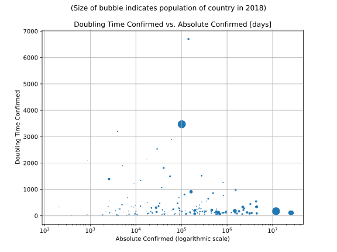

# Most Recent Figures: Lowest Doubling Time Rate by Country

The doubling time mentioned below is calculated based on 
* an exponential growth assumption
* for time difference of past seven (7) days
* showing the most recent reported value available
* for confirmed (not active!) cases.

The doubling time's unit is "days". 

| Country | Doubling Time (Confirmed) |
|---------|---------------------------|
| [Sudan](./perCountry/SDN_doublingtime.md) (SDN) | 3.6 days | 
| [Maldives](./perCountry/MDV_doublingtime.md) (MDV) | 3.9 days | 
| [Bangladesh](./perCountry/BGD_doublingtime.md) (BGD) | 4.7 days | 
| [Nepal](./perCountry/NPL_doublingtime.md) (NPL) | 5.0 days | 
| [Singapore](./perCountry/SGP_doublingtime.md) (SGP) | 5.1 days | 
| [Russia](./perCountry/RUS_doublingtime.md) (RUS) | 6.0 days | 
| [SaudiArabia](./perCountry/SAU_doublingtime.md) (SAU) | 6.6 days | 
| [Nigeria](./perCountry/NGA_doublingtime.md) (NGA) | 6.7 days | 
| [Gabon](./perCountry/GAB_doublingtime.md) (GAB) | 7.0 days | 
| [Eswatini](./perCountry/SWZ_doublingtime.md) (SWZ) | 7.0 days | 
| [Belarus](./perCountry/BLR_doublingtime.md) (BLR) | 7.6 days | 
| [Qatar](./perCountry/QAT_doublingtime.md) (QAT) | 7.8 days | 
| [Guinea](./perCountry/GIN_doublingtime.md) (GIN) | 8.0 days | 
| [Jamaica](./perCountry/JAM_doublingtime.md) (JAM) | 8.1 days | 
| [Ghana](./perCountry/GHA_doublingtime.md) (GHA) | 8.5 days | 
| [Oman](./perCountry/OMN_doublingtime.md) (OMN) | 8.8 days | 
| [Mexico](./perCountry/MEX_doublingtime.md) (MEX) | 8.9 days | 
| [Guatemala](./perCountry/GTM_doublingtime.md) (GTM) | 9.0 days | 
| [Ukraine](./perCountry/UKR_doublingtime.md) (UKR) | 9.0 days | 
| [India](./perCountry/IND_doublingtime.md) (IND) | 9.2 days | 
| [Morocco](./perCountry/MAR_doublingtime.md) (MAR) | 9.5 days | 
| [Peru](./perCountry/PER_doublingtime.md) (PER) | 9.7 days | 
| [Kazakhstan](./perCountry/KAZ_doublingtime.md) (KAZ) | 10.0 days | 
| [Brazil](./perCountry/BRA_doublingtime.md) (BRA) | 10.5 days | 
| [Kuwait](./perCountry/KWT_doublingtime.md) (KWT) | 10.7 days | 
| [Pakistan](./perCountry/PAK_doublingtime.md) (PAK) | 11.0 days | 
| [UnitedArab Emirates](./perCountry/ARE_doublingtime.md) (ARE) | 11.7 days | 
| [Bolivia](./perCountry/BOL_doublingtime.md) (BOL) | 11.7 days | 
| [Afghanistan](./perCountry/AFG_doublingtime.md) (AFG) | 12.3 days | 
| [Coted&#39;Ivoire](./perCountry/CIV_doublingtime.md) (CIV) | 12.5 days | 
| [Canada](./perCountry/CAN_doublingtime.md) (CAN) | 12.8 days | 
| [DominicanRepublic](./perCountry/DOM_doublingtime.md) (DOM) | 13.0 days | 
| [Venezuela](./perCountry/VEN_doublingtime.md) (VEN) | 13.1 days | 
| [Cuba](./perCountry/CUB_doublingtime.md) (CUB) | 13.1 days | 
| [Egypt](./perCountry/EGY_doublingtime.md) (EGY) | 13.1 days | 
| [SouthAfrica](./perCountry/ZAF_doublingtime.md) (ZAF) | 13.4 days | 
| [Indonesia](./perCountry/IDN_doublingtime.md) (IDN) | 13.5 days | 
| [Slovakia](./perCountry/SVK_doublingtime.md) (SVK) | 13.6 days | 
| [Turkey](./perCountry/TUR_doublingtime.md) (TUR) | 14.1 days | 
| [Japan](./perCountry/JPN_doublingtime.md) (JPN) | 14.1 days | 
| [Congo(Kinshasa)](./perCountry/COD_doublingtime.md) (COD) | 14.4 days | 
| [Senegal](./perCountry/SEN_doublingtime.md) (SEN) | 14.5 days | 
| [Colombia](./perCountry/COL_doublingtime.md) (COL) | 14.7 days | 
| [SriLanka](./perCountry/LKA_doublingtime.md) (LKA) | 15.2 days | 
| [Ecuador](./perCountry/ECU_doublingtime.md) (ECU) | 15.4 days | 
| [Hungary](./perCountry/HUN_doublingtime.md) (HUN) | 15.6 days | 
| [Cameroon](./perCountry/CMR_doublingtime.md) (CMR) | 15.7 days | 
| [Bulgaria](./perCountry/BGR_doublingtime.md) (BGR) | 15.7 days | 
| [Chile](./perCountry/CHL_doublingtime.md) (CHL) | 15.9 days | 
| [Ethiopia](./perCountry/ETH_doublingtime.md) (ETH) | 15.9 days | 
| [Serbia](./perCountry/SRB_doublingtime.md) (SRB) | 16.1 days | 
| [Georgia](./perCountry/GEO_doublingtime.md) (GEO) | 16.1 days | 
| [Moldova](./perCountry/MDA_doublingtime.md) (MDA) | 16.3 days | 
| [UnitedKingdom](./perCountry/GBR_doublingtime.md) (GBR) | 16.4 days | 
| [Panama](./perCountry/PAN_doublingtime.md) (PAN) | 16.6 days | 
| [Algeria](./perCountry/DZA_doublingtime.md) (DZA) | 16.6 days | 
| [Kenya](./perCountry/KEN_doublingtime.md) (KEN) | 16.6 days | 
| [Romania](./perCountry/ROU_doublingtime.md) (ROU) | 16.7 days | 
| [Sweden](./perCountry/SWE_doublingtime.md) (SWE) | 16.8 days | 
| [Poland](./perCountry/POL_doublingtime.md) (POL) | 16.9 days | 
| [Ireland](./perCountry/IRL_doublingtime.md) (IRL) | 17.4 days | 
| [Bahamas](./perCountry/BHS_doublingtime.md) (BHS) | 17.5 days | 
| [Armenia](./perCountry/ARM_doublingtime.md) (ARM) | 17.5 days | 
| [Paraguay](./perCountry/PRY_doublingtime.md) (PRY) | 17.7 days | 
| [US](./perCountry/USA_doublingtime.md) (USA) | 17.8 days | 
| [Uzbekistan](./perCountry/UZB_doublingtime.md) (UZB) | 17.9 days | 
| [SanMarino](./perCountry/SMR_doublingtime.md) (SMR) | 18.2 days | 
| [NorthMacedonia](./perCountry/MKD_doublingtime.md) (MKD) | 19.2 days | 
| [Argentina](./perCountry/ARG_doublingtime.md) (ARG) | 19.6 days | 
| [Albania](./perCountry/ALB_doublingtime.md) (ALB) | 19.8 days | 
| [Finland](./perCountry/FIN_doublingtime.md) (FIN) | 20.3 days | 
| [Lithuania](./perCountry/LTU_doublingtime.md) (LTU) | 21.7 days | 
| [Belgium](./perCountry/BEL_doublingtime.md) (BEL) | 22.3 days | 
| [Netherlands](./perCountry/NLD_doublingtime.md) (NLD) | 23.1 days | 
| [Bosniaand Herzegovina](./perCountry/BIH_doublingtime.md) (BIH) | 23.6 days | 
| [Philippines](./perCountry/PHL_doublingtime.md) (PHL) | 23.7 days | 
| [Guyana](./perCountry/GUY_doublingtime.md) (GUY) | 24.9 days | 
| [Honduras](./perCountry/HND_doublingtime.md) (HND) | 25.0 days | 
| [Portugal](./perCountry/PRT_doublingtime.md) (PRT) | 25.3 days | 
| [Bahrain](./perCountry/BHR_doublingtime.md) (BHR) | 25.5 days | 
| [Azerbaijan](./perCountry/AZE_doublingtime.md) (AZE) | 25.6 days | 
| [Bhutan](./perCountry/BTN_doublingtime.md) (BTN) | 27.0 days | 
| [Denmark](./perCountry/DNK_doublingtime.md) (DNK) | 29.8 days | 
| [Spain](./perCountry/ESP_doublingtime.md) (ESP) | 30.7 days | 
| [France](./perCountry/FRA_doublingtime.md) (FRA) | 31.7 days | 
| [Mongolia](./perCountry/MNG_doublingtime.md) (MNG) | 31.8 days | 
| [Tunisia](./perCountry/TUN_doublingtime.md) (TUN) | 32.0 days | 
| [Israel](./perCountry/ISR_doublingtime.md) (ISR) | 33.1 days | 
| [Iraq](./perCountry/IRQ_doublingtime.md) (IRQ) | 34.5 days | 
| [Czechia](./perCountry/CZE_doublingtime.md) (CZE) | 35.6 days | 
| [Latvia](./perCountry/LVA_doublingtime.md) (LVA) | 36.7 days | 
| [Italy](./perCountry/ITA_doublingtime.md) (ITA) | 38.9 days | 
| [Iran](./perCountry/IRN_doublingtime.md) (IRN) | 41.3 days | 
| [Rwanda](./perCountry/RWA_doublingtime.md) (RWA) | 41.5 days | 
| [BurkinaFaso](./perCountry/BFA_doublingtime.md) (BFA) | 42.0 days | 
| [Croatia](./perCountry/HRV_doublingtime.md) (HRV) | 43.1 days | 
| [Germany](./perCountry/GER_doublingtime.md) (GER) | 43.9 days | 
| [Estonia](./perCountry/EST_doublingtime.md) (EST) | 45.5 days | 
| [Malta](./perCountry/MLT_doublingtime.md) (MLT) | 45.7 days | 
| [Gambia](./perCountry/GMB_doublingtime.md) (GMB) | 46.4 days | 
| [Cyprus](./perCountry/CYP_doublingtime.md) (CYP) | 49.0 days | 
| [Uruguay](./perCountry/URY_doublingtime.md) (URY) | 49.5 days | 
| [Greece](./perCountry/GRC_doublingtime.md) (GRC) | 52.0 days | 
| [Malaysia](./perCountry/MYS_doublingtime.md) (MYS) | 56.2 days | 
| [Norway](./perCountry/NOR_doublingtime.md) (NOR) | 57.4 days | 
| [CostaRica](./perCountry/CRI_doublingtime.md) (CRI) | 58.0 days | 
| [Togo](./perCountry/TGO_doublingtime.md) (TGO) | 58.9 days | 
| [Jordan](./perCountry/JOR_doublingtime.md) (JOR) | 60.0 days | 
| [Slovenia](./perCountry/SVN_doublingtime.md) (SVN) | 60.4 days | 
| [Luxembourg](./perCountry/LUX_doublingtime.md) (LUX) | 61.0 days | 
| [Andorra](./perCountry/AND_doublingtime.md) (AND) | 68.1 days | 
| [Switzerland](./perCountry/CHE_doublingtime.md) (CHE) | 68.9 days | 
| [Thailand](./perCountry/THA_doublingtime.md) (THA) | 72.8 days | 
| [NewZealand](./perCountry/NZL_doublingtime.md) (NZL) | 106.2 days | 
| [Antiguaand Barbuda](./perCountry/ATG_doublingtime.md) (ATG) | 114.4 days | 
| [Austria](./perCountry/AUT_doublingtime.md) (AUT) | 120.9 days | 
| [Lebanon](./perCountry/LBN_doublingtime.md) (LBN) | 135.8 days | 
| [Iceland](./perCountry/ISL_doublingtime.md) (ISL) | 147.2 days | 
| [Liechtenstein](./perCountry/LIE_doublingtime.md) (LIE) | 194.4 days | 
| [Australia](./perCountry/AUS_doublingtime.md) (AUS) | 294.8 days | 
| [Brunei](./perCountry/BRN_doublingtime.md) (BRN) | 332.7 days | 
| [Monaco](./perCountry/MCO_doublingtime.md) (MCO) | 454.0 days | 
| [Korea,South](./perCountry/KOR_doublingtime.md) (KOR) | 501.7 days | 
| [Trinidadand Tobago](./perCountry/TTO_doublingtime.md) (TTO) | 555.9 days | 
| [China](./perCountry/CHN_doublingtime.md) (CHN) | 792.7 days | 
| [Vietnam](./perCountry/VNM_doublingtime.md) (VNM) | 1298.3 days | 

