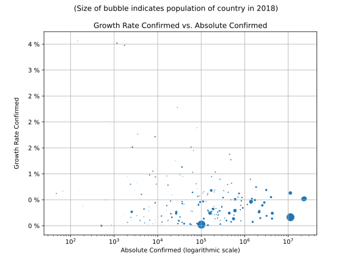

# Most Recent Figures: Highest Confirmed Growth Rate by Country

The Growth Rate mentioned below is calculated based on 
* an exponential growth assumption
* for time difference of past seven (7) days
* showing the most recent reported value available
* for confirmed (not active!) cases.

The rate is based on "growth by day". 

| Country | Confirmed Growth Rate |
|---------|-----------------------|
| [Guinea](./perCountry/GIN_growthrate.md) (GIN) | 26.84 % | 
| [Belarus](./perCountry/BLR_growthrate.md) (BLR) | 24.77 % | 
| [India](./perCountry/IND_growthrate.md) (IND) | 19.08 % | 
| [UnitedArab Emirates](./perCountry/ARE_growthrate.md) (ARE) | 18.11 % | 
| [Cameroon](./perCountry/CMR_growthrate.md) (CMR) | 17.52 % | 
| [Bangladesh](./perCountry/BGD_growthrate.md) (BGD) | 16.69 % | 
| [Russia](./perCountry/RUS_growthrate.md) (RUS) | 16.65 % | 
| [Uzbekistan](./perCountry/UZB_growthrate.md) (UZB) | 15.80 % | 
| [Moldova](./perCountry/MDA_growthrate.md) (MDA) | 15.65 % | 
| [Kenya](./perCountry/KEN_growthrate.md) (KEN) | 15.29 % | 
| [Peru](./perCountry/PER_growthrate.md) (PER) | 14.57 % | 
| [Guyana](./perCountry/GUY_growthrate.md) (GUY) | 14.45 % | 
| [Serbia](./perCountry/SRB_growthrate.md) (SRB) | 14.29 % | 
| [Antiguaand Barbuda](./perCountry/ATG_growthrate.md) (ATG) | 14.26 % | 
| [Qatar](./perCountry/QAT_growthrate.md) (QAT) | 13.83 % | 
| [Kuwait](./perCountry/KWT_growthrate.md) (KWT) | 13.49 % | 
| [Turkey](./perCountry/TUR_growthrate.md) (TUR) | 13.21 % | 
| [Brazil](./perCountry/BRA_growthrate.md) (BRA) | 12.83 % | 
| [Afghanistan](./perCountry/AFG_growthrate.md) (AFG) | 12.69 % | 
| [Azerbaijan](./perCountry/AZE_growthrate.md) (AZE) | 12.54 % | 
| [Bahamas](./perCountry/BHS_growthrate.md) (BHS) | 12.25 % | 
| [Ukraine](./perCountry/UKR_growthrate.md) (UKR) | 11.69 % | 
| [Mexico](./perCountry/MEX_growthrate.md) (MEX) | 11.45 % | 
| [UnitedKingdom](./perCountry/GBR_growthrate.md) (GBR) | 11.24 % | 
| [Honduras](./perCountry/HND_growthrate.md) (HND) | 11.02 % | 
| [Cuba](./perCountry/CUB_growthrate.md) (CUB) | 10.80 % | 
| [US](./perCountry/USA_growthrate.md) (USA) | 10.64 % | 
| [Poland](./perCountry/POL_growthrate.md) (POL) | 10.58 % | 
| [Canada](./perCountry/CAN_growthrate.md) (CAN) | 10.57 % | 
| [France](./perCountry/FRA_growthrate.md) (FRA) | 10.49 % | 
| [Pakistan](./perCountry/PAK_growthrate.md) (PAK) | 10.48 % | 
| [Algeria](./perCountry/DZA_growthrate.md) (DZA) | 10.26 % | 
| [Egypt](./perCountry/EGY_growthrate.md) (EGY) | 10.20 % | 
| [Kazakhstan](./perCountry/KAZ_growthrate.md) (KAZ) | 10.13 % | 
| [Guatemala](./perCountry/GTM_growthrate.md) (GTM) | 10.09 % | 
| [Japan](./perCountry/JPN_growthrate.md) (JPN) | 9.90 % | 
| [Sudan](./perCountry/SDN_growthrate.md) (SDN) | 9.90 % | 
| [Ethiopia](./perCountry/ETH_growthrate.md) (ETH) | 9.90 % | 
| [Romania](./perCountry/ROU_growthrate.md) (ROU) | 9.67 % | 
| [Colombia](./perCountry/COL_growthrate.md) (COL) | 9.65 % | 
| [Coted&#39;Ivoire](./perCountry/CIV_growthrate.md) (CIV) | 9.54 % | 
| [Oman](./perCountry/OMN_growthrate.md) (OMN) | 9.41 % | 
| [Morocco](./perCountry/MAR_growthrate.md) (MAR) | 9.31 % | 
| [Togo](./perCountry/TGO_growthrate.md) (TGO) | 9.26 % | 
| [Cyprus](./perCountry/CYP_growthrate.md) (CYP) | 9.06 % | 
| [Nigeria](./perCountry/NGA_growthrate.md) (NGA) | 9.03 % | 
| [Gabon](./perCountry/GAB_growthrate.md) (GAB) | 8.98 % | 
| [Chile](./perCountry/CHL_growthrate.md) (CHL) | 8.93 % | 
| [Congo(Kinshasa)](./perCountry/COD_growthrate.md) (COD) | 8.69 % | 
| [NorthMacedonia](./perCountry/MKD_growthrate.md) (MKD) | 8.56 % | 
| [Bosniaand Herzegovina](./perCountry/BIH_growthrate.md) (BIH) | 8.55 % | 
| [Bolivia](./perCountry/BOL_growthrate.md) (BOL) | 8.50 % | 
| [Philippines](./perCountry/PHL_growthrate.md) (PHL) | 8.45 % | 
| [Nepal](./perCountry/NPL_growthrate.md) (NPL) | 8.40 % | 
| [NewZealand](./perCountry/NZL_growthrate.md) (NZL) | 8.34 % | 
| [Indonesia](./perCountry/IDN_growthrate.md) (IDN) | 8.33 % | 
| [SaudiArabia](./perCountry/SAU_growthrate.md) (SAU) | 8.30 % | 
| [Ghana](./perCountry/GHA_growthrate.md) (GHA) | 8.26 % | 
| [Georgia](./perCountry/GEO_growthrate.md) (GEO) | 8.25 % | 
| [Panama](./perCountry/PAN_growthrate.md) (PAN) | 8.22 % | 
| [Paraguay](./perCountry/PRY_growthrate.md) (PRY) | 8.15 % | 
| [Ireland](./perCountry/IRL_growthrate.md) (IRL) | 8.11 % | 
| [DominicanRepublic](./perCountry/DOM_growthrate.md) (DOM) | 8.11 % | 
| [Jamaica](./perCountry/JAM_growthrate.md) (JAM) | 7.99 % | 
| [Belgium](./perCountry/BEL_growthrate.md) (BEL) | 7.89 % | 
| [Sweden](./perCountry/SWE_growthrate.md) (SWE) | 7.87 % | 
| [Malta](./perCountry/MLT_growthrate.md) (MLT) | 7.86 % | 
| [Denmark](./perCountry/DNK_growthrate.md) (DNK) | 7.85 % | 
| [Israel](./perCountry/ISR_growthrate.md) (ISR) | 7.80 % | 
| [Ecuador](./perCountry/ECU_growthrate.md) (ECU) | 7.35 % | 
| [Portugal](./perCountry/PRT_growthrate.md) (PRT) | 7.34 % | 
| [Hungary](./perCountry/HUN_growthrate.md) (HUN) | 7.25 % | 
| [Lithuania](./perCountry/LTU_growthrate.md) (LTU) | 7.06 % | 
| [Finland](./perCountry/FIN_growthrate.md) (FIN) | 6.96 % | 
| [Iraq](./perCountry/IRQ_growthrate.md) (IRQ) | 6.86 % | 
| [Armenia](./perCountry/ARM_growthrate.md) (ARM) | 6.74 % | 
| [Slovakia](./perCountry/SVK_growthrate.md) (SVK) | 6.72 % | 
| [Singapore](./perCountry/SGP_growthrate.md) (SGP) | 6.71 % | 
| [Tunisia](./perCountry/TUN_growthrate.md) (TUN) | 6.55 % | 
| [Albania](./perCountry/ALB_growthrate.md) (ALB) | 6.50 % | 
| [Netherlands](./perCountry/NLD_growthrate.md) (NLD) | 6.32 % | 
| [Argentina](./perCountry/ARG_growthrate.md) (ARG) | 6.21 % | 
| [Estonia](./perCountry/EST_growthrate.md) (EST) | 6.19 % | 
| [Monaco](./perCountry/MCO_growthrate.md) (MCO) | 5.97 % | 
| [Czechia](./perCountry/CZE_growthrate.md) (CZE) | 5.95 % | 
| [Germany](./perCountry/GER_growthrate.md) (GER) | 5.79 % | 
| [Spain](./perCountry/ESP_growthrate.md) (ESP) | 5.60 % | 
| [Croatia](./perCountry/HRV_growthrate.md) (HRV) | 5.59 % | 
| [BurkinaFaso](./perCountry/BFA_growthrate.md) (BFA) | 5.52 % | 
| [Namibia](./perCountry/NAM_growthrate.md) (NAM) | 5.35 % | 
| [Andorra](./perCountry/AND_growthrate.md) (AND) | 5.30 % | 
| [Bulgaria](./perCountry/BGR_growthrate.md) (BGR) | 5.27 % | 
| [Malaysia](./perCountry/MYS_growthrate.md) (MYS) | 5.14 % | 
| [Bahrain](./perCountry/BHR_growthrate.md) (BHR) | 5.11 % | 
| [Iran](./perCountry/IRN_growthrate.md) (IRN) | 4.84 % | 
| [Rwanda](./perCountry/RWA_growthrate.md) (RWA) | 4.81 % | 
| [Iceland](./perCountry/ISL_growthrate.md) (ISL) | 4.78 % | 
| [Greece](./perCountry/GRC_growthrate.md) (GRC) | 4.75 % | 
| [CostaRica](./perCountry/CRI_growthrate.md) (CRI) | 4.72 % | 
| [Latvia](./perCountry/LVA_growthrate.md) (LVA) | 4.57 % | 
| [Thailand](./perCountry/THA_growthrate.md) (THA) | 4.47 % | 
| [Luxembourg](./perCountry/LUX_growthrate.md) (LUX) | 4.43 % | 
| [Senegal](./perCountry/SEN_growthrate.md) (SEN) | 4.33 % | 
| [Switzerland](./perCountry/CHE_growthrate.md) (CHE) | 4.18 % | 
| [Slovenia](./perCountry/SVN_growthrate.md) (SVN) | 3.97 % | 
| [Norway](./perCountry/NOR_growthrate.md) (NOR) | 3.87 % | 
| [SriLanka](./perCountry/LKA_growthrate.md) (LKA) | 3.68 % | 
| [Australia](./perCountry/AUS_growthrate.md) (AUS) | 3.67 % | 
| [SouthAfrica](./perCountry/ZAF_growthrate.md) (ZAF) | 3.67 % | 
| [Jordan](./perCountry/JOR_growthrate.md) (JOR) | 3.62 % | 
| [Italy](./perCountry/ITA_growthrate.md) (ITA) | 3.54 % | 
| [Uruguay](./perCountry/URY_growthrate.md) (URY) | 3.24 % | 
| [Bhutan](./perCountry/BTN_growthrate.md) (BTN) | 3.19 % | 
| [Mongolia](./perCountry/MNG_growthrate.md) (MNG) | 3.19 % | 
| [Austria](./perCountry/AUT_growthrate.md) (AUT) | 3.09 % | 
| [Trinidadand Tobago](./perCountry/TTO_growthrate.md) (TTO) | 2.96 % | 
| [Venezuela](./perCountry/VEN_growthrate.md) (VEN) | 2.87 % | 
| [SanMarino](./perCountry/SMR_growthrate.md) (SMR) | 2.39 % | 
| [Vietnam](./perCountry/VNM_growthrate.md) (VNM) | 2.30 % | 
| [Lebanon](./perCountry/LBN_growthrate.md) (LBN) | 2.19 % | 
| [Liechtenstein](./perCountry/LIE_growthrate.md) (LIE) | 1.96 % | 
| [Suriname](./perCountry/SUR_growthrate.md) (SUR) | 1.51 % | 
| [Eswatini](./perCountry/SWZ_growthrate.md) (SWZ) | 1.51 % | 
| [Seychelles](./perCountry/SYC_growthrate.md) (SYC) | 1.36 % | 
| [Korea,South](./perCountry/KOR_growthrate.md) (KOR) | 0.77 % | 
| [Maldives](./perCountry/MDV_growthrate.md) (MDV) | 0.77 % | 
| [Cambodia](./perCountry/KHM_growthrate.md) (KHM) | 0.77 % | 
| [Brunei](./perCountry/BRN_growthrate.md) (BRN) | 0.65 % | 
| [China](./perCountry/CHN_growthrate.md) (CHN) | 0.08 % | 
| [Mauritania](./perCountry/MRT_growthrate.md) (MRT) | 0.00 % | 
| [Gambia](./perCountry/GMB_growthrate.md) (GMB) | 0.00 % | 

