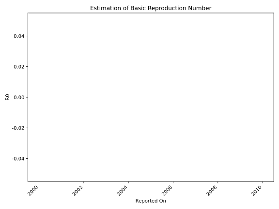

# Country Figures: Time Series for Basic Reproduction Number of Aruba 

| Reported On | &Delta; Confirmed | Total &Delta; Confirmed First Interval | Total &Delta; Confirmed Second Interval | Estimated Basic Reproduction Number R0 | 
|-------------|-------------------|----------------------------------------|-----------------------------------------|---------------------------------------------------|
| 2020-03-19 | 0 |  2  |  None  |  None  | 
| 2020-03-18 | 1 |  1  |  None  |  None  | 
| 2020-03-17 | 1 |  None  |  None  |  None  | 
| 2020-03-16 | 0 |  None  |  None  |  None  | 
| 2020-03-15 | 0 |  None  |  None  |  None  | 
| 2020-03-14 | 0 |  None  |  None  |  None  | 
| 2020-03-13 | None |  None  |  None  |  None  | 

