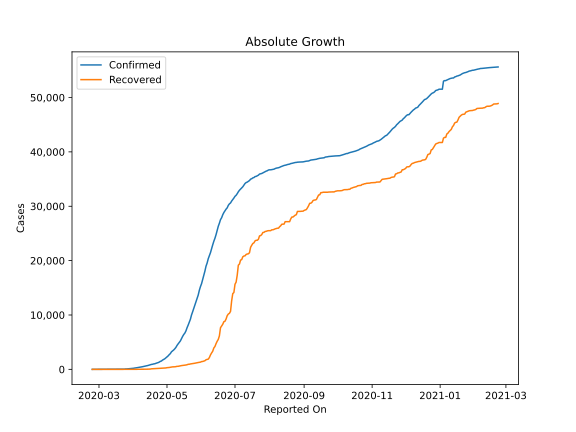
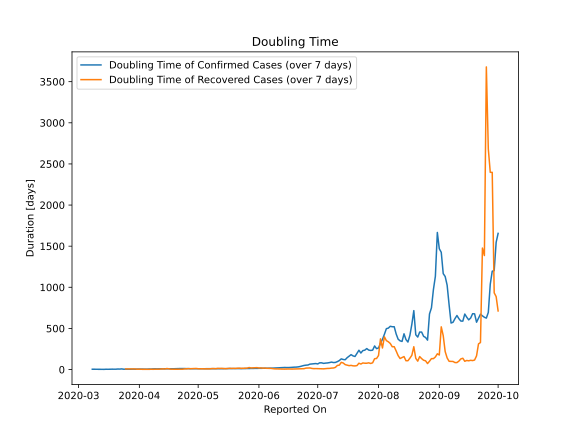

# Country Figures: Doubling Time of Infections for Afghanistan 

The doubling time below are calculated based on
* an exponential growth assumption
* for time difference of past seven (7) days.
The doubling time's unit is "days".

The first doubling time indicates the increase of confirmed (infected)
cases. There, the *higher* the number is, the better is to take control
of the disease.

The second doubling time indicates the increase of recovered (healed)
cases. There, the *lower* the number is, the better it is to take
control of the disease.

| Reported On | Confirmed | Doubling Time (Confirmed) | Recovered | Doubling Time (Recovered) |
|-------------|-----------|---------------------------|-----------|---------------------------|
| 2020-04-04 | 299 |  5.2 days  | 10 |  3.3 days  | 
| 2020-04-03 | 281 |  5.5 days  | 10 |  3.3 days  | 
| 2020-04-02 | 273 |  4.9 days  | 10 |  3.3 days  | 
| 2020-04-01 | 237 |  5.0 days  | 5 |  5.6 days  | 
| 2020-03-31 | 174 |  6.0 days  | 5 |  3.3 days  | 
| 2020-03-30 | 170 |  3.7 days  | 2 |  7.3 days  | 
| 2020-03-29 | 120 |  4.8 days  | 2 |  7.3 days  | 
| 2020-03-28 | 110 |  3.5 days  | 2 |  7.3 days  | 
| 2020-03-27 | 110 |  3.5 days  | 2 |  7.3 days  | 
| 2020-03-26 | 94 |  3.7 days  | 2 |  7.3 days  | 
| 2020-03-25 | 84 |  4.0 days  | 2 |  7.3 days  | 
| 2020-03-24 | 74 |  4.3 days  | 1 |  None  | 
| 2020-03-23 | 40 |  7.9 days  | 1 |  None  | 
| 2020-03-22 | 40 |  5.6 days  | 1 |  None  | 
| 2020-03-21 | 24 |  6.6 days  | 1 |  None  | 
| 2020-03-20 | 24 |  4.3 days  | 1 |  None  | 
| 2020-03-19 | 22 |  4.6 days  | 1 |  None  | 
| 2020-03-18 | 22 |  4.6 days  | 1 |  None  | 
| 2020-03-17 | 22 |  3.6 days  | 1 |  None  | 
| 2020-03-16 | 21 |  3.3 days  | 1 |  None  | 
| 2020-03-15 | 16 |  3.8 days  | 0 |  None  | 
| 2020-03-14 | 11 |  2.4 days  | 0 |  None  | 
| 2020-03-13 | 7 |  2.8 days  | 0 |  None  | 
| 2020-03-12 | 7 |  2.8 days  | 0 |  None  | 
| 2020-03-11 | 7 |  2.8 days  | 0 |  None  | 
| 2020-03-10 | 5 |  3.3 days  | 0 |  None  | 
| 2020-03-09 | 4 |  3.8 days  | 0 |  None  | 
| 2020-03-08 | 4 |  3.8 days  | 0 |  None  | 
| 2020-03-07 | 1 |  None  | 0 |  None  | 
| 2020-03-06 | 1 |  None  | 0 |  None  | 
| 2020-03-05 | 1 |  None  | 0 |  None  | 
| 2020-03-04 | 1 |  None  | 0 |  None  | 
| 2020-03-03 | 1 |  None  | 0 |  None  | 
| 2020-03-02 | 1 |  None  | 0 |  None  | 
| 2020-03-01 | 1 |  None  | 0 |  None  | 
| 2020-02-29 | 1 |  None  | 0 |  None  | 
| 2020-02-28 | 1 |  None  | 0 |  None  | 
| 2020-02-27 | 1 |  None  | 0 |  None  | 
| 2020-02-26 | 1 |  None  | 0 |  None  | 
| 2020-02-25 | 1 |  None  | 0 |  None  | 
| 2020-02-24 | 1 |  None  | 0 |  None  | 

