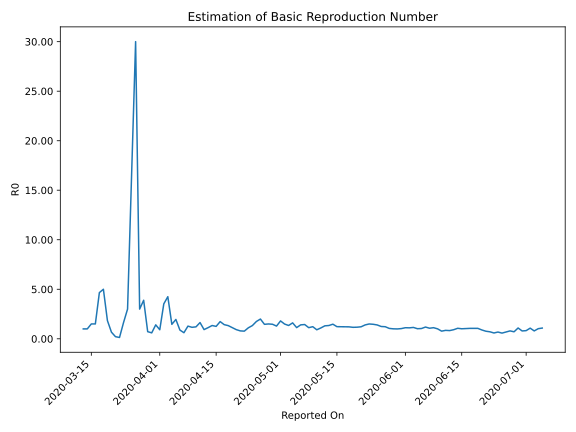

# Country Figures: Time Series for Basic Reproduction Number of Afghanistan 

| Reported On | &Delta; Confirmed | Total &Delta; Confirmed First Interval | Total &Delta; Confirmed Second Interval | Estimated Basic Reproduction Number R0 | 
|-------------|-------------------|----------------------------------------|-----------------------------------------|---------------------------------------------------|
| 2020-04-28 | 125 |  424  |  283  |  1.50  | 
| 2020-04-27 | 172 |  355  |  243  |  1.46  | 
| 2020-04-26 | 68 |  371  |  186  |  1.99  | 
| 2020-04-25 | 112 |  325  |  186  |  1.75  | 
| 2020-04-24 | 72 |  283  |  212  |  1.33  | 
| 2020-04-23 | 103 |  243  |  219  |  1.11  | 
| 2020-04-22 | 84 |  186  |  241  |  0.77  | 
| 2020-04-21 | 66 |  186  |  233  |  0.80  | 
| 2020-04-20 | 30 |  212  |  229  |  0.93  | 
| 2020-04-19 | 63 |  219  |  193  |  1.13  | 
| 2020-04-18 | 27 |  241  |  181  |  1.33  | 
| 2020-04-17 | 66 |  233  |  163  |  1.43  | 
| 2020-04-16 | 56 |  229  |  132  |  1.73  | 
| 2020-04-15 | 70 |  193  |  154  |  1.25  | 
| 2020-04-14 | 49 |  181  |  135  |  1.34  | 
| 2020-04-13 | 58 |  163  |  145  |  1.12  | 
| 2020-04-12 | 52 |  132  |  142  |  0.93  | 
| 2020-04-11 | 34 |  154  |  94  |  1.64  | 
| 2020-04-10 | 37 |  135  |  112  |  1.21  | 
| 2020-04-09 | 40 |  145  |  125  |  1.16  | 
| 2020-04-08 | 21 |  142  |  111  |  1.28  | 
| 2020-04-07 | 56 |  94  |  153  |  0.61  | 
| 2020-04-06 | 18 |  112  |  127  |  0.88  | 
| 2020-04-05 | 50 |  125  |  64  |  1.95  | 
| 2020-04-04 | 18 |  111  |  76  |  1.46  | 
| 2020-04-03 | 8 |  153  |  36  |  4.25  | 
| 2020-04-02 | 36 |  127  |  36  |  3.53  | 
| 2020-04-01 | 63 |  64  |  70  |  0.91  | 
| 2020-03-31 | 4 |  76  |  54  |  1.41  | 
| 2020-03-30 | 50 |  36  |  60  |  0.60  | 
| 2020-03-29 | 10 |  36  |  50  |  0.72  | 
| 2020-03-28 | 0 |  70  |  18  |  3.89  | 
| 2020-03-27 | 16 |  54  |  18  |  3.00  | 
| 2020-03-26 | 10 |  60  |  2  |  30.00  | 
| 2020-03-25 | 10 |  50  |  3  |  16.67  | 
| 2020-03-24 | 34 |  18  |  6  |  3.00  | 
| 2020-03-23 | 0 |  18  |  11  |  1.64  | 
| 2020-03-22 | 16 |  2  |  15  |  0.13  | 
| 2020-03-21 | 0 |  3  |  14  |  0.21  | 
| 2020-03-20 | 2 |  6  |  9  |  0.67  | 
| 2020-03-19 | 0 |  11  |  6  |  1.83  | 
| 2020-03-18 | 0 |  15  |  3  |  5.00  | 
| 2020-03-17 | 1 |  14  |  3  |  4.67  | 
| 2020-03-16 | 5 |  9  |  6  |  1.50  | 
| 2020-03-15 | 5 |  6  |  4  |  1.50  | 
| 2020-03-14 | 4 |  3  |  3  |  1.00  | 
| 2020-03-13 | 0 |  3  |  3  |  1.00  | 
| 2020-03-12 | 0 |  6  |  None  |  None  | 
| 2020-03-11 | 2 |  4  |  None  |  None  | 
| 2020-03-10 | 1 |  3  |  None  |  None  | 
| 2020-03-09 | 0 |  3  |  None  |  None  | 
| 2020-03-08 | 3 |  None  |  None  |  None  | 
| 2020-03-07 | 0 |  None  |  None  |  None  | 
| 2020-03-06 | 0 |  None  |  None  |  None  | 
| 2020-03-05 | 0 |  None  |  None  |  None  | 
| 2020-03-04 | 0 |  None  |  None  |  None  | 
| 2020-03-03 | 0 |  None  |  None  |  None  | 
| 2020-03-02 | 0 |  None  |  None  |  None  | 
| 2020-03-01 | 0 |  None  |  None  |  None  | 
| 2020-02-29 | 0 |  None  |  None  |  None  | 
| 2020-02-28 | 0 |  None  |  None  |  None  | 
| 2020-02-27 | 0 |  None  |  None  |  None  | 
| 2020-02-26 | 0 |  None  |  None  |  None  | 
| 2020-02-25 | 0 |  None  |  None  |  None  | 
| 2020-02-24 | None |  None  |  None  |  None  | 

