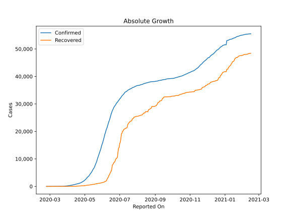
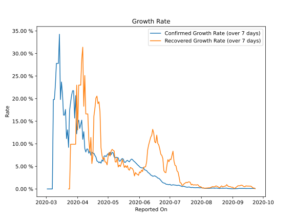

# Country Figures: Growth Rate for Afghanistan 

The growth rates below are calculated based on
* an exponential growth assumption
* for time difference of past seven (7) days.
The growth rate is to be understood as on "growth per day".

The first growth rate indicates the increase of confirmed (infected) cases.

The second growth rate indicates the increase of recovered (healed) cases.

| Reported On | Confirmed | Growth Rate (Confirmed) | Recovered | Growth Rate (Recovered) |
|-------------|-----------|-------------------------|-----------|-------------------------|
| 2020-05-06 | 3392 |  7.99 %  | 458 |  8.535 %  | 
| 2020-05-05 | 3224 |  8.11 %  | 421 |  8.761 %  | 
| 2020-05-04 | 2894 |  7.57 %  | 397 |  8.433 %  | 
| 2020-05-03 | 2704 |  8.13 %  | 345 |  7.298 %  | 
| 2020-05-02 | 2469 |  7.48 %  | 331 |  8.081 %  | 
| 2020-05-01 | 2335 |  7.82 %  | 310 |  7.145 %  | 
| 2020-04-30 | 2171 |  7.56 %  | 260 |  5.333 %  | 
| 2020-04-29 | 1939 |  7.14 %  | 252 |  5.963 %  | 
| 2020-04-28 | 1828 |  7.36 %  | 228 |  5.982 %  | 
| 2020-04-27 | 1703 |  7.24 %  | 220 |  6.976 %  | 
| 2020-04-26 | 1531 |  6.14 %  | 207 |  6.536 %  | 
| 2020-04-25 | 1463 |  6.43 %  | 188 |  7.399 %  | 
| 2020-04-24 | 1351 |  5.71 %  | 188 |  9.162 %  | 
| 2020-04-23 | 1279 |  6.01 %  | 179 |  17.120 %  | 
| 2020-04-22 | 1176 |  5.79 %  | 166 |  19.297 %  | 
| 2020-04-21 | 1092 |  6.07 %  | 150 |  18.882 %  | 
| 2020-04-20 | 1026 |  6.19 %  | 135 |  20.565 %  | 
| 2020-04-19 | 996 |  7.07 %  | 131 |  20.135 %  | 
| 2020-04-18 | 933 |  7.42 %  | 112 |  17.897 %  | 
| 2020-04-17 | 906 |  7.90 %  | 99 |  16.134 %  | 
| 2020-04-16 | 840 |  7.88 %  | 54 |  7.475 %  | 
| 2020-04-15 | 784 |  8.12 %  | 43 |  5.627 %  | 
| 2020-04-14 | 714 |  7.48 %  | 40 |  11.407 %  | 
| 2020-04-13 | 665 |  8.49 %  | 32 |  8.219 %  | 
| 2020-04-12 | 607 |  7.91 %  | 32 |  10.824 %  | 
| 2020-04-11 | 555 |  8.84 %  | 32 |  16.616 %  | 
| 2020-04-10 | 521 |  8.82 %  | 32 |  16.616 %  | 
| 2020-04-09 | 484 |  8.18 %  | 32 |  16.616 %  | 
| 2020-04-08 | 444 |  8.97 %  | 29 |  25.112 %  | 
| 2020-04-07 | 423 |  12.69 %  | 18 |  18.299 %  | 
| 2020-04-06 | 367 |  10.99 %  | 18 |  31.389 %  | 
| 2020-04-05 | 349 |  15.25 %  | 15 |  28.784 %  | 
| 2020-04-04 | 299 |  14.29 %  | 10 |  22.992 %  | 
| 2020-04-03 | 281 |  13.40 %  | 10 |  22.992 %  | 
| 2020-04-02 | 273 |  15.23 %  | 10 |  22.992 %  | 
| 2020-04-01 | 237 |  14.82 %  | 5 |  13.090 %  | 
| 2020-03-31 | 174 |  12.21 %  | 5 |  22.992 %  | 
| 2020-03-30 | 170 |  20.67 %  | 2 |  9.902 %  | 
| 2020-03-29 | 120 |  15.69 %  | 2 |  9.902 %  | 
| 2020-03-28 | 110 |  21.75 %  | 2 |  9.902 %  | 
| 2020-03-27 | 110 |  21.75 %  | 2 |  9.902 %  | 
| 2020-03-26 | 94 |  20.75 %  | 2 |  9.902 %  | 
| 2020-03-25 | 84 |  19.14 %  | 2 |  9.902 %  | 
| 2020-03-24 | 74 |  17.33 %  | 1 |  None  | 
| 2020-03-23 | 40 |  9.21 %  | 1 |  None  | 
| 2020-03-22 | 40 |  13.09 %  | 1 |  None  | 
| 2020-03-21 | 24 |  11.15 %  | 1 |  None  | 
| 2020-03-20 | 24 |  17.60 %  | 1 |  None  | 
| 2020-03-19 | 22 |  16.36 %  | 1 |  None  | 
| 2020-03-18 | 22 |  16.36 %  | 1 |  None  | 
| 2020-03-17 | 22 |  21.17 %  | 1 |  None  | 
| 2020-03-16 | 21 |  23.69 %  | 1 |  None  | 
| 2020-03-15 | 16 |  19.80 %  | 0 |  None  | 
| 2020-03-14 | 11 |  34.26 %  | 0 |  None  | 
| 2020-03-13 | 7 |  27.80 %  | 0 |  None  | 
| 2020-03-12 | 7 |  27.80 %  | 0 |  None  | 
| 2020-03-11 | 7 |  27.80 %  | 0 |  None  | 
| 2020-03-10 | 5 |  22.99 %  | 0 |  None  | 
| 2020-03-09 | 4 |  19.80 %  | 0 |  None  | 
| 2020-03-08 | 4 |  19.80 %  | 0 |  None  | 
| 2020-03-07 | 1 |  None  | 0 |  None  | 
| 2020-03-06 | 1 |  None  | 0 |  None  | 
| 2020-03-05 | 1 |  None  | 0 |  None  | 
| 2020-03-04 | 1 |  None  | 0 |  None  | 
| 2020-03-03 | 1 |  None  | 0 |  None  | 
| 2020-03-02 | 1 |  None  | 0 |  None  | 
| 2020-03-01 | 1 |  None  | 0 |  None  | 
| 2020-02-29 | 1 |  None  | 0 |  None  | 
| 2020-02-28 | 1 |  None  | 0 |  None  | 
| 2020-02-27 | 1 |  None  | 0 |  None  | 
| 2020-02-26 | 1 |  None  | 0 |  None  | 
| 2020-02-25 | 1 |  None  | 0 |  None  | 
| 2020-02-24 | 1 |  None  | 0 |  None  | 

