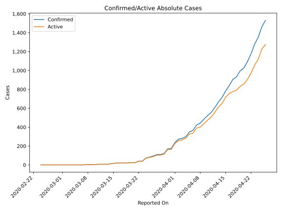
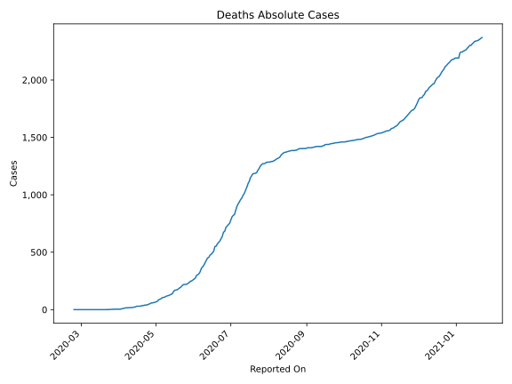
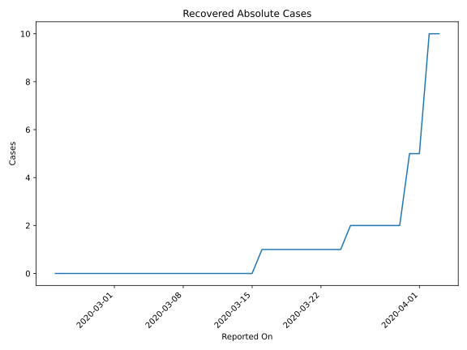
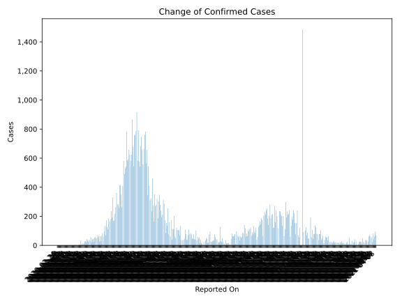
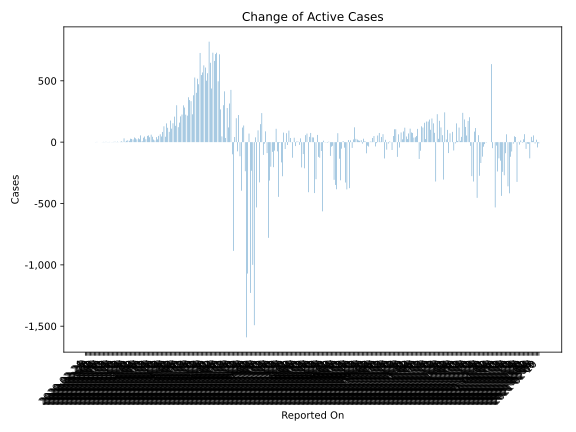
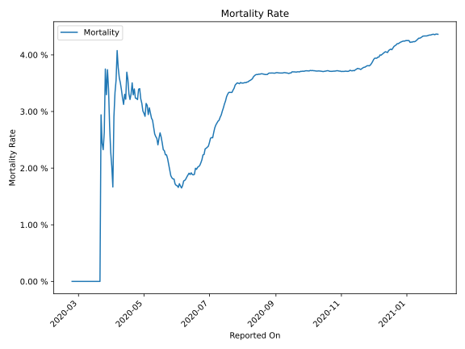

# Country Figures: Time Series for Afghanistan 

| Reported On | Confirmed | Deaths | Recovered | Active | Mortality | &Delta; Confirmed | &Delta; Deaths | &Delta; Active | % Active of Population |
|-------------|-----------|--------|-----------|--------|-----------|-------------------|----------------|----------------|------------------------|
| 2020-03-30 | 170 | 4 | 2 | 164 |  2.35 %  | 50 | 0 | 50 |  0.000 %  | 
| 2020-03-29 | 120 | 4 | 2 | 114 |  3.33 %  | 10 | 0 | 10 |  0.000 %  | 
| 2020-03-28 | 110 | 4 | 2 | 104 |  3.64 %  | 0 | 0 | 0 |  0.000 %  | 
| 2020-03-27 | 110 | 4 | 2 | 104 |  3.64 %  | 16 | 0 | 16 |  0.000 %  | 
| 2020-03-26 | 94 | 4 | 2 | 88 |  4.26 %  | 10 | 2 | 8 |  0.000 %  | 
| 2020-03-25 | 84 | 2 | 2 | 80 |  2.38 %  | 10 | 1 | 8 |  0.000 %  | 
| 2020-03-24 | 74 | 1 | 1 | 72 |  1.35 %  | 34 | 0 | 34 |  0.000 %  | 
| 2020-03-23 | 40 | 1 | 1 | 38 |  2.50 %  | 0 | 0 | 0 |  0.000 %  | 
| 2020-03-22 | 40 | 1 | 1 | 38 |  2.50 %  | 16 | 1 | 15 |  0.000 %  | 
| 2020-03-21 | 24 | 0 | 1 | 23 |  None  | 0 | 0 | 0 |  0.000 %  | 
| 2020-03-20 | 24 | 0 | 1 | 23 |  None  | 2 | 0 | 2 |  0.000 %  | 
| 2020-03-19 | 22 | 0 | 1 | 21 |  None  | 0 | 0 | 0 |  0.000 %  | 
| 2020-03-18 | 22 | 0 | 1 | 21 |  None  | 0 | 0 | 0 |  0.000 %  | 
| 2020-03-17 | 22 | 0 | 1 | 21 |  None  | 1 | 0 | 1 |  0.000 %  | 
| 2020-03-16 | 21 | 0 | 1 | 20 |  None  | 5 | 0 | 4 |  0.000 %  | 
| 2020-03-15 | 16 | 0 | 0 | 16 |  None  | 5 | 0 | 5 |  0.000 %  | 
| 2020-03-14 | 11 | 0 | 0 | 11 |  None  | 4 | 0 | 4 |  0.000 %  | 
| 2020-03-13 | 7 | 0 | 0 | 7 |  None  | 0 | 0 | 0 |  0.000 %  | 
| 2020-03-12 | 7 | 0 | 0 | 7 |  None  | 0 | 0 | 0 |  0.000 %  | 
| 2020-03-11 | 7 | 0 | 0 | 7 |  None  | 2 | 0 | 2 |  0.000 %  | 
| 2020-03-10 | 5 | 0 | 0 | 5 |  None  | 1 | 0 | 1 |  0.000 %  | 
| 2020-03-09 | 4 | 0 | 0 | 4 |  None  | 0 | 0 | 0 |  0.000 %  | 
| 2020-03-08 | 4 | 0 | 0 | 4 |  None  | 3 | 0 | 3 |  0.000 %  | 
| 2020-03-07 | 1 | 0 | 0 | 1 |  None  | 0 | 0 | 0 |  0.000 %  | 
| 2020-03-06 | 1 | 0 | 0 | 1 |  None  | 0 | 0 | 0 |  0.000 %  | 
| 2020-03-05 | 1 | 0 | 0 | 1 |  None  | 0 | 0 | 0 |  0.000 %  | 
| 2020-03-04 | 1 | 0 | 0 | 1 |  None  | 0 | 0 | 0 |  0.000 %  | 
| 2020-03-03 | 1 | 0 | 0 | 1 |  None  | 0 | 0 | 0 |  0.000 %  | 
| 2020-03-02 | 1 | 0 | 0 | 1 |  None  | 0 | 0 | 0 |  0.000 %  | 
| 2020-03-01 | 1 | 0 | 0 | 1 |  None  | 0 | 0 | 0 |  0.000 %  | 
| 2020-02-29 | 1 | 0 | 0 | 1 |  None  | 0 | 0 | 0 |  0.000 %  | 
| 2020-02-28 | 1 | 0 | 0 | 1 |  None  | 0 | 0 | 0 |  0.000 %  | 
| 2020-02-27 | 1 | 0 | 0 | 1 |  None  | 0 | 0 | 0 |  0.000 %  | 
| 2020-02-26 | 1 | 0 | 0 | 1 |  None  | 0 | 0 | 0 |  0.000 %  | 
| 2020-02-25 | 1 | 0 | 0 | 1 |  None  | 0 | 0 | 0 |  0.000 %  | 
| 2020-02-24 | 1 | 0 | 0 | 1 |  None  | None | None | None |  0.000 %  | 

