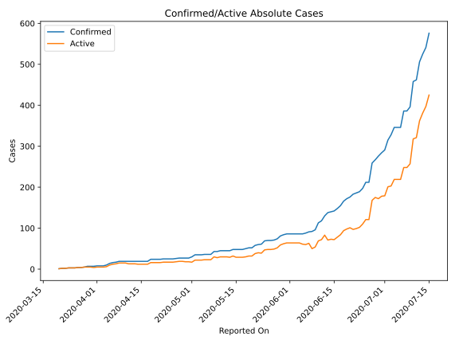
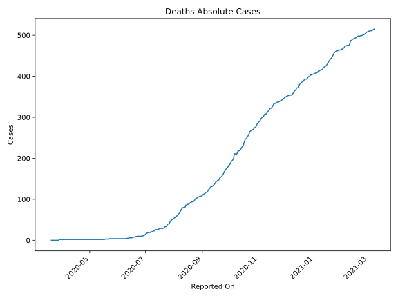
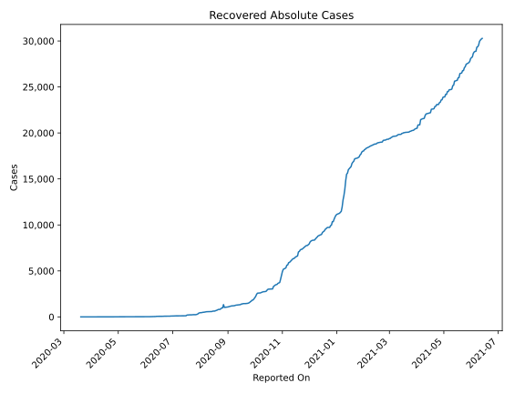
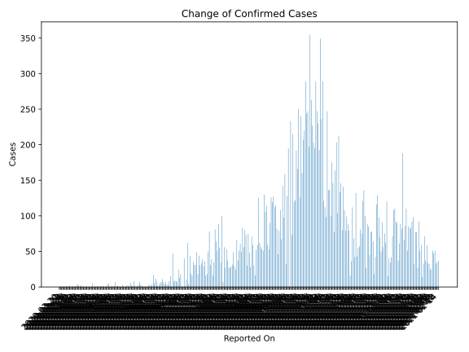
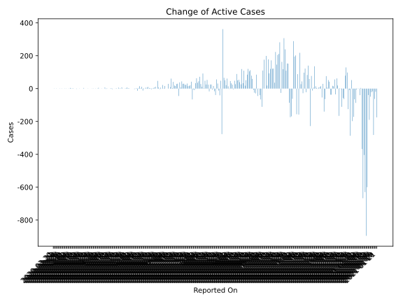
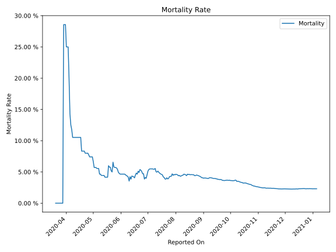

# Country Figures: Time Series for Angola 

| Reported On | Confirmed | Deaths | Recovered | Active | Mortality | &Delta; Confirmed | &Delta; Deaths | &Delta; Recovered | &Delta; Active | % Active of Population |
|-------------|-----------|--------|-----------|--------|-----------|-------------------|----------------|-------------------|----------------|------------------------|
| 2020-04-27 | 27 | 2 | 6 | 19 |  7.41 %  | 1 | 0 | 0 | 1 |  0.000 %  | 
| 2020-04-26 | 26 | 2 | 6 | 18 |  7.69 %  | 1 | 0 | 0 | 1 |  0.000 %  | 
| 2020-04-25 | 25 | 2 | 6 | 17 |  8.00 %  | 0 | 0 | 0 | 0 |  0.000 %  | 
| 2020-04-24 | 25 | 2 | 6 | 17 |  8.00 %  | 0 | 0 | 0 | 0 |  0.000 %  | 
| 2020-04-23 | 25 | 2 | 6 | 17 |  8.00 %  | 0 | 0 | 0 | 0 |  0.000 %  | 
| 2020-04-22 | 25 | 2 | 6 | 17 |  8.00 %  | 1 | 0 | 0 | 1 |  0.000 %  | 
| 2020-04-21 | 24 | 2 | 6 | 16 |  8.33 %  | 0 | 0 | 0 | 0 |  0.000 %  | 
| 2020-04-20 | 24 | 2 | 6 | 16 |  8.33 %  | 0 | 0 | 0 | 0 |  0.000 %  | 
| 2020-04-19 | 24 | 2 | 6 | 16 |  8.33 %  | 0 | 0 | 0 | 0 |  0.000 %  | 
| 2020-04-18 | 24 | 2 | 6 | 16 |  8.33 %  | 5 | 0 | 1 | 4 |  0.000 %  | 
| 2020-04-17 | 19 | 2 | 5 | 12 |  10.53 %  | 0 | 0 | 0 | 0 |  0.000 %  | 
| 2020-04-16 | 19 | 2 | 5 | 12 |  10.53 %  | 0 | 0 | 0 | 0 |  0.000 %  | 
| 2020-04-15 | 19 | 2 | 5 | 12 |  10.53 %  | 0 | 0 | 0 | 0 |  0.000 %  | 
| 2020-04-14 | 19 | 2 | 5 | 12 |  10.53 %  | 0 | 0 | 1 | -1 |  0.000 %  | 
| 2020-04-13 | 19 | 2 | 4 | 13 |  10.53 %  | 0 | 0 | 0 | 0 |  0.000 %  | 
| 2020-04-12 | 19 | 2 | 4 | 13 |  10.53 %  | 0 | 0 | 0 | 0 |  0.000 %  | 
| 2020-04-11 | 19 | 2 | 4 | 13 |  10.53 %  | 0 | 0 | 2 | -2 |  0.000 %  | 
| 2020-04-10 | 19 | 2 | 2 | 15 |  10.53 %  | 0 | 0 | 0 | 0 |  0.000 %  | 
| 2020-04-09 | 19 | 2 | 2 | 15 |  10.53 %  | 0 | 0 | 0 | 0 |  0.000 %  | 
| 2020-04-08 | 19 | 2 | 2 | 15 |  10.53 %  | 2 | 0 | 0 | 2 |  0.000 %  | 
| 2020-04-07 | 17 | 2 | 2 | 13 |  11.76 %  | 1 | 0 | 0 | 1 |  0.000 %  | 
| 2020-04-06 | 16 | 2 | 2 | 12 |  12.50 %  | 2 | 0 | 0 | 2 |  0.000 %  | 
| 2020-04-05 | 14 | 2 | 2 | 10 |  14.29 %  | 4 | 0 | 0 | 4 |  0.000 %  | 
| 2020-04-04 | 10 | 2 | 2 | 6 |  20.00 %  | 2 | 0 | 1 | 1 |  0.000 %  | 
| 2020-04-03 | 8 | 2 | 1 | 5 |  25.00 %  | 0 | 0 | 0 | 0 |  0.000 %  | 
| 2020-04-02 | 8 | 2 | 1 | 5 |  25.00 %  | 0 | 0 | 0 | 0 |  0.000 %  | 
| 2020-04-01 | 8 | 2 | 1 | 5 |  25.00 %  | 1 | 0 | 0 | 1 |  0.000 %  | 
| 2020-03-31 | 7 | 2 | 1 | 4 |  28.57 %  | 0 | 0 | 1 | -1 |  0.000 %  | 
| 2020-03-30 | 7 | 2 | 0 | 5 |  28.57 %  | 0 | 0 | 0 | 0 |  0.000 %  | 
| 2020-03-29 | 7 | 2 | 0 | 5 |  28.57 %  | 2 | 2 | 0 | 0 |  0.000 %  | 
| 2020-03-28 | 5 | 0 | 0 | 5 |  None  | 1 | 0 | 0 | 1 |  0.000 %  | 
| 2020-03-27 | 4 | 0 | 0 | 4 |  None  | 0 | 0 | 0 | 0 |  0.000 %  | 
| 2020-03-26 | 4 | 0 | 0 | 4 |  None  | 1 | 0 | 0 | 1 |  0.000 %  | 
| 2020-03-25 | 3 | 0 | 0 | 3 |  None  | 0 | 0 | 0 | 0 |  0.000 %  | 
| 2020-03-24 | 3 | 0 | 0 | 3 |  None  | 0 | 0 | 0 | 0 |  0.000 %  | 
| 2020-03-23 | 3 | 0 | 0 | 3 |  None  | 1 | 0 | 0 | 1 |  0.000 %  | 
| 2020-03-22 | 2 | 0 | 0 | 2 |  None  | 0 | 0 | 0 | 0 |  0.000 %  | 
| 2020-03-21 | 2 | 0 | 0 | 2 |  None  | 1 | 0 | 0 | 1 |  0.000 %  | 
| 2020-03-20 | 1 | 0 | 0 | 1 |  None  | None | None | None | None |  0.000 %  | 

