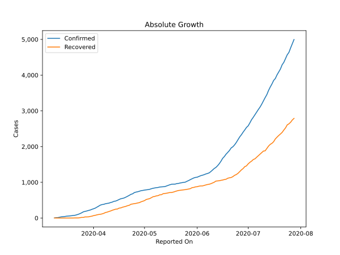
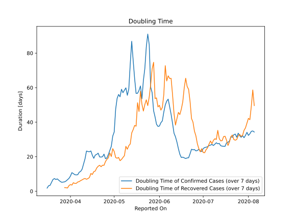

# Country Figures: Doubling Time of Infections for Albania 

The doubling time below are calculated based on
* an exponential growth assumption
* for time difference of past seven (7) days.
The doubling time's unit is "days".

The first doubling time indicates the increase of confirmed (infected)
cases. There, the *higher* the number is, the better is to take control
of the disease.

The second doubling time indicates the increase of recovered (healed)
cases. There, the *lower* the number is, the better it is to take
control of the disease.

| Reported On | Confirmed | Doubling Time (Confirmed) | Recovered | Doubling Time (Recovered) |
|-------------|-----------|---------------------------|-----------|---------------------------|
| 2020-04-14 | 475 |  22.9 days  | 248 |  7.9 days  | 
| 2020-04-13 | 467 |  23.0 days  | 232 |  7.3 days  | 
| 2020-04-12 | 446 |  23.3 days  | 217 |  6.9 days  | 
| 2020-04-11 | 433 |  18.8 days  | 197 |  7.4 days  | 
| 2020-04-10 | 416 |  15.8 days  | 182 |  7.1 days  | 
| 2020-04-09 | 409 |  12.8 days  | 165 |  6.6 days  | 
| 2020-04-08 | 400 |  11.5 days  | 154 |  6.2 days  | 
| 2020-04-07 | 383 |  11.0 days  | 131 |  5.6 days  | 
| 2020-04-06 | 377 |  9.6 days  | 116 |  5.3 days  | 
| 2020-04-05 | 361 |  9.5 days  | 104 |  4.6 days  | 
| 2020-04-04 | 333 |  9.6 days  | 99 |  4.5 days  | 
| 2020-04-03 | 304 |  10.2 days  | 89 |  4.9 days  | 
| 2020-04-02 | 277 |  10.8 days  | 76 |  3.6 days  | 
| 2020-04-01 | 259 |  8.8 days  | 67 |  3.9 days  | 
| 2020-03-31 | 243 |  7.5 days  | 52 |  3.3 days  | 
| 2020-03-30 | 223 |  6.7 days  | 44 |  1.9 days  | 
| 2020-03-29 | 212 |  5.9 days  | 33 |  2.1 days  | 
| 2020-03-28 | 197 |  5.4 days  | 31 |  2.1 days  | 
| 2020-03-27 | 186 |  5.3 days  | 31 |  None  | 
| 2020-03-26 | 174 |  5.2 days  | 17 |  None  | 
| 2020-03-25 | 146 |  5.7 days  | 17 |  None  | 
| 2020-03-24 | 123 |  6.4 days  | 10 |  None  | 
| 2020-03-23 | 104 |  7.2 days  | 2 |  None  | 
| 2020-03-22 | 89 |  6.8 days  | 2 |  None  | 
| 2020-03-21 | 76 |  7.3 days  | 2 |  None  | 
| 2020-03-20 | 70 |  6.8 days  | 0 |  None  | 
| 2020-03-19 | 64 |  5.1 days  | 0 |  None  | 
| 2020-03-18 | 59 |  3.4 days  | 0 |  None  | 
| 2020-03-17 | 55 |  3.2 days  | 0 |  None  | 
| 2020-03-16 | 51 |  1.8 days  | 0 |  None  | 
| 2020-03-15 | 42 |  None  | 0 |  None  | 
| 2020-03-14 | 38 |  None  | 0 |  None  | 
| 2020-03-13 | 33 |  None  | 0 |  None  | 
| 2020-03-12 | 23 |  None  | 0 |  None  | 
| 2020-03-11 | 12 |  None  | 0 |  None  | 
| 2020-03-10 | 10 |  None  | 0 |  None  | 
| 2020-03-09 | 2 |  None  | 0 |  None  | 

