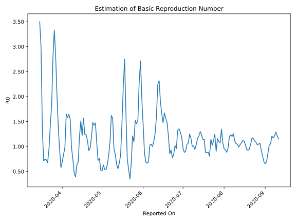

# Country Figures: Time Series for Basic Reproduction Number of Albania 

| Reported On | &Delta; Confirmed | Total &Delta; Confirmed First Interval | Total &Delta; Confirmed Second Interval | Estimated Basic Reproduction Number R0 | 
|-------------|-------------------|----------------------------------------|-----------------------------------------|---------------------------------------------------|
| 2020-05-07 | 10 |  43  |  39  |  1.10  | 
| 2020-05-06 | 12 |  38  |  46  |  0.83  | 
| 2020-05-05 | 17 |  30  |  47  |  0.64  | 
| 2020-05-04 | 8 |  29  |  54  |  0.54  | 
| 2020-05-03 | 6 |  39  |  72  |  0.54  | 
| 2020-05-02 | 7 |  46  |  73  |  0.63  | 
| 2020-05-01 | 9 |  47  |  92  |  0.51  | 
| 2020-04-30 | 7 |  54  |  103  |  0.52  | 
| 2020-04-29 | 16 |  72  |  94  |  0.77  | 
| 2020-04-28 | 14 |  73  |  101  |  0.72  | 
| 2020-04-27 | 10 |  92  |  86  |  1.07  | 
| 2020-04-26 | 14 |  103  |  70  |  1.47  | 
| 2020-04-25 | 34 |  94  |  66  |  1.42  | 
| 2020-04-24 | 15 |  101  |  68  |  1.49  | 
| 2020-04-23 | 29 |  86  |  73  |  1.18  | 
| 2020-04-22 | 25 |  70  |  72  |  0.97  | 
| 2020-04-21 | 25 |  66  |  72  |  0.92  | 
| 2020-04-20 | 22 |  68  |  61  |  1.11  | 
| 2020-04-19 | 14 |  73  |  59  |  1.24  | 
| 2020-04-18 | 9 |  72  |  58  |  1.24  | 
| 2020-04-17 | 21 |  72  |  46  |  1.57  | 
| 2020-04-16 | 24 |  61  |  50  |  1.22  | 
| 2020-04-15 | 19 |  59  |  39  |  1.51  | 
| 2020-04-14 | 8 |  58  |  48  |  1.21  | 
| 2020-04-13 | 21 |  46  |  67  |  0.69  | 
| 2020-04-12 | 13 |  50  |  79  |  0.63  | 
| 2020-04-11 | 17 |  39  |  100  |  0.39  | 
| 2020-04-10 | 7 |  48  |  102  |  0.47  | 
| 2020-04-09 | 9 |  67  |  90  |  0.74  | 
| 2020-04-08 | 17 |  79  |  81  |  0.98  | 
| 2020-04-07 | 6 |  100  |  65  |  1.54  | 
| 2020-04-06 | 16 |  102  |  62  |  1.65  | 
| 2020-04-05 | 28 |  90  |  57  |  1.58  | 
| 2020-04-04 | 29 |  81  |  49  |  1.65  | 
| 2020-04-03 | 27 |  65  |  66  |  0.98  | 
| 2020-04-02 | 18 |  62  |  74  |  0.84  | 
| 2020-04-01 | 16 |  57  |  82  |  0.70  | 
| 2020-03-31 | 20 |  49  |  85  |  0.58  | 
| 2020-03-30 | 11 |  66  |  70  |  0.94  | 
| 2020-03-29 | 15 |  74  |  53  |  1.40  | 
| 2020-03-28 | 11 |  82  |  40  |  2.05  | 
| 2020-03-27 | 12 |  85  |  30  |  2.83  | 
| 2020-03-26 | 28 |  70  |  21  |  3.33  | 
| 2020-03-25 | 23 |  53  |  19  |  2.79  | 
| 2020-03-24 | 19 |  40  |  22  |  1.82  | 
| 2020-03-23 | 15 |  30  |  21  |  1.43  | 
| 2020-03-22 | 13 |  21  |  22  |  0.95  | 
| 2020-03-21 | 6 |  19  |  28  |  0.68  | 
| 2020-03-20 | 6 |  22  |  30  |  0.73  | 
| 2020-03-19 | 5 |  21  |  28  |  0.75  | 
| 2020-03-18 | 4 |  22  |  31  |  0.71  | 
| 2020-03-17 | 4 |  28  |  21  |  1.33  | 
| 2020-03-16 | 9 |  30  |  10  |  3.00  | 
| 2020-03-15 | 4 |  28  |  8  |  3.50  | 
| 2020-03-14 | 5 |  31  |  None  |  None  | 
| 2020-03-13 | 10 |  21  |  None  |  None  | 
| 2020-03-12 | 11 |  10  |  None  |  None  | 
| 2020-03-11 | 2 |  8  |  None  |  None  | 
| 2020-03-10 | 8 |  None  |  None  |  None  | 
| 2020-03-09 | None |  None  |  None  |  None  | 

