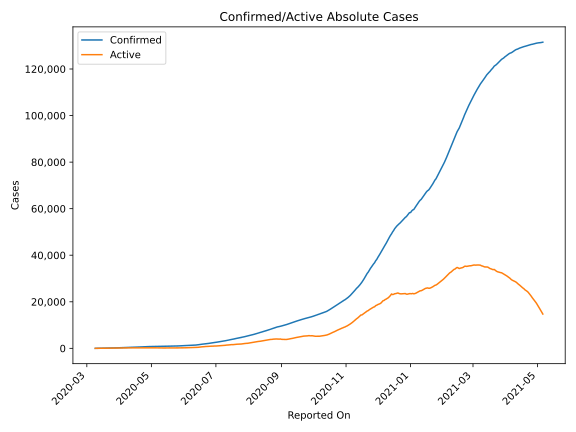
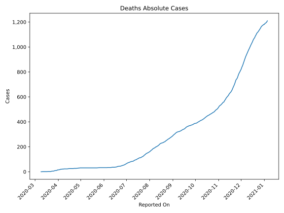
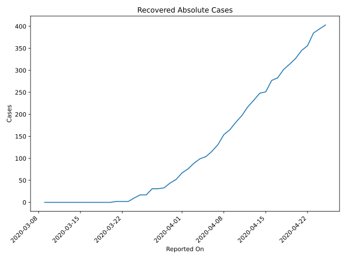
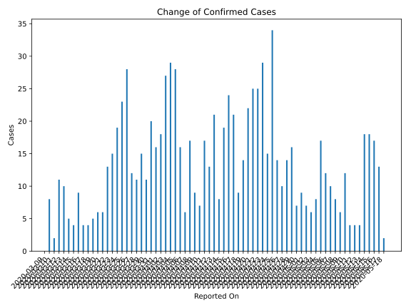
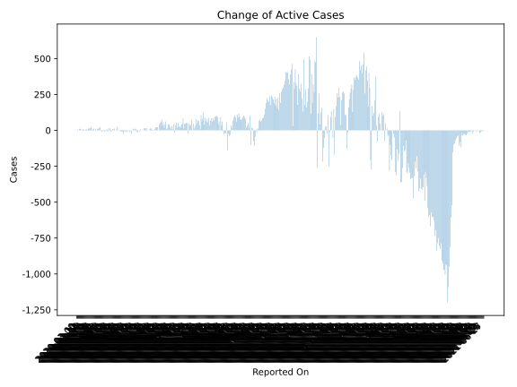
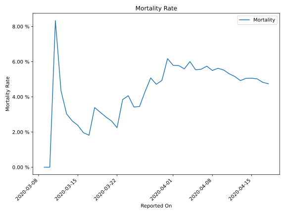

# Country Figures: Time Series for Albania 

| Reported On | Confirmed | Deaths | Recovered | Active | Mortality | &Delta; Confirmed | &Delta; Deaths | &Delta; Active | % Active of Population |
|-------------|-----------|--------|-----------|--------|-----------|-------------------|----------------|----------------|------------------------|
| 2020-04-06 | 377 | 21 | 116 | 240 |  5.57 %  | 16 | 1 | 3 |  0.008 %  | 
| 2020-04-05 | 361 | 20 | 104 | 237 |  5.54 %  | 28 | 0 | 23 |  0.008 %  | 
| 2020-04-04 | 333 | 20 | 99 | 214 |  6.01 %  | 29 | 3 | 16 |  0.007 %  | 
| 2020-04-03 | 304 | 17 | 89 | 198 |  5.59 %  | 27 | 1 | 13 |  0.007 %  | 
| 2020-04-02 | 277 | 16 | 76 | 185 |  5.78 %  | 18 | 1 | 8 |  0.006 %  | 
| 2020-04-01 | 259 | 15 | 67 | 177 |  5.79 %  | 16 | 0 | 1 |  0.006 %  | 
| 2020-03-31 | 243 | 15 | 52 | 176 |  6.17 %  | 20 | 4 | 8 |  0.006 %  | 
| 2020-03-30 | 223 | 11 | 44 | 168 |  4.93 %  | 11 | 1 | -1 |  0.006 %  | 
| 2020-03-29 | 212 | 10 | 33 | 169 |  4.72 %  | 15 | 0 | 13 |  0.006 %  | 
| 2020-03-28 | 197 | 10 | 31 | 156 |  5.08 %  | 11 | 2 | 9 |  0.005 %  | 
| 2020-03-27 | 186 | 8 | 31 | 147 |  4.30 %  | 12 | 2 | -4 |  0.005 %  | 
| 2020-03-26 | 174 | 6 | 17 | 151 |  3.45 %  | 28 | 1 | 27 |  0.005 %  | 
| 2020-03-25 | 146 | 5 | 17 | 124 |  3.42 %  | 23 | 0 | 16 |  0.004 %  | 
| 2020-03-24 | 123 | 5 | 10 | 108 |  4.07 %  | 19 | 1 | 10 |  0.004 %  | 
| 2020-03-23 | 104 | 4 | 2 | 98 |  3.85 %  | 15 | 2 | 13 |  0.003 %  | 
| 2020-03-22 | 89 | 2 | 2 | 85 |  2.25 %  | 13 | 0 | 13 |  0.003 %  | 
| 2020-03-21 | 76 | 2 | 2 | 72 |  2.63 %  | 6 | 0 | 4 |  0.003 %  | 
| 2020-03-20 | 70 | 2 | 0 | 68 |  2.86 %  | 6 | 0 | 6 |  0.002 %  | 
| 2020-03-19 | 64 | 2 | 0 | 62 |  3.12 %  | 5 | 0 | 5 |  0.002 %  | 
| 2020-03-18 | 59 | 2 | 0 | 57 |  3.39 %  | 4 | 1 | 3 |  0.002 %  | 
| 2020-03-17 | 55 | 1 | 0 | 54 |  1.82 %  | 4 | 0 | 4 |  0.002 %  | 
| 2020-03-16 | 51 | 1 | 0 | 50 |  1.96 %  | 9 | 0 | 9 |  0.002 %  | 
| 2020-03-15 | 42 | 1 | 0 | 41 |  2.38 %  | 4 | 0 | 4 |  0.001 %  | 
| 2020-03-14 | 38 | 1 | 0 | 37 |  2.63 %  | 5 | 0 | 5 |  0.001 %  | 
| 2020-03-13 | 33 | 1 | 0 | 32 |  3.03 %  | 10 | 0 | 10 |  0.001 %  | 
| 2020-03-12 | 23 | 1 | 0 | 22 |  4.35 %  | 11 | 0 | 11 |  0.001 %  | 
| 2020-03-11 | 12 | 1 | 0 | 11 |  8.33 %  | 2 | 1 | 1 |  0.000 %  | 
| 2020-03-10 | 10 | 0 | 0 | 10 |  None  | 8 | 0 | 8 |  0.000 %  | 
| 2020-03-09 | 2 | 0 | 0 | 2 |  None  | None | None | None |  0.000 %  | 

