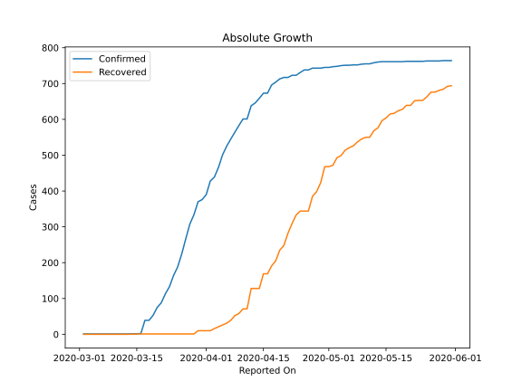
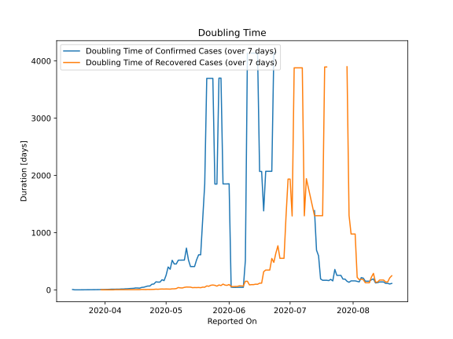

# Country Figures: Doubling Time of Infections for Andorra 

The doubling time below are calculated based on
* an exponential growth assumption
* for time difference of past seven (7) days.
The doubling time's unit is "days".

The first doubling time indicates the increase of confirmed (infected)
cases. There, the *higher* the number is, the better is to take control
of the disease.

The second doubling time indicates the increase of recovered (healed)
cases. There, the *lower* the number is, the better it is to take
control of the disease.

| Reported On | Confirmed | Doubling Time (Confirmed) | Recovered | Doubling Time (Recovered) |
|-------------|-----------|---------------------------|-----------|---------------------------|
| 2020-04-26 | 738 |  141.1 days  | 344 |  13.1 days  | 
| 2020-04-25 | 738 |  103.2 days  | 344 |  9.7 days  | 
| 2020-04-24 | 731 |  99.2 days  | 344 |  8.6 days  | 
| 2020-04-23 | 723 |  68.1 days  | 333 |  7.5 days  | 
| 2020-04-22 | 723 |  68.1 days  | 309 |  8.4 days  | 
| 2020-04-21 | 717 |  57.9 days  | 282 |  6.5 days  | 
| 2020-04-20 | 717 |  46.9 days  | 248 |  7.7 days  | 
| 2020-04-19 | 713 |  44.0 days  | 235 |  8.3 days  | 
| 2020-04-18 | 704 |  31.0 days  | 205 |  4.9 days  | 
| 2020-04-17 | 696 |  33.4 days  | 191 |  5.2 days  | 
| 2020-04-16 | 673 |  34.1 days  | 169 |  4.9 days  | 
| 2020-04-15 | 673 |  27.8 days  | 169 |  4.5 days  | 
| 2020-04-14 | 659 |  25.9 days  | 128 |  4.4 days  | 
| 2020-04-13 | 646 |  23.7 days  | 128 |  3.8 days  | 
| 2020-04-12 | 638 |  20.4 days  | 128 |  3.4 days  | 
| 2020-04-11 | 601 |  19.4 days  | 71 |  4.3 days  | 
| 2020-04-10 | 601 |  15.8 days  | 71 |  3.6 days  | 
| 2020-04-09 | 583 |  16.0 days  | 58 |  3.1 days  | 
| 2020-04-08 | 564 |  13.5 days  | 52 |  3.3 days  | 
| 2020-04-07 | 545 |  13.4 days  | 39 |  3.9 days  | 
| 2020-04-06 | 525 |  14.2 days  | 31 |  4.6 days  | 
| 2020-04-05 | 501 |  12.3 days  | 26 |  1.8 days  | 
| 2020-04-04 | 466 |  12.1 days  | 21 |  1.9 days  | 
| 2020-04-03 | 439 |  10.1 days  | 16 |  2.1 days  | 
| 2020-04-02 | 428 |  7.8 days  | 10 |  2.4 days  | 
| 2020-04-01 | 390 |  7.0 days  | 10 |  2.4 days  | 
| 2020-03-31 | 376 |  6.2 days  | 10 |  2.4 days  | 
| 2020-03-30 | 370 |  5.1 days  | 10 |  2.4 days  | 
| 2020-03-29 | 334 |  4.8 days  | 1 |  None  | 
| 2020-03-28 | 308 |  4.2 days  | 1 |  None  | 
| 2020-03-27 | 267 |  4.2 days  | 1 |  None  | 
| 2020-03-26 | 224 |  3.7 days  | 1 |  None  | 
| 2020-03-25 | 188 |  3.4 days  | 1 |  None  | 
| 2020-03-24 | 164 |  3.7 days  | 1 |  None  | 
| 2020-03-23 | 133 |  1.5 days  | 1 |  None  | 
| 2020-03-22 | 113 |  1.3 days  | 1 |  None  | 
| 2020-03-21 | 88 |  1.4 days  | 1 |  None  | 
| 2020-03-20 | 75 |  1.4 days  | 1 |  None  | 
| 2020-03-19 | 53 |  1.5 days  | 1 |  None  | 
| 2020-03-18 | 39 |  1.6 days  | 1 |  None  | 
| 2020-03-17 | 39 |  1.6 days  | 1 |  None  | 
| 2020-03-16 | 2 |  7.3 days  | 1 |  None  | 
| 2020-03-13 | 1 |  None  | 0 |  None  | 
| 2020-03-11 | 1 |  None  | 0 |  None  | 
| 2020-03-10 | 1 |  None  | 0 |  None  | 
| 2020-03-09 | 1 |  None  | 0 |  None  | 
| 2020-03-08 | 1 |  None  | 0 |  None  | 
| 2020-03-07 | 1 |  None  | 0 |  None  | 
| 2020-03-06 | 1 |  None  | 0 |  None  | 
| 2020-03-05 | 1 |  None  | 0 |  None  | 
| 2020-03-04 | 1 |  None  | 0 |  None  | 
| 2020-03-03 | 1 |  None  | 0 |  None  | 
| 2020-03-02 | 1 |  None  | 0 |  None  | 

