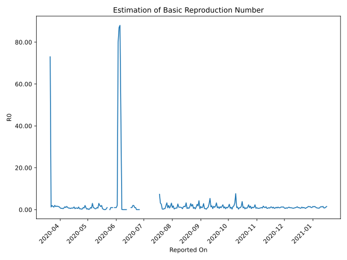

# Country Figures: Time Series for Basic Reproduction Number of Andorra 

| Reported On | &Delta; Confirmed | Total &Delta; Confirmed First Interval | Total &Delta; Confirmed Second Interval | Estimated Basic Reproduction Number R0 | 
|-------------|-------------------|----------------------------------------|-----------------------------------------|---------------------------------------------------|
| 2020-04-28 | 0 |  20  |  10  |  2.00  | 
| 2020-04-27 | 5 |  15  |  19  |  0.79  | 
| 2020-04-26 | 0 |  21  |  21  |  1.00  | 
| 2020-04-25 | 7 |  14  |  44  |  0.32  | 
| 2020-04-24 | 8 |  10  |  40  |  0.25  | 
| 2020-04-23 | 0 |  19  |  45  |  0.42  | 
| 2020-04-22 | 6 |  21  |  50  |  0.42  | 
| 2020-04-21 | 0 |  44  |  35  |  1.26  | 
| 2020-04-20 | 4 |  40  |  72  |  0.56  | 
| 2020-04-19 | 9 |  45  |  58  |  0.78  | 
| 2020-04-18 | 8 |  50  |  63  |  0.79  | 
| 2020-04-17 | 23 |  35  |  74  |  0.47  | 
| 2020-04-16 | 0 |  72  |  56  |  1.29  | 
| 2020-04-15 | 14 |  58  |  76  |  0.76  | 
| 2020-04-14 | 13 |  63  |  82  |  0.77  | 
| 2020-04-13 | 8 |  74  |  98  |  0.76  | 
| 2020-04-12 | 37 |  56  |  106  |  0.53  | 
| 2020-04-11 | 0 |  76  |  97  |  0.78  | 
| 2020-04-10 | 18 |  82  |  111  |  0.74  | 
| 2020-04-09 | 19 |  98  |  90  |  1.09  | 
| 2020-04-08 | 19 |  106  |  69  |  1.54  | 
| 2020-04-07 | 20 |  97  |  94  |  1.03  | 
| 2020-04-06 | 24 |  111  |  82  |  1.35  | 
| 2020-04-05 | 35 |  90  |  109  |  0.83  | 
| 2020-04-04 | 27 |  69  |  146  |  0.47  | 
| 2020-04-03 | 11 |  94  |  146  |  0.64  | 
| 2020-04-02 | 38 |  82  |  144  |  0.57  | 
| 2020-04-01 | 14 |  109  |  134  |  0.81  | 
| 2020-03-31 | 6 |  146  |  111  |  1.32  | 
| 2020-03-30 | 36 |  146  |  100  |  1.46  | 
| 2020-03-29 | 26 |  144  |  89  |  1.62  | 
| 2020-03-28 | 41 |  134  |  80  |  1.68  | 
| 2020-03-27 | 43 |  111  |  74  |  1.50  | 
| 2020-03-26 | 36 |  100  |  49  |  2.04  | 
| 2020-03-25 | 24 |  89  |  73  |  1.22  | 
| 2020-03-24 | 31 |  80  |  52  |  1.54  | 
| 2020-03-23 | 20 |  74  |  38  |  1.95  | 
| 2020-03-22 | 25 |  49  |  38  |  1.29  | 
| 2020-03-21 | 13 |  73  |  1  |  73.00  | 
| 2020-03-20 | 22 |  52  |  None  |  None  | 
| 2020-03-19 | 14 |  38  |  None  |  None  | 
| 2020-03-18 | 0 |  38  |  None  |  None  | 
| 2020-03-17 | 37 |  1  |  None  |  None  | 
| 2020-03-16 | 1 |  None  |  None  |  None  | 
| 2020-03-15 | 0 |  None  |  None  |  None  | 
| 2020-03-14 | 0 |  None  |  None  |  None  | 
| 2020-03-13 | 0 |  None  |  None  |  None  | 
| 2020-03-12 | 0 |  None  |  None  |  None  | 
| 2020-03-11 | 0 |  None  |  None  |  None  | 
| 2020-03-10 | 0 |  None  |  None  |  None  | 
| 2020-03-09 | 0 |  None  |  None  |  None  | 
| 2020-03-08 | 0 |  None  |  None  |  None  | 
| 2020-03-07 | 0 |  None  |  None  |  None  | 
| 2020-03-06 | 0 |  None  |  None  |  None  | 
| 2020-03-05 | 0 |  None  |  None  |  None  | 
| 2020-03-04 | 0 |  None  |  None  |  None  | 
| 2020-03-03 | 0 |  None  |  None  |  None  | 
| 2020-03-02 | None |  None  |  None  |  None  | 

