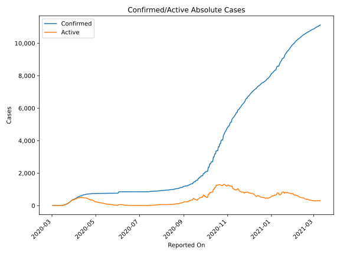
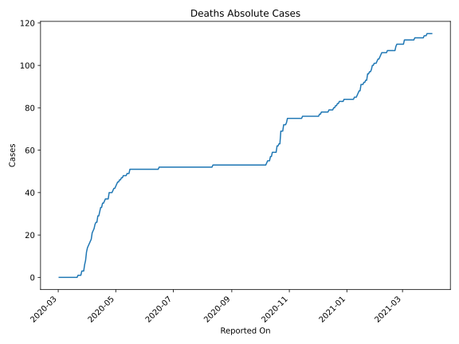
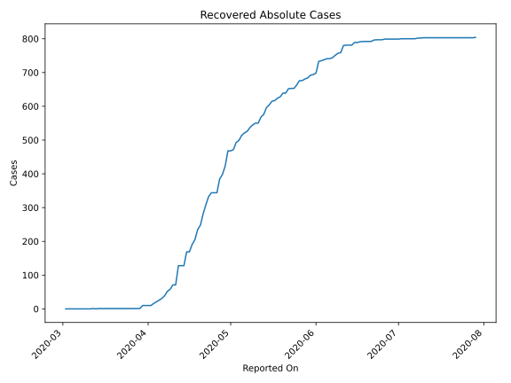
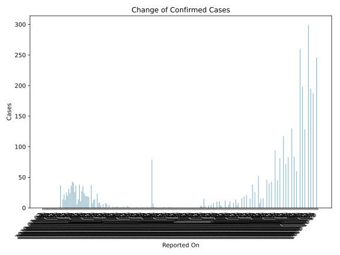
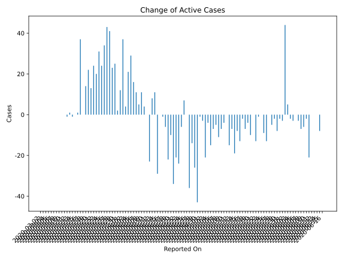
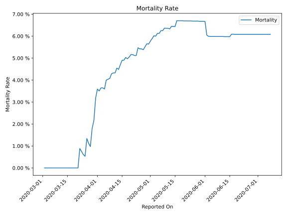

# Country Figures: Time Series for Andorra 

| Reported On | Confirmed | Deaths | Recovered | Active | Mortality | &Delta; Confirmed | &Delta; Deaths | &Delta; Active | % Active of Population |
|-------------|-----------|--------|-----------|--------|-----------|-------------------|----------------|----------------|------------------------|
| 2020-03-21 | 88 | 0 | 1 | 87 |  None  | 13 | 0 | 13 |  0.113 %  | 
| 2020-03-20 | 75 | 0 | 1 | 74 |  None  | 22 | 0 | 22 |  0.096 %  | 
| 2020-03-19 | 53 | 0 | 1 | 52 |  None  | 14 | 0 | 14 |  0.068 %  | 
| 2020-03-18 | 39 | 0 | 1 | 38 |  None  | 0 | 0 | 0 |  0.049 %  | 
| 2020-03-17 | 39 | 0 | 1 | 38 |  None  | 37 | 0 | 37 |  0.049 %  | 
| 2020-03-16 | 2 | 0 | 1 | 1 |  None  | 1 | 0 | 1 |  0.001 %  | 
| 2020-03-15 | 1 | 0 | 1 | 0 |  None  | 0 | 0 | 0 |  n/a  | 
| 2020-03-14 | 1 | 0 | 1 | 0 |  None  | 0 | 0 | -1 |  n/a  | 
| 2020-03-13 | 1 | 0 | 0 | 1 |  None  | 0 | 0 | 1 |  0.001 %  | 
| 2020-03-12 | 1 | 0 | 1 | 0 |  None  | 0 | 0 | -1 |  n/a  | 
| 2020-03-11 | 1 | 0 | 0 | 1 |  None  | 0 | 0 | 0 |  0.001 %  | 
| 2020-03-10 | 1 | 0 | 0 | 1 |  None  | 0 | 0 | 0 |  0.001 %  | 
| 2020-03-09 | 1 | 0 | 0 | 1 |  None  | 0 | 0 | 0 |  0.001 %  | 
| 2020-03-08 | 1 | 0 | 0 | 1 |  None  | 0 | 0 | 0 |  0.001 %  | 
| 2020-03-07 | 1 | 0 | 0 | 1 |  None  | 0 | 0 | 0 |  0.001 %  | 
| 2020-03-06 | 1 | 0 | 0 | 1 |  None  | 0 | 0 | 0 |  0.001 %  | 
| 2020-03-05 | 1 | 0 | 0 | 1 |  None  | 0 | 0 | 0 |  0.001 %  | 
| 2020-03-04 | 1 | 0 | 0 | 1 |  None  | 0 | 0 | 0 |  0.001 %  | 
| 2020-03-03 | 1 | 0 | 0 | 1 |  None  | 0 | 0 | 0 |  0.001 %  | 
| 2020-03-02 | 1 | 0 | 0 | 1 |  None  | None | None | None |  0.001 %  | 

