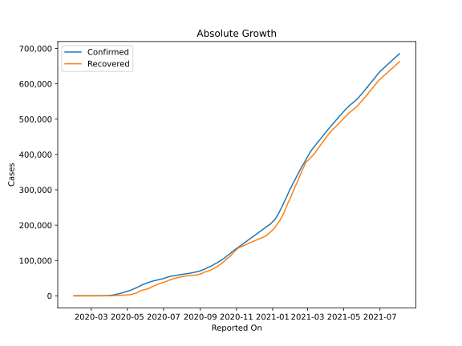
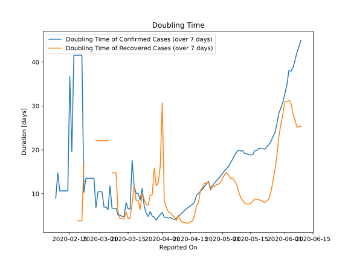

# Country Figures: Doubling Time of Infections for UnitedArab Emirates 

The doubling time below are calculated based on
* an exponential growth assumption
* for time difference of past seven (7) days.
The doubling time's unit is "days".

The first doubling time indicates the increase of confirmed (infected)
cases. There, the *higher* the number is, the better is to take control
of the disease.

The second doubling time indicates the increase of recovered (healed)
cases. There, the *lower* the number is, the better it is to take
control of the disease.

| Reported On | Confirmed | Doubling Time (Confirmed) | Recovered | Doubling Time (Recovered) |
|-------------|-----------|---------------------------|-----------|---------------------------|
| 2020-04-12 | 4123 |  6.2 days  | 680 |  3.5 days  | 
| 2020-04-11 | 3736 |  5.7 days  | 588 |  3.5 days  | 
| 2020-04-10 | 3360 |  5.3 days  | 418 |  3.9 days  | 
| 2020-04-09 | 2990 |  4.9 days  | 268 |  5.1 days  | 
| 2020-04-08 | 2659 |  4.4 days  | 239 |  3.9 days  | 
| 2020-04-07 | 2359 |  4.2 days  | 186 |  4.7 days  | 
| 2020-04-06 | 2076 |  4.3 days  | 167 |  5.2 days  | 
| 2020-04-05 | 1799 |  4.6 days  | 144 |  5.7 days  | 
| 2020-04-04 | 1505 |  4.5 days  | 125 |  5.9 days  | 
| 2020-04-03 | 1264 |  4.6 days  | 108 |  7.0 days  | 
| 2020-04-02 | 1024 |  4.7 days  | 96 |  8.3 days  | 
| 2020-04-01 | 814 |  5.8 days  | 61 |  30.7 days  | 
| 2020-03-31 | 664 |  5.3 days  | 61 |  16.3 days  | 
| 2020-03-30 | 611 |  4.6 days  | 61 |  12.6 days  | 
| 2020-03-29 | 570 |  4.0 days  | 58 |  11.8 days  | 
| 2020-03-28 | 468 |  4.7 days  | 52 |  15.8 days  | 
| 2020-03-27 | 405 |  4.9 days  | 52 |  9.7 days  | 
| 2020-03-26 | 333 |  5.9 days  | 52 |  9.7 days  | 
| 2020-03-25 | 333 |  4.8 days  | 52 |  7.3 days  | 
| 2020-03-24 | 248 |  5.6 days  | 45 |  7.6 days  | 
| 2020-03-23 | 198 |  7.2 days  | 41 |  8.7 days  | 
| 2020-03-22 | 153 |  11.2 days  | 38 |  10.0 days  | 
| 2020-03-21 | 153 |  8.6 days  | 38 |  6.4 days  | 
| 2020-03-20 | 140 |  10.1 days  | 31 |  8.4 days  | 
| 2020-03-19 | 140 |  10.1 days  | 31 |  8.4 days  | 
| 2020-03-18 | 113 |  11.8 days  | 26 |  11.8 days  | 
| 2020-03-17 | 98 |  17.6 days  | 23 |  7.8 days  | 
| 2020-03-16 | 98 |  6.6 days  | 23 |  4.4 days  | 
| 2020-03-15 | 98 |  6.6 days  | 23 |  4.4 days  | 
| 2020-03-14 | 85 |  8.0 days  | 17 |  5.8 days  | 
| 2020-03-13 | 85 |  4.9 days  | 17 |  4.3 days  | 
| 2020-03-12 | 85 |  4.9 days  | 17 |  4.3 days  | 
| 2020-03-11 | 74 |  5.2 days  | 17 |  4.3 days  | 
| 2020-03-10 | 74 |  5.2 days  | 12 |  5.9 days  | 
| 2020-03-09 | 45 |  6.7 days  | 7 |  14.8 days  | 
| 2020-03-08 | 45 |  6.7 days  | 7 |  14.8 days  | 
| 2020-03-07 | 45 |  6.7 days  | 7 |  14.8 days  | 
| 2020-03-06 | 29 |  11.8 days  | 5 |  None  | 
| 2020-03-05 | 29 |  6.4 days  | 5 |  22.1 days  | 
| 2020-03-04 | 27 |  7.0 days  | 5 |  22.1 days  | 
| 2020-03-03 | 27 |  7.0 days  | 5 |  22.1 days  | 
| 2020-03-02 | 21 |  10.5 days  | 5 |  22.1 days  | 
| 2020-03-01 | 21 |  10.5 days  | 5 |  22.1 days  | 
| 2020-02-29 | 21 |  10.5 days  | 5 |  22.1 days  | 
| 2020-02-28 | 19 |  6.8 days  | 5 |  22.1 days  | 
| 2020-02-27 | 13 |  13.5 days  | 4 |  None  | 
| 2020-02-26 | 13 |  13.5 days  | 4 |  None  | 
| 2020-02-25 | 13 |  13.5 days  | 4 |  None  | 
| 2020-02-24 | 13 |  13.5 days  | 4 |  None  | 
| 2020-02-23 | 13 |  13.5 days  | 4 |  None  | 
| 2020-02-22 | 13 |  10.3 days  | 4 |  17.2 days  | 
| 2020-02-21 | 9 |  41.5 days  | 4 |  3.8 days  | 
| 2020-02-20 | 9 |  41.5 days  | 4 |  3.8 days  | 
| 2020-02-19 | 9 |  41.5 days  | 4 |  3.8 days  | 
| 2020-02-18 | 9 |  41.5 days  | 4 |  None  | 
| 2020-02-17 | 9 |  41.5 days  | 4 |  None  | 
| 2020-02-16 | 9 |  19.7 days  | 4 |  None  | 
| 2020-02-15 | 8 |  36.7 days  | 3 |  None  | 
| 2020-02-14 | 8 |  10.7 days  | 1 |  None  | 
| 2020-02-13 | 8 |  10.7 days  | 1 |  None  | 
| 2020-02-12 | 8 |  10.7 days  | 1 |  None  | 
| 2020-02-11 | 8 |  10.7 days  | 0 |  None  | 
| 2020-02-10 | 8 |  10.7 days  | 0 |  None  | 
| 2020-02-09 | 7 |  14.8 days  | 0 |  None  | 
| 2020-02-08 | 7 |  9.0 days  | 0 |  None  | 
| 2020-02-07 | 5 |  None  | 0 |  None  | 
| 2020-02-06 | 5 |  None  | 0 |  None  | 
| 2020-02-05 | 5 |  None  | 0 |  None  | 
| 2020-02-04 | 5 |  None  | 0 |  None  | 
| 2020-02-03 | 5 |  None  | 0 |  None  | 
| 2020-02-02 | 5 |  None  | 0 |  None  | 
| 2020-02-01 | 4 |  None  | 0 |  None  | 

