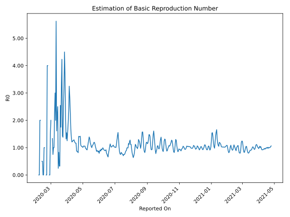

# Country Figures: Time Series for Basic Reproduction Number of UnitedArab Emirates 

| Reported On | &Delta; Confirmed | Total &Delta; Confirmed First Interval | Total &Delta; Confirmed Second Interval | Estimated Basic Reproduction Number R0 | 
|-------------|-------------------|----------------------------------------|-----------------------------------------|---------------------------------------------------|
| 2020-05-06 | 546 |  2154  |  2199  |  0.98  | 
| 2020-05-05 | 462 |  2249  |  2132  |  1.05  | 
| 2020-05-04 | 567 |  2234  |  2116  |  1.06  | 
| 2020-05-03 | 564 |  2219  |  2099  |  1.06  | 
| 2020-05-02 | 561 |  2199  |  2083  |  1.06  | 
| 2020-05-01 | 557 |  2132  |  2111  |  1.01  | 
| 2020-04-30 | 552 |  2116  |  2058  |  1.03  | 
| 2020-04-29 | 549 |  2099  |  2016  |  1.04  | 
| 2020-04-28 | 541 |  2083  |  1975  |  1.05  | 
| 2020-04-27 | 490 |  2111  |  1936  |  1.09  | 
| 2020-04-26 | 536 |  2058  |  1453  |  1.42  | 
| 2020-04-25 | 532 |  2016  |  1440  |  1.40  | 
| 2020-04-24 | 525 |  1975  |  1416  |  1.39  | 
| 2020-04-23 | 518 |  1936  |  1369  |  1.41  | 
| 2020-04-22 | 483 |  1453  |  1781  |  0.82  | 
| 2020-04-21 | 490 |  1440  |  1702  |  0.85  | 
| 2020-04-20 | 484 |  1416  |  1629  |  0.87  | 
| 2020-04-19 | 479 |  1369  |  1573  |  0.87  | 
| 2020-04-18 | 0 |  1781  |  1531  |  1.16  | 
| 2020-04-17 | 477 |  1702  |  1464  |  1.16  | 
| 2020-04-16 | 460 |  1629  |  1377  |  1.18  | 
| 2020-04-15 | 432 |  1573  |  1284  |  1.23  | 
| 2020-04-14 | 412 |  1531  |  1191  |  1.29  | 
| 2020-04-13 | 398 |  1464  |  1154  |  1.27  | 
| 2020-04-12 | 387 |  1377  |  1095  |  1.26  | 
| 2020-04-11 | 376 |  1284  |  1052  |  1.22  | 
| 2020-04-10 | 370 |  1191  |  985  |  1.21  | 
| 2020-04-09 | 331 |  1154  |  841  |  1.37  | 
| 2020-04-08 | 300 |  1095  |  653  |  1.68  | 
| 2020-04-07 | 283 |  1052  |  454  |  2.32  | 
| 2020-04-06 | 277 |  985  |  346  |  2.85  | 
| 2020-04-05 | 294 |  841  |  259  |  3.25  | 
| 2020-04-04 | 241 |  653  |  278  |  2.35  | 
| 2020-04-03 | 240 |  454  |  237  |  1.92  | 
| 2020-04-02 | 210 |  346  |  220  |  1.57  | 
| 2020-04-01 | 150 |  259  |  207  |  1.25  | 
| 2020-03-31 | 53 |  278  |  180  |  1.54  | 
| 2020-03-30 | 41 |  237  |  180  |  1.32  | 
| 2020-03-29 | 102 |  220  |  108  |  2.04  | 
| 2020-03-28 | 63 |  207  |  58  |  3.57  | 
| 2020-03-27 | 72 |  180  |  40  |  4.50  | 
| 2020-03-26 | 0 |  180  |  55  |  3.27  | 
| 2020-03-25 | 85 |  108  |  42  |  2.57  | 
| 2020-03-24 | 50 |  58  |  42  |  1.38  | 
| 2020-03-23 | 45 |  40  |  28  |  1.43  | 
| 2020-03-22 | 0 |  55  |  13  |  4.23  | 
| 2020-03-21 | 13 |  42  |  13  |  3.23  | 
| 2020-03-20 | 0 |  42  |  24  |  1.75  | 
| 2020-03-19 | 27 |  28  |  11  |  2.55  | 
| 2020-03-18 | 15 |  13  |  40  |  0.33  | 
| 2020-03-17 | 0 |  13  |  40  |  0.33  | 
| 2020-03-16 | 0 |  24  |  29  |  0.83  | 
| 2020-03-15 | 13 |  11  |  45  |  0.24  | 
| 2020-03-14 | 0 |  40  |  16  |  2.50  | 
| 2020-03-13 | 0 |  40  |  18  |  2.22  | 
| 2020-03-12 | 11 |  29  |  18  |  1.61  | 
| 2020-03-11 | 0 |  45  |  8  |  5.62  | 
| 2020-03-10 | 29 |  16  |  8  |  2.00  | 
| 2020-03-09 | 0 |  18  |  6  |  3.00  | 
| 2020-03-08 | 0 |  18  |  8  |  2.25  | 
| 2020-03-07 | 16 |  8  |  8  |  1.00  | 
| 2020-03-06 | 0 |  8  |  8  |  1.00  | 
| 2020-03-05 | 2 |  6  |  8  |  0.75  | 
| 2020-03-04 | 0 |  8  |  6  |  1.33  | 
| 2020-03-03 | 6 |  8  |  None  |  None  | 
| 2020-03-02 | 0 |  8  |  None  |  None  | 
| 2020-03-01 | 0 |  8  |  4  |  2.00  | 
| 2020-02-29 | 2 |  6  |  4  |  1.50  | 
| 2020-02-28 | 6 |  None  |  4  |  None  | 
| 2020-02-27 | 0 |  None  |  4  |  None  | 
| 2020-02-26 | 0 |  4  |  None  |  None  | 
| 2020-02-25 | 0 |  4  |  None  |  None  | 
| 2020-02-24 | 0 |  4  |  1  |  4.00  | 
| 2020-02-23 | 0 |  4  |  1  |  4.00  | 
| 2020-02-22 | 4 |  None  |  1  |  None  | 
| 2020-02-21 | 0 |  None  |  1  |  None  | 
| 2020-02-20 | 0 |  1  |  None  |  None  | 
| 2020-02-19 | 0 |  1  |  None  |  None  | 
| 2020-02-18 | 0 |  1  |  1  |  1.00  | 
| 2020-02-17 | 0 |  1  |  1  |  1.00  | 
| 2020-02-16 | 1 |  None  |  3  |  None  | 
| 2020-02-15 | 0 |  None  |  3  |  None  | 
| 2020-02-14 | 0 |  1  |  2  |  0.50  | 
| 2020-02-13 | 0 |  1  |  2  |  0.50  | 
| 2020-02-12 | 0 |  3  |  None  |  None  | 
| 2020-02-11 | 0 |  3  |  None  |  None  | 
| 2020-02-10 | 1 |  2  |  1  |  2.00  | 
| 2020-02-09 | 0 |  2  |  1  |  2.00  | 
| 2020-02-08 | 2 |  None  |  1  |  None  | 
| 2020-02-07 | 0 |  None  |  1  |  None  | 
| 2020-02-06 | 0 |  1  |  None  |  None  | 
| 2020-02-05 | 0 |  1  |  None  |  None  | 
| 2020-02-04 | 0 |  1  |  None  |  None  | 
| 2020-02-03 | 0 |  1  |  None  |  None  | 
| 2020-02-02 | 1 |  None  |  None  |  None  | 
| 2020-02-01 | 0 |  None  |  None  |  None  | 
| 2020-01-31 | 0 |  None  |  None  |  None  | 
| 2020-01-30 | 0 |  None  |  None  |  None  | 
| 2020-01-29 | None |  None  |  None  |  None  | 

