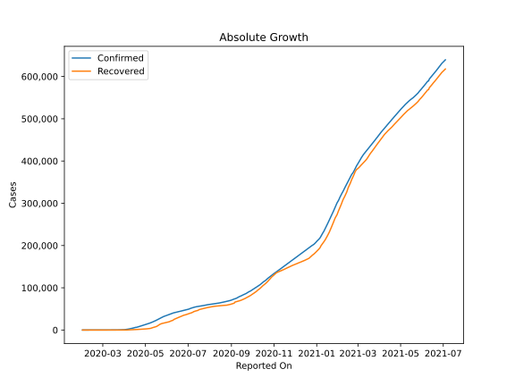
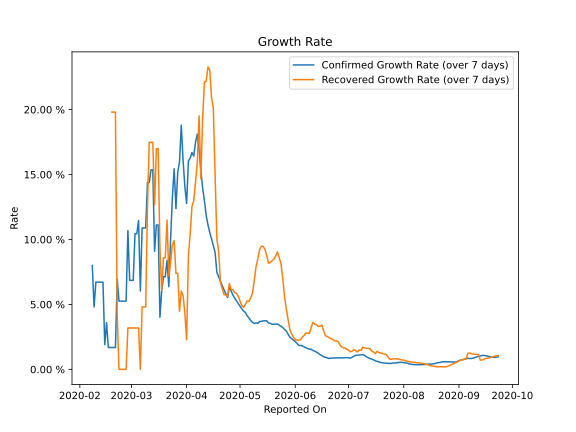

# Country Figures: Growth Rate for UnitedArab Emirates 

The growth rates below are calculated based on
* an exponential growth assumption
* for time difference of past seven (7) days.
The growth rate is to be understood as on "growth per day".

The first growth rate indicates the increase of confirmed (infected) cases.

The second growth rate indicates the increase of recovered (healed) cases.

| Reported On | Confirmed | Growth Rate (Confirmed) | Recovered | Growth Rate (Recovered) |
|-------------|-----------|-------------------------|-----------|-------------------------|
| 2020-04-19 | 6781 |  7.11 %  | 1286 |  9.103 %  | 
| 2020-04-18 | 6302 |  7.47 %  | 1188 |  10.047 %  | 
| 2020-04-17 | 6302 |  8.98 %  | 1188 |  14.922 %  | 
| 2020-04-16 | 5825 |  9.53 %  | 1095 |  20.107 %  | 
| 2020-04-15 | 5365 |  10.03 %  | 1034 |  20.925 %  | 
| 2020-04-14 | 4933 |  10.54 %  | 933 |  23.038 %  | 
| 2020-04-13 | 4521 |  11.12 %  | 852 |  23.280 %  | 
| 2020-04-12 | 4123 |  11.85 %  | 680 |  22.175 %  | 
| 2020-04-11 | 3736 |  12.99 %  | 588 |  22.120 %  | 
| 2020-04-10 | 3360 |  13.97 %  | 418 |  19.334 %  | 
| 2020-04-09 | 2990 |  15.31 %  | 268 |  14.666 %  | 
| 2020-04-08 | 2659 |  16.91 %  | 239 |  19.508 %  | 
| 2020-04-07 | 2359 |  18.11 %  | 186 |  15.927 %  | 
| 2020-04-06 | 2076 |  17.47 %  | 167 |  14.387 %  | 
| 2020-04-05 | 1799 |  16.42 %  | 144 |  12.991 %  | 
| 2020-04-04 | 1505 |  16.69 %  | 125 |  12.530 %  | 
| 2020-04-03 | 1264 |  16.26 %  | 108 |  10.441 %  | 
| 2020-04-02 | 1024 |  16.05 %  | 96 |  8.759 %  | 
| 2020-04-01 | 814 |  12.77 %  | 61 |  2.280 %  | 
| 2020-03-31 | 664 |  14.07 %  | 61 |  4.346 %  | 
| 2020-03-30 | 611 |  16.10 %  | 61 |  5.676 %  | 
| 2020-03-29 | 570 |  18.79 %  | 58 |  6.041 %  | 
| 2020-03-28 | 468 |  15.97 %  | 52 |  4.481 %  | 
| 2020-03-27 | 405 |  15.17 %  | 52 |  7.389 %  | 
| 2020-03-26 | 333 |  12.38 %  | 52 |  7.389 %  | 
| 2020-03-25 | 333 |  15.44 %  | 52 |  9.902 %  | 
| 2020-03-24 | 248 |  13.26 %  | 45 |  9.588 %  | 
| 2020-03-23 | 198 |  10.05 %  | 41 |  8.258 %  | 
| 2020-03-22 | 153 |  6.36 %  | 38 |  7.173 %  | 
| 2020-03-21 | 153 |  8.40 %  | 38 |  11.491 %  | 
| 2020-03-20 | 140 |  7.13 %  | 31 |  8.582 %  | 
| 2020-03-19 | 140 |  7.13 %  | 31 |  8.582 %  | 
| 2020-03-18 | 113 |  6.05 %  | 26 |  6.070 %  | 
| 2020-03-17 | 98 |  4.01 %  | 23 |  9.294 %  | 
| 2020-03-16 | 98 |  11.12 %  | 23 |  16.994 %  | 
| 2020-03-15 | 98 |  11.12 %  | 23 |  16.994 %  | 
| 2020-03-14 | 85 |  9.09 %  | 17 |  12.676 %  | 
| 2020-03-13 | 85 |  15.36 %  | 17 |  17.483 %  | 
| 2020-03-12 | 85 |  15.36 %  | 17 |  17.483 %  | 
| 2020-03-11 | 74 |  14.40 %  | 17 |  17.483 %  | 
| 2020-03-10 | 74 |  14.40 %  | 12 |  12.507 %  | 
| 2020-03-09 | 45 |  10.89 %  | 7 |  4.807 %  | 
| 2020-03-08 | 45 |  10.89 %  | 7 |  4.807 %  | 
| 2020-03-07 | 45 |  10.89 %  | 7 |  4.807 %  | 
| 2020-03-06 | 29 |  6.04 %  | 5 |  None  | 
| 2020-03-05 | 29 |  11.46 %  | 5 |  3.188 %  | 
| 2020-03-04 | 27 |  10.44 %  | 5 |  3.188 %  | 
| 2020-03-03 | 27 |  10.44 %  | 5 |  3.188 %  | 
| 2020-03-02 | 21 |  6.85 %  | 5 |  3.188 %  | 
| 2020-03-01 | 21 |  6.85 %  | 5 |  3.188 %  | 
| 2020-02-29 | 21 |  6.85 %  | 5 |  3.188 %  | 
| 2020-02-28 | 19 |  10.67 %  | 5 |  3.188 %  | 
| 2020-02-27 | 13 |  5.25 %  | 4 |  None  | 
| 2020-02-26 | 13 |  5.25 %  | 4 |  None  | 
| 2020-02-25 | 13 |  5.25 %  | 4 |  None  | 
| 2020-02-24 | 13 |  5.25 %  | 4 |  None  | 
| 2020-02-23 | 13 |  5.25 %  | 4 |  None  | 
| 2020-02-22 | 13 |  6.94 %  | 4 |  4.110 %  | 
| 2020-02-21 | 9 |  1.68 %  | 4 |  19.804 %  | 
| 2020-02-20 | 9 |  1.68 %  | 4 |  19.804 %  | 
| 2020-02-19 | 9 |  1.68 %  | 4 |  19.804 %  | 
| 2020-02-18 | 9 |  1.68 %  | 4 |  None  | 
| 2020-02-17 | 9 |  1.68 %  | 4 |  None  | 
| 2020-02-16 | 9 |  3.59 %  | 4 |  None  | 
| 2020-02-15 | 8 |  1.91 %  | 3 |  None  | 
| 2020-02-14 | 8 |  6.71 %  | 1 |  None  | 
| 2020-02-13 | 8 |  6.71 %  | 1 |  None  | 
| 2020-02-12 | 8 |  6.71 %  | 1 |  None  | 
| 2020-02-11 | 8 |  6.71 %  | 0 |  None  | 
| 2020-02-10 | 8 |  6.71 %  | 0 |  None  | 
| 2020-02-09 | 7 |  4.81 %  | 0 |  None  | 
| 2020-02-08 | 7 |  7.99 %  | 0 |  None  | 
| 2020-02-07 | 5 |  None  | 0 |  None  | 
| 2020-02-06 | 5 |  None  | 0 |  None  | 
| 2020-02-05 | 5 |  None  | 0 |  None  | 
| 2020-02-04 | 5 |  None  | 0 |  None  | 
| 2020-02-03 | 5 |  None  | 0 |  None  | 
| 2020-02-02 | 5 |  None  | 0 |  None  | 
| 2020-02-01 | 4 |  None  | 0 |  None  | 

