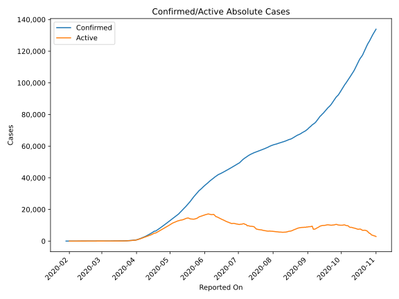
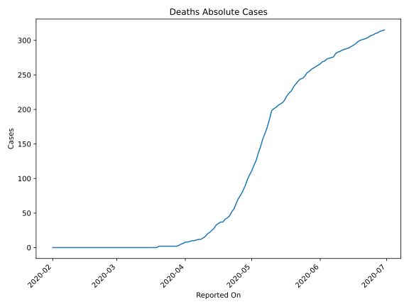
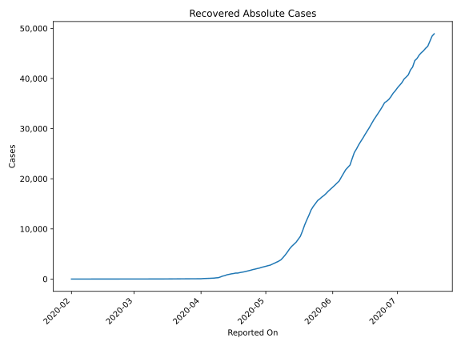
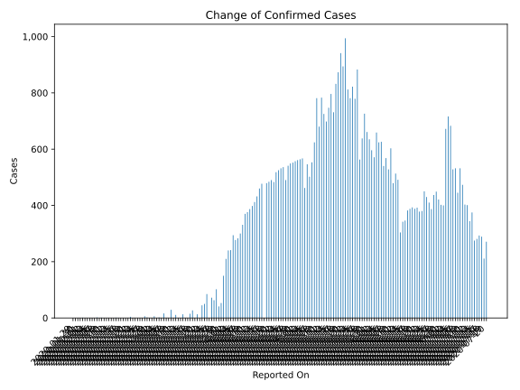
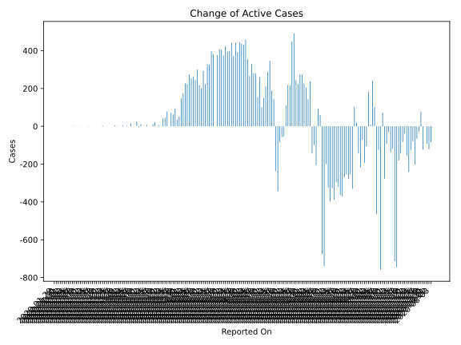
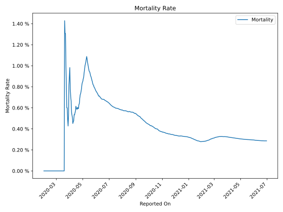

# Country Figures: Time Series for UnitedArab Emirates 

| Reported On | Confirmed | Deaths | Recovered | Active | Mortality | &Delta; Confirmed | &Delta; Deaths | &Delta; Recovered | &Delta; Active | % Active of Population |
|-------------|-----------|--------|-----------|--------|-----------|-------------------|----------------|-------------------|----------------|------------------------|
| 2020-04-29 | 11929 | 98 | 2329 | 9502 |  0.82 %  | 549 | 9 | 148 | 392 |  0.099 %  | 
| 2020-04-28 | 11380 | 89 | 2181 | 9110 |  0.78 %  | 541 | 7 | 91 | 443 |  0.095 %  | 
| 2020-04-27 | 10839 | 82 | 2090 | 8667 |  0.76 %  | 490 | 6 | 112 | 372 |  0.090 %  | 
| 2020-04-26 | 10349 | 76 | 1978 | 8295 |  0.73 %  | 536 | 5 | 91 | 440 |  0.086 %  | 
| 2020-04-25 | 9813 | 71 | 1887 | 7855 |  0.72 %  | 532 | 7 | 127 | 398 |  0.082 %  | 
| 2020-04-24 | 9281 | 64 | 1760 | 7457 |  0.69 %  | 525 | 8 | 123 | 394 |  0.077 %  | 
| 2020-04-23 | 8756 | 56 | 1637 | 7063 |  0.64 %  | 518 | 4 | 91 | 423 |  0.073 %  | 
| 2020-04-22 | 8238 | 52 | 1546 | 6640 |  0.63 %  | 483 | 6 | 103 | 374 |  0.069 %  | 
| 2020-04-21 | 7755 | 46 | 1443 | 6266 |  0.59 %  | 490 | 3 | 83 | 404 |  0.065 %  | 
| 2020-04-20 | 7265 | 43 | 1360 | 5862 |  0.59 %  | 484 | 2 | 74 | 408 |  0.061 %  | 
| 2020-04-19 | 6781 | 41 | 1286 | 5454 |  0.60 %  | 479 | 4 | 98 | 377 |  0.057 %  | 
| 2020-04-18 | 6302 | 37 | 1188 | 5077 |  0.59 %  | 0 | 0 | 0 | 0 |  0.053 %  | 
| 2020-04-17 | 6302 | 37 | 1188 | 5077 |  0.59 %  | 477 | 2 | 93 | 382 |  0.053 %  | 
| 2020-04-16 | 5825 | 35 | 1095 | 4695 |  0.60 %  | 460 | 2 | 61 | 397 |  0.049 %  | 
| 2020-04-15 | 5365 | 33 | 1034 | 4298 |  0.62 %  | 432 | 5 | 101 | 326 |  0.045 %  | 
| 2020-04-14 | 4933 | 28 | 933 | 3972 |  0.57 %  | 412 | 3 | 81 | 328 |  0.041 %  | 
| 2020-04-13 | 4521 | 25 | 852 | 3644 |  0.55 %  | 398 | 3 | 172 | 223 |  0.038 %  | 
| 2020-04-12 | 4123 | 22 | 680 | 3421 |  0.53 %  | 387 | 2 | 92 | 293 |  0.036 %  | 
| 2020-04-11 | 3736 | 20 | 588 | 3128 |  0.54 %  | 376 | 4 | 170 | 202 |  0.032 %  | 
| 2020-04-10 | 3360 | 16 | 418 | 2926 |  0.48 %  | 370 | 2 | 150 | 218 |  0.030 %  | 
| 2020-04-09 | 2990 | 14 | 268 | 2708 |  0.47 %  | 331 | 2 | 29 | 300 |  0.028 %  | 
| 2020-04-08 | 2659 | 12 | 239 | 2408 |  0.45 %  | 300 | 0 | 53 | 247 |  0.025 %  | 
| 2020-04-07 | 2359 | 12 | 186 | 2161 |  0.51 %  | 283 | 1 | 19 | 263 |  0.022 %  | 
| 2020-04-06 | 2076 | 11 | 167 | 1898 |  0.53 %  | 277 | 1 | 23 | 253 |  0.020 %  | 
| 2020-04-05 | 1799 | 10 | 144 | 1645 |  0.56 %  | 294 | 0 | 19 | 275 |  0.017 %  | 
| 2020-04-04 | 1505 | 10 | 125 | 1370 |  0.66 %  | 241 | 1 | 17 | 223 |  0.014 %  | 
| 2020-04-03 | 1264 | 9 | 108 | 1147 |  0.71 %  | 240 | 1 | 12 | 227 |  0.012 %  | 
| 2020-04-02 | 1024 | 8 | 96 | 920 |  0.78 %  | 210 | 0 | 35 | 175 |  0.010 %  | 
| 2020-04-01 | 814 | 8 | 61 | 745 |  0.98 %  | 150 | 2 | 0 | 148 |  0.008 %  | 
| 2020-03-31 | 664 | 6 | 61 | 597 |  0.90 %  | 53 | 1 | 0 | 52 |  0.006 %  | 
| 2020-03-30 | 611 | 5 | 61 | 545 |  0.82 %  | 41 | 2 | 3 | 36 |  0.006 %  | 
| 2020-03-29 | 570 | 3 | 58 | 509 |  0.53 %  | 102 | 1 | 6 | 95 |  0.005 %  | 
| 2020-03-28 | 468 | 2 | 52 | 414 |  0.43 %  | 63 | 0 | 0 | 63 |  0.004 %  | 
| 2020-03-27 | 405 | 2 | 52 | 351 |  0.49 %  | 72 | 0 | 0 | 72 |  0.004 %  | 
| 2020-03-26 | 333 | 2 | 52 | 279 |  0.60 %  | 0 | 0 | 0 | 0 |  0.003 %  | 
| 2020-03-25 | 333 | 2 | 52 | 279 |  0.60 %  | 85 | 0 | 7 | 78 |  0.003 %  | 
| 2020-03-24 | 248 | 2 | 45 | 201 |  0.81 %  | 50 | 0 | 4 | 46 |  0.002 %  | 
| 2020-03-23 | 198 | 2 | 41 | 155 |  1.01 %  | 45 | 0 | 3 | 42 |  0.002 %  | 
| 2020-03-22 | 153 | 2 | 38 | 113 |  1.31 %  | 0 | 0 | 0 | 0 |  0.001 %  | 
| 2020-03-21 | 153 | 2 | 38 | 113 |  1.31 %  | 13 | 0 | 7 | 6 |  0.001 %  | 
| 2020-03-20 | 140 | 2 | 31 | 107 |  1.43 %  | 0 | 2 | 0 | -2 |  0.001 %  | 
| 2020-03-19 | 140 | 0 | 31 | 109 |  None  | 27 | 0 | 5 | 22 |  0.001 %  | 
| 2020-03-18 | 113 | 0 | 26 | 87 |  None  | 15 | 0 | 3 | 12 |  0.001 %  | 
| 2020-03-17 | 98 | 0 | 23 | 75 |  None  | 0 | 0 | 0 | 0 |  0.001 %  | 
| 2020-03-16 | 98 | 0 | 23 | 75 |  None  | 0 | 0 | 0 | 0 |  0.001 %  | 
| 2020-03-15 | 98 | 0 | 23 | 75 |  None  | 13 | 0 | 6 | 7 |  0.001 %  | 
| 2020-03-14 | 85 | 0 | 17 | 68 |  None  | 0 | 0 | 0 | 0 |  0.001 %  | 
| 2020-03-13 | 85 | 0 | 17 | 68 |  None  | 0 | 0 | 0 | 0 |  0.001 %  | 
| 2020-03-12 | 85 | 0 | 17 | 68 |  None  | 11 | 0 | 0 | 11 |  0.001 %  | 
| 2020-03-11 | 74 | 0 | 17 | 57 |  None  | 0 | 0 | 5 | -5 |  0.001 %  | 
| 2020-03-10 | 74 | 0 | 12 | 62 |  None  | 29 | 0 | 5 | 24 |  0.001 %  | 
| 2020-03-09 | 45 | 0 | 7 | 38 |  None  | 0 | 0 | 0 | 0 |  0.000 %  | 
| 2020-03-08 | 45 | 0 | 7 | 38 |  None  | 0 | 0 | 0 | 0 |  0.000 %  | 
| 2020-03-07 | 45 | 0 | 7 | 38 |  None  | 16 | 0 | 2 | 14 |  0.000 %  | 
| 2020-03-06 | 29 | 0 | 5 | 24 |  None  | 0 | 0 | 0 | 0 |  0.000 %  | 
| 2020-03-05 | 29 | 0 | 5 | 24 |  None  | 2 | 0 | 0 | 2 |  0.000 %  | 
| 2020-03-04 | 27 | 0 | 5 | 22 |  None  | 0 | 0 | 0 | 0 |  0.000 %  | 
| 2020-03-03 | 27 | 0 | 5 | 22 |  None  | 6 | 0 | 0 | 6 |  0.000 %  | 
| 2020-03-02 | 21 | 0 | 5 | 16 |  None  | 0 | 0 | 0 | 0 |  0.000 %  | 
| 2020-03-01 | 21 | 0 | 5 | 16 |  None  | 0 | 0 | 0 | 0 |  0.000 %  | 
| 2020-02-29 | 21 | 0 | 5 | 16 |  None  | 2 | 0 | 0 | 2 |  0.000 %  | 
| 2020-02-28 | 19 | 0 | 5 | 14 |  None  | 6 | 0 | 1 | 5 |  0.000 %  | 
| 2020-02-27 | 13 | 0 | 4 | 9 |  None  | 0 | 0 | 0 | 0 |  0.000 %  | 
| 2020-02-26 | 13 | 0 | 4 | 9 |  None  | 0 | 0 | 0 | 0 |  0.000 %  | 
| 2020-02-25 | 13 | 0 | 4 | 9 |  None  | 0 | 0 | 0 | 0 |  0.000 %  | 
| 2020-02-24 | 13 | 0 | 4 | 9 |  None  | 0 | 0 | 0 | 0 |  0.000 %  | 
| 2020-02-23 | 13 | 0 | 4 | 9 |  None  | 0 | 0 | 0 | 0 |  0.000 %  | 
| 2020-02-22 | 13 | 0 | 4 | 9 |  None  | 4 | 0 | 0 | 4 |  0.000 %  | 
| 2020-02-21 | 9 | 0 | 4 | 5 |  None  | 0 | 0 | 0 | 0 |  0.000 %  | 
| 2020-02-20 | 9 | 0 | 4 | 5 |  None  | 0 | 0 | 0 | 0 |  0.000 %  | 
| 2020-02-19 | 9 | 0 | 4 | 5 |  None  | 0 | 0 | 0 | 0 |  0.000 %  | 
| 2020-02-18 | 9 | 0 | 4 | 5 |  None  | 0 | 0 | 0 | 0 |  0.000 %  | 
| 2020-02-17 | 9 | 0 | 4 | 5 |  None  | 0 | 0 | 0 | 0 |  0.000 %  | 
| 2020-02-16 | 9 | 0 | 4 | 5 |  None  | 1 | 0 | 1 | 0 |  0.000 %  | 
| 2020-02-15 | 8 | 0 | 3 | 5 |  None  | 0 | 0 | 2 | -2 |  0.000 %  | 
| 2020-02-14 | 8 | 0 | 1 | 7 |  None  | 0 | 0 | 0 | 0 |  0.000 %  | 
| 2020-02-13 | 8 | 0 | 1 | 7 |  None  | 0 | 0 | 0 | 0 |  0.000 %  | 
| 2020-02-12 | 8 | 0 | 1 | 7 |  None  | 0 | 0 | 1 | -1 |  0.000 %  | 
| 2020-02-11 | 8 | 0 | 0 | 8 |  None  | 0 | 0 | 0 | 0 |  0.000 %  | 
| 2020-02-10 | 8 | 0 | 0 | 8 |  None  | 1 | 0 | 0 | 1 |  0.000 %  | 
| 2020-02-09 | 7 | 0 | 0 | 7 |  None  | 0 | 0 | 0 | 0 |  0.000 %  | 
| 2020-02-08 | 7 | 0 | 0 | 7 |  None  | 2 | 0 | 0 | 2 |  0.000 %  | 
| 2020-02-07 | 5 | 0 | 0 | 5 |  None  | 0 | 0 | 0 | 0 |  0.000 %  | 
| 2020-02-06 | 5 | 0 | 0 | 5 |  None  | 0 | 0 | 0 | 0 |  0.000 %  | 
| 2020-02-05 | 5 | 0 | 0 | 5 |  None  | 0 | 0 | 0 | 0 |  0.000 %  | 
| 2020-02-04 | 5 | 0 | 0 | 5 |  None  | 0 | 0 | 0 | 0 |  0.000 %  | 
| 2020-02-03 | 5 | 0 | 0 | 5 |  None  | 0 | 0 | 0 | 0 |  0.000 %  | 
| 2020-02-02 | 5 | 0 | 0 | 5 |  None  | 1 | 0 | 0 | 1 |  0.000 %  | 
| 2020-02-01 | 4 | 0 | 0 | 4 |  None  | 0 | None | None | None |  0.000 %  | 
| 2020-01-31 | 4 | None | None | None |  None  | 0 | None | None | None |  n/a  | 
| 2020-01-30 | 4 | None | None | None |  None  | 0 | None | None | None |  n/a  | 
| 2020-01-29 | 4 | None | None | None |  None  | None | None | None | None |  n/a  | 

