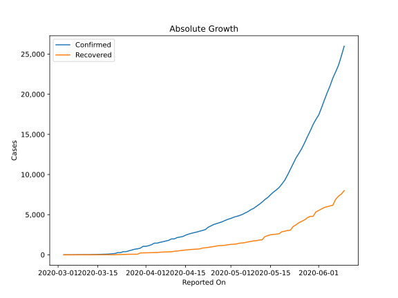
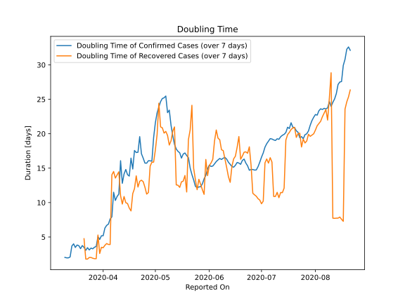

# Country Figures: Doubling Time of Infections for Argentina 

The doubling time below are calculated based on
* an exponential growth assumption
* for time difference of past seven (7) days.
The doubling time's unit is "days".

The first doubling time indicates the increase of confirmed (infected)
cases. There, the *higher* the number is, the better is to take control
of the disease.

The second doubling time indicates the increase of recovered (healed)
cases. There, the *lower* the number is, the better it is to take
control of the disease.

| Reported On | Confirmed | Doubling Time (Confirmed) | Recovered | Doubling Time (Recovered) |
|-------------|-----------|---------------------------|-----------|---------------------------|
| 2020-04-04 | 1451 |  6.9 days  | 279 |  3.9 days  | 
| 2020-04-03 | 1265 |  6.7 days  | 266 |  4.0 days  | 
| 2020-04-02 | 1133 |  6.3 days  | 256 |  3.8 days  | 
| 2020-04-01 | 1054 |  5.2 days  | 248 |  3.4 days  | 
| 2020-03-31 | 1054 |  5.2 days  | 240 |  3.5 days  | 
| 2020-03-30 | 820 |  4.6 days  | 228 |  2.6 days  | 
| 2020-03-29 | 745 |  5.0 days  | 72 |  5.3 days  | 
| 2020-03-28 | 690 |  3.6 days  | 72 |  1.9 days  | 
| 2020-03-27 | 589 |  3.5 days  | 72 |  1.9 days  | 
| 2020-03-26 | 502 |  3.3 days  | 63 |  1.9 days  | 
| 2020-03-25 | 387 |  3.4 days  | 52 |  2.0 days  | 
| 2020-03-24 | 387 |  3.1 days  | 52 |  2.0 days  | 
| 2020-03-23 | 266 |  3.4 days  | 27 |  1.8 days  | 
| 2020-03-22 | 266 |  3.1 days  | 27 |  1.8 days  | 
| 2020-03-21 | 158 |  3.5 days  | 3 |  4.8 days  | 
| 2020-03-20 | 128 |  3.8 days  | 3 |  None  | 
| 2020-03-19 | 97 |  3.3 days  | 3 |  None  | 
| 2020-03-18 | 79 |  3.7 days  | 3 |  None  | 
| 2020-03-17 | 68 |  3.8 days  | 3 |  None  | 
| 2020-03-16 | 56 |  3.5 days  | 1 |  None  | 
| 2020-03-15 | 45 |  4.0 days  | 1 |  None  | 
| 2020-03-14 | 34 |  3.7 days  | 1 |  None  | 
| 2020-03-13 | 31 |  2.1 days  | 0 |  None  | 
| 2020-03-12 | 19 |  2.0 days  | 0 |  None  | 
| 2020-03-11 | 19 |  2.0 days  | 0 |  None  | 
| 2020-03-10 | 17 |  2.0 days  | 0 |  None  | 
| 2020-03-09 | 12 |  None  | 0 |  None  | 
| 2020-03-08 | 12 |  None  | 0 |  None  | 
| 2020-03-07 | 8 |  None  | 0 |  None  | 
| 2020-03-06 | 2 |  None  | 0 |  None  | 
| 2020-03-05 | 1 |  None  | 0 |  None  | 
| 2020-03-04 | 1 |  None  | 0 |  None  | 
| 2020-03-03 | 1 |  None  | 0 |  None  | 

