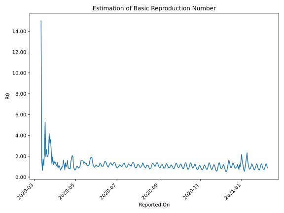

# Country Figures: Time Series for Basic Reproduction Number of Argentina 

| Reported On | &Delta; Confirmed | Total &Delta; Confirmed First Interval | Total &Delta; Confirmed Second Interval | Estimated Basic Reproduction Number R0 | 
|-------------|-------------------|----------------------------------------|-----------------------------------------|---------------------------------------------------|
| 2020-05-01 | 104 |  536  |  748  |  0.72  | 
| 2020-04-30 | 143 |  505  |  749  |  0.67  | 
| 2020-04-29 | 158 |  520  |  666  |  0.78  | 
| 2020-04-28 | 124 |  568  |  596  |  0.95  | 
| 2020-04-27 | 111 |  748  |  386  |  1.94  | 
| 2020-04-26 | 112 |  749  |  362  |  2.07  | 
| 2020-04-25 | 173 |  666  |  370  |  1.80  | 
| 2020-04-24 | 172 |  596  |  396  |  1.51  | 
| 2020-04-23 | 291 |  386  |  481  |  0.80  | 
| 2020-04-22 | 113 |  362  |  461  |  0.79  | 
| 2020-04-21 | 90 |  370  |  429  |  0.86  | 
| 2020-04-20 | 102 |  396  |  468  |  0.85  | 
| 2020-04-19 | 81 |  481  |  302  |  1.59  | 
| 2020-04-18 | 89 |  461  |  413  |  1.12  | 
| 2020-04-17 | 98 |  429  |  427  |  1.00  | 
| 2020-04-16 | 128 |  468  |  347  |  1.35  | 
| 2020-04-15 | 166 |  302  |  421  |  0.72  | 
| 2020-04-14 | 69 |  413  |  344  |  1.20  | 
| 2020-04-13 | 66 |  427  |  264  |  1.62  | 
| 2020-04-12 | 167 |  347  |  363  |  0.96  | 
| 2020-04-11 | 0 |  421  |  421  |  1.00  | 
| 2020-04-10 | 180 |  344  |  397  |  0.87  | 
| 2020-04-09 | 80 |  264  |  397  |  0.66  | 
| 2020-04-08 | 87 |  363  |  445  |  0.82  | 
| 2020-04-07 | 74 |  421  |  388  |  1.09  | 
| 2020-04-06 | 103 |  397  |  364  |  1.09  | 
| 2020-04-05 | 0 |  397  |  465  |  0.85  | 
| 2020-04-04 | 186 |  445  |  318  |  1.40  | 
| 2020-04-03 | 132 |  388  |  358  |  1.08  | 
| 2020-04-02 | 79 |  364  |  303  |  1.20  | 
| 2020-04-01 | 0 |  465  |  323  |  1.44  | 
| 2020-03-31 | 234 |  318  |  236  |  1.35  | 
| 2020-03-30 | 75 |  358  |  229  |  1.56  | 
| 2020-03-29 | 55 |  303  |  259  |  1.17  | 
| 2020-03-28 | 101 |  323  |  169  |  1.91  | 
| 2020-03-27 | 87 |  236  |  187  |  1.26  | 
| 2020-03-26 | 115 |  229  |  90  |  2.54  | 
| 2020-03-25 | 0 |  259  |  72  |  3.60  | 
| 2020-03-24 | 121 |  169  |  52  |  3.25  | 
| 2020-03-23 | 0 |  187  |  45  |  4.16  | 
| 2020-03-22 | 108 |  90  |  37  |  2.43  | 
| 2020-03-21 | 30 |  72  |  37  |  1.95  | 
| 2020-03-20 | 31 |  52  |  26  |  2.00  | 
| 2020-03-19 | 18 |  45  |  17  |  2.65  | 
| 2020-03-18 | 11 |  37  |  19  |  1.95  | 
| 2020-03-17 | 12 |  37  |  7  |  5.29  | 
| 2020-03-16 | 11 |  26  |  11  |  2.36  | 
| 2020-03-15 | 11 |  17  |  15  |  1.13  | 
| 2020-03-14 | 3 |  19  |  11  |  1.73  | 
| 2020-03-13 | 12 |  7  |  11  |  0.64  | 
| 2020-03-12 | 0 |  11  |  7  |  1.57  | 
| 2020-03-11 | 2 |  15  |  1  |  15.00  | 
| 2020-03-10 | 5 |  11  |  None  |  None  | 
| 2020-03-09 | 0 |  11  |  None  |  None  | 
| 2020-03-08 | 4 |  7  |  None  |  None  | 
| 2020-03-07 | 6 |  1  |  None  |  None  | 
| 2020-03-06 | 1 |  None  |  None  |  None  | 
| 2020-03-05 | 0 |  None  |  None  |  None  | 
| 2020-03-04 | 0 |  None  |  None  |  None  | 
| 2020-03-03 | None |  None  |  None  |  None  | 

