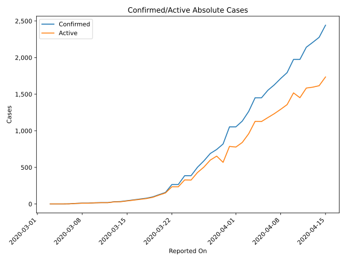
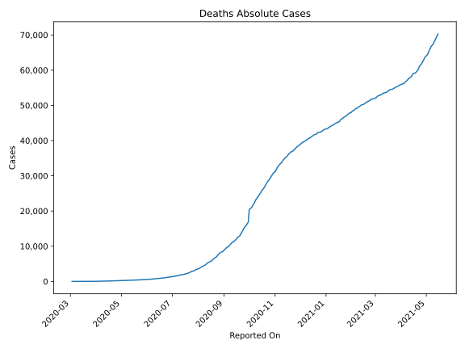
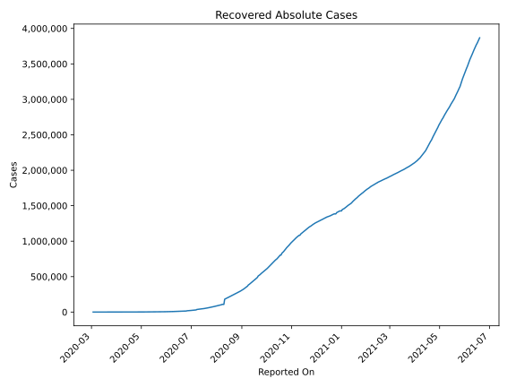
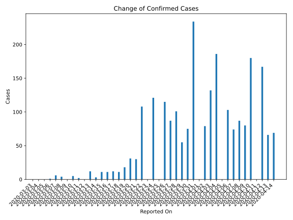
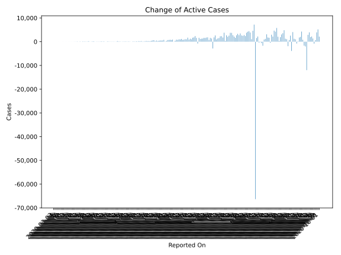
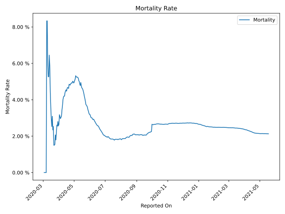

# Country Figures: Time Series for Argentina 

| Reported On | Confirmed | Deaths | Recovered | Active | Mortality | &Delta; Confirmed | &Delta; Deaths | &Delta; Recovered | &Delta; Active | % Active of Population |
|-------------|-----------|--------|-----------|--------|-----------|-------------------|----------------|-------------------|----------------|------------------------|
| 2020-04-27 | 4003 | 197 | 1140 | 2666 |  4.92 %  | 111 | 5 | 33 | 73 |  0.006 %  | 
| 2020-04-26 | 3892 | 192 | 1107 | 2593 |  4.93 %  | 112 | 7 | 77 | 28 |  0.006 %  | 
| 2020-04-25 | 3780 | 185 | 1030 | 2565 |  4.89 %  | 173 | 9 | 54 | 110 |  0.006 %  | 
| 2020-04-24 | 3607 | 176 | 976 | 2455 |  4.88 %  | 172 | 11 | 57 | 104 |  0.006 %  | 
| 2020-04-23 | 3435 | 165 | 919 | 2351 |  4.80 %  | 291 | 13 | 47 | 231 |  0.005 %  | 
| 2020-04-22 | 3144 | 152 | 872 | 2120 |  4.83 %  | 113 | 5 | 32 | 76 |  0.005 %  | 
| 2020-04-21 | 3031 | 147 | 840 | 2044 |  4.85 %  | 90 | 11 | 103 | -24 |  0.005 %  | 
| 2020-04-20 | 2941 | 136 | 737 | 2068 |  4.62 %  | 102 | 4 | 28 | 70 |  0.005 %  | 
| 2020-04-19 | 2839 | 132 | 709 | 1998 |  4.65 %  | 81 | 3 | 24 | 54 |  0.004 %  | 
| 2020-04-18 | 2758 | 129 | 685 | 1944 |  4.68 %  | 89 | 6 | 19 | 64 |  0.004 %  | 
| 2020-04-17 | 2669 | 123 | 666 | 1880 |  4.61 %  | 98 | 8 | 35 | 55 |  0.004 %  | 
| 2020-04-16 | 2571 | 115 | 631 | 1825 |  4.47 %  | 128 | 4 | 35 | 89 |  0.004 %  | 
| 2020-04-15 | 2443 | 111 | 596 | 1736 |  4.54 %  | 166 | 9 | 37 | 120 |  0.004 %  | 
| 2020-04-14 | 2277 | 102 | 559 | 1616 |  4.48 %  | 69 | 5 | 44 | 20 |  0.004 %  | 
| 2020-04-13 | 2208 | 97 | 515 | 1596 |  4.39 %  | 66 | 7 | 47 | 12 |  0.004 %  | 
| 2020-04-12 | 2142 | 90 | 468 | 1584 |  4.20 %  | 167 | 7 | 28 | 132 |  0.004 %  | 
| 2020-04-11 | 1975 | 83 | 440 | 1452 |  4.20 %  | 0 | 1 | 65 | -66 |  0.003 %  | 
| 2020-04-10 | 1975 | 82 | 375 | 1518 |  4.15 %  | 180 | 10 | 10 | 160 |  0.003 %  | 
| 2020-04-09 | 1795 | 72 | 365 | 1358 |  4.01 %  | 80 | 9 | 7 | 64 |  0.003 %  | 
| 2020-04-08 | 1715 | 63 | 358 | 1294 |  3.67 %  | 87 | 7 | 20 | 60 |  0.003 %  | 
| 2020-04-07 | 1628 | 56 | 338 | 1234 |  3.44 %  | 74 | 8 | 13 | 53 |  0.003 %  | 
| 2020-04-06 | 1554 | 48 | 325 | 1181 |  3.09 %  | 103 | 4 | 45 | 54 |  0.003 %  | 
| 2020-04-05 | 1451 | 44 | 280 | 1127 |  3.03 %  | 0 | 1 | 1 | -2 |  0.003 %  | 
| 2020-04-04 | 1451 | 43 | 279 | 1129 |  2.96 %  | 186 | 4 | 13 | 169 |  0.003 %  | 
| 2020-04-03 | 1265 | 39 | 266 | 960 |  3.08 %  | 132 | 3 | 10 | 119 |  0.002 %  | 
| 2020-04-02 | 1133 | 36 | 256 | 841 |  3.18 %  | 79 | 8 | 8 | 63 |  0.002 %  | 
| 2020-04-01 | 1054 | 28 | 248 | 778 |  2.66 %  | 0 | 1 | 8 | -9 |  0.002 %  | 
| 2020-03-31 | 1054 | 27 | 240 | 787 |  2.56 %  | 234 | 4 | 12 | 218 |  0.002 %  | 
| 2020-03-30 | 820 | 23 | 228 | 569 |  2.80 %  | 75 | 4 | 156 | -85 |  0.001 %  | 
| 2020-03-29 | 745 | 19 | 72 | 654 |  2.55 %  | 55 | 1 | 0 | 54 |  0.001 %  | 
| 2020-03-28 | 690 | 18 | 72 | 600 |  2.61 %  | 101 | 5 | 0 | 96 |  0.001 %  | 
| 2020-03-27 | 589 | 13 | 72 | 504 |  2.21 %  | 87 | 4 | 9 | 74 |  0.001 %  | 
| 2020-03-26 | 502 | 9 | 63 | 430 |  1.79 %  | 115 | 1 | 11 | 103 |  0.001 %  | 
| 2020-03-25 | 387 | 8 | 52 | 327 |  2.07 %  | 0 | 2 | 0 | -2 |  0.001 %  | 
| 2020-03-24 | 387 | 6 | 52 | 329 |  1.55 %  | 121 | 2 | 25 | 94 |  0.001 %  | 
| 2020-03-23 | 266 | 4 | 27 | 235 |  1.50 %  | 0 | 0 | 0 | 0 |  0.001 %  | 
| 2020-03-22 | 266 | 4 | 27 | 235 |  1.50 %  | 108 | 0 | 24 | 84 |  0.001 %  | 
| 2020-03-21 | 158 | 4 | 3 | 151 |  2.53 %  | 30 | 1 | 0 | 29 |  0.000 %  | 
| 2020-03-20 | 128 | 3 | 3 | 122 |  2.34 %  | 31 | 0 | 0 | 31 |  0.000 %  | 
| 2020-03-19 | 97 | 3 | 3 | 91 |  3.09 %  | 18 | 1 | 0 | 17 |  0.000 %  | 
| 2020-03-18 | 79 | 2 | 3 | 74 |  2.53 %  | 11 | 0 | 0 | 11 |  0.000 %  | 
| 2020-03-17 | 68 | 2 | 3 | 63 |  2.94 %  | 12 | 0 | 2 | 10 |  0.000 %  | 
| 2020-03-16 | 56 | 2 | 1 | 53 |  3.57 %  | 11 | 0 | 0 | 11 |  0.000 %  | 
| 2020-03-15 | 45 | 2 | 1 | 42 |  4.44 %  | 11 | 0 | 0 | 11 |  0.000 %  | 
| 2020-03-14 | 34 | 2 | 1 | 31 |  5.88 %  | 3 | 0 | 1 | 2 |  0.000 %  | 
| 2020-03-13 | 31 | 2 | 0 | 29 |  6.45 %  | 12 | 1 | 0 | 11 |  0.000 %  | 
| 2020-03-12 | 19 | 1 | 0 | 18 |  5.26 %  | 0 | 0 | 0 | 0 |  0.000 %  | 
| 2020-03-11 | 19 | 1 | 0 | 18 |  5.26 %  | 2 | 0 | 0 | 2 |  0.000 %  | 
| 2020-03-10 | 17 | 1 | 0 | 16 |  5.88 %  | 5 | 0 | 0 | 5 |  0.000 %  | 
| 2020-03-09 | 12 | 1 | 0 | 11 |  8.33 %  | 0 | 0 | 0 | 0 |  0.000 %  | 
| 2020-03-08 | 12 | 1 | 0 | 11 |  8.33 %  | 4 | 1 | 0 | 3 |  0.000 %  | 
| 2020-03-07 | 8 | 0 | 0 | 8 |  None  | 6 | 0 | 0 | 6 |  0.000 %  | 
| 2020-03-06 | 2 | 0 | 0 | 2 |  None  | 1 | 0 | 0 | 1 |  0.000 %  | 
| 2020-03-05 | 1 | 0 | 0 | 1 |  None  | 0 | 0 | 0 | 0 |  0.000 %  | 
| 2020-03-04 | 1 | 0 | 0 | 1 |  None  | 0 | 0 | 0 | 0 |  0.000 %  | 
| 2020-03-03 | 1 | 0 | 0 | 1 |  None  | None | None | None | None |  0.000 %  | 

