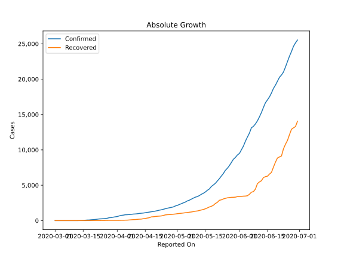
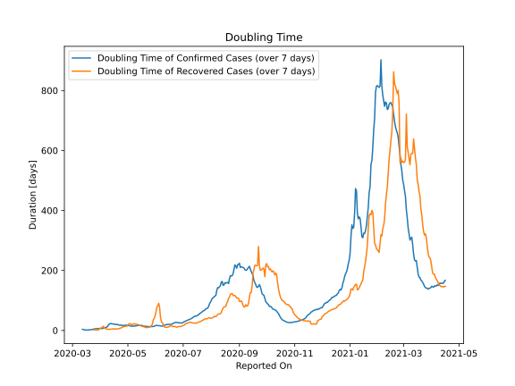

# Country Figures: Doubling Time of Infections for Armenia 

The doubling time below are calculated based on
* an exponential growth assumption
* for time difference of past seven (7) days.
The doubling time's unit is "days".

The first doubling time indicates the increase of confirmed (infected)
cases. There, the *higher* the number is, the better is to take control
of the disease.

The second doubling time indicates the increase of recovered (healed)
cases. There, the *lower* the number is, the better it is to take
control of the disease.

| Reported On | Confirmed | Doubling Time (Confirmed) | Recovered | Doubling Time (Recovered) |
|-------------|-----------|---------------------------|-----------|---------------------------|
| 2020-05-01 | 2148 |  16.7 days  | 977 |  16.8 days  | 
| 2020-04-30 | 2066 |  16.3 days  | 929 |  14.5 days  | 
| 2020-04-29 | 1932 |  18.2 days  | 900 |  14.1 days  | 
| 2020-04-28 | 1867 |  17.2 days  | 866 |  14.1 days  | 
| 2020-04-27 | 1808 |  16.5 days  | 848 |  13.1 days  | 
| 2020-04-26 | 1746 |  16.4 days  | 833 |  11.8 days  | 
| 2020-04-25 | 1677 |  16.8 days  | 803 |  11.7 days  | 
| 2020-04-24 | 1596 |  17.4 days  | 728 |  8.5 days  | 
| 2020-04-23 | 1523 |  18.1 days  | 659 |  8.3 days  | 
| 2020-04-22 | 1473 |  17.5 days  | 633 |  6.8 days  | 
| 2020-04-21 | 1401 |  18.2 days  | 609 |  6.2 days  | 
| 2020-04-20 | 1339 |  19.5 days  | 580 |  5.1 days  | 
| 2020-04-19 | 1291 |  20.4 days  | 545 |  5.1 days  | 
| 2020-04-18 | 1248 |  19.4 days  | 523 |  4.7 days  | 
| 2020-04-17 | 1201 |  19.9 days  | 402 |  5.2 days  | 
| 2020-04-16 | 1159 |  21.5 days  | 358 |  5.4 days  | 
| 2020-04-15 | 1111 |  21.3 days  | 297 |  5.4 days  | 
| 2020-04-14 | 1067 |  22.0 days  | 265 |  4.7 days  | 
| 2020-04-13 | 1039 |  22.3 days  | 211 |  4.3 days  | 
| 2020-04-12 | 1013 |  23.6 days  | 197 |  4.2 days  | 
| 2020-04-11 | 967 |  21.6 days  | 173 |  3.8 days  | 
| 2020-04-10 | 937 |  20.4 days  | 149 |  4.2 days  | 
| 2020-04-09 | 921 |  15.1 days  | 138 |  3.7 days  | 
| 2020-04-08 | 881 |  11.5 days  | 114 |  4.1 days  | 
| 2020-04-07 | 853 |  10.6 days  | 87 |  4.9 days  | 
| 2020-04-06 | 833 |  9.2 days  | 62 |  7.0 days  | 
| 2020-04-05 | 822 |  7.7 days  | 57 |  7.9 days  | 
| 2020-04-04 | 770 |  8.0 days  | 43 |  13.8 days  | 
| 2020-04-03 | 736 |  6.4 days  | 43 |  11.7 days  | 
| 2020-04-02 | 663 |  6.2 days  | 33 |  8.3 days  | 
| 2020-04-01 | 571 |  6.7 days  | 31 |  7.7 days  | 
| 2020-03-31 | 532 |  6.7 days  | 30 |  6.7 days  | 
| 2020-03-30 | 482 |  7.1 days  | 30 |  2.1 days  | 
| 2020-03-29 | 424 |  6.5 days  | 30 |  2.1 days  | 
| 2020-03-28 | 407 |  5.5 days  | 30 |  1.8 days  | 
| 2020-03-27 | 329 |  5.8 days  | 28 |  1.8 days  | 
| 2020-03-26 | 290 |  5.6 days  | 18 |  2.0 days  | 
| 2020-03-25 | 265 |  4.6 days  | 16 |  2.1 days  | 
| 2020-03-24 | 249 |  4.5 days  | 14 |  2.2 days  | 
| 2020-03-23 | 235 |  3.6 days  | 2 |  None  | 
| 2020-03-22 | 194 |  2.7 days  | 2 |  None  | 
| 2020-03-21 | 160 |  2.6 days  | 1 |  None  | 
| 2020-03-20 | 136 |  2.0 days  | 1 |  None  | 
| 2020-03-19 | 115 |  1.8 days  | 1 |  None  | 
| 2020-03-18 | 84 |  1.4 days  | 1 |  None  | 
| 2020-03-17 | 78 |  1.4 days  | 1 |  None  | 
| 2020-03-16 | 52 |  1.5 days  | 0 |  None  | 
| 2020-03-15 | 26 |  1.8 days  | 0 |  None  | 
| 2020-03-14 | 18 |  2.0 days  | 0 |  None  | 
| 2020-03-13 | 8 |  2.7 days  | 0 |  None  | 
| 2020-03-12 | 4 |  3.8 days  | 0 |  None  | 
| 2020-03-11 | 1 |  None  | 0 |  None  | 
| 2020-03-10 | 1 |  None  | 0 |  None  | 
| 2020-03-09 | 1 |  None  | 0 |  None  | 
| 2020-03-08 | 1 |  None  | 0 |  None  | 
| 2020-03-07 | 1 |  None  | 0 |  None  | 
| 2020-03-06 | 1 |  None  | 0 |  None  | 
| 2020-03-05 | 1 |  None  | 0 |  None  | 
| 2020-03-04 | 1 |  None  | 0 |  None  | 
| 2020-03-03 | 1 |  None  | 0 |  None  | 
| 2020-03-02 | 1 |  None  | 0 |  None  | 
| 2020-03-01 | 1 |  None  | 0 |  None  | 

