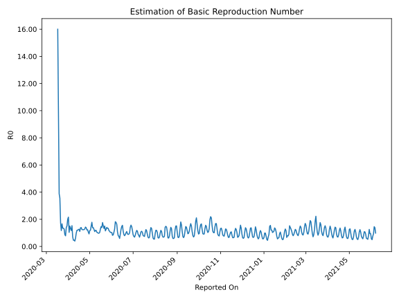

# Country Figures: Time Series for Basic Reproduction Number of Armenia 

| Reported On | &Delta; Confirmed | Total &Delta; Confirmed First Interval | Total &Delta; Confirmed Second Interval | Estimated Basic Reproduction Number R0 | 
|-------------|-------------------|----------------------------------------|-----------------------------------------|---------------------------------------------------|
| 2020-05-01 | 82 |  320  |  273  |  1.17  | 
| 2020-04-30 | 134 |  255  |  276  |  0.92  | 
| 2020-04-29 | 65 |  271  |  257  |  1.05  | 
| 2020-04-28 | 59 |  285  |  232  |  1.23  | 
| 2020-04-27 | 62 |  273  |  225  |  1.21  | 
| 2020-04-26 | 69 |  276  |  200  |  1.38  | 
| 2020-04-25 | 81 |  257  |  180  |  1.43  | 
| 2020-04-24 | 73 |  232  |  180  |  1.29  | 
| 2020-04-23 | 50 |  225  |  181  |  1.24  | 
| 2020-04-22 | 72 |  200  |  162  |  1.23  | 
| 2020-04-21 | 62 |  180  |  146  |  1.23  | 
| 2020-04-20 | 48 |  180  |  144  |  1.25  | 
| 2020-04-19 | 43 |  181  |  130  |  1.39  | 
| 2020-04-18 | 47 |  162  |  118  |  1.37  | 
| 2020-04-17 | 42 |  146  |  132  |  1.11  | 
| 2020-04-16 | 48 |  144  |  114  |  1.26  | 
| 2020-04-15 | 44 |  130  |  104  |  1.25  | 
| 2020-04-14 | 28 |  118  |  99  |  1.19  | 
| 2020-04-13 | 26 |  132  |  111  |  1.19  | 
| 2020-04-12 | 46 |  114  |  117  |  0.97  | 
| 2020-04-11 | 30 |  104  |  170  |  0.61  | 
| 2020-04-10 | 16 |  99  |  251  |  0.39  | 
| 2020-04-09 | 40 |  111  |  238  |  0.47  | 
| 2020-04-08 | 28 |  117  |  254  |  0.46  | 
| 2020-04-07 | 20 |  170  |  239  |  0.71  | 
| 2020-04-06 | 11 |  251  |  164  |  1.53  | 
| 2020-04-05 | 52 |  238  |  203  |  1.17  | 
| 2020-04-04 | 34 |  254  |  192  |  1.32  | 
| 2020-04-03 | 73 |  239  |  159  |  1.50  | 
| 2020-04-02 | 92 |  164  |  158  |  1.04  | 
| 2020-04-01 | 39 |  203  |  94  |  2.16  | 
| 2020-03-31 | 50 |  192  |  96  |  2.00  | 
| 2020-03-30 | 58 |  159  |  105  |  1.51  | 
| 2020-03-29 | 17 |  158  |  113  |  1.40  | 
| 2020-03-28 | 78 |  94  |  120  |  0.78  | 
| 2020-03-27 | 39 |  96  |  110  |  0.87  | 
| 2020-03-26 | 25 |  105  |  82  |  1.28  | 
| 2020-03-25 | 16 |  113  |  84  |  1.35  | 
| 2020-03-24 | 14 |  120  |  89  |  1.35  | 
| 2020-03-23 | 41 |  110  |  66  |  1.67  | 
| 2020-03-22 | 34 |  82  |  70  |  1.17  | 
| 2020-03-21 | 24 |  84  |  48  |  1.75  | 
| 2020-03-20 | 21 |  89  |  25  |  3.56  | 
| 2020-03-19 | 31 |  66  |  17  |  3.88  | 
| 2020-03-18 | 6 |  70  |  7  |  10.00  | 
| 2020-03-17 | 26 |  48  |  3  |  16.00  | 
| 2020-03-16 | 26 |  25  |  None  |  None  | 
| 2020-03-15 | 8 |  17  |  None  |  None  | 
| 2020-03-14 | 10 |  7  |  None  |  None  | 
| 2020-03-13 | 4 |  3  |  None  |  None  | 
| 2020-03-12 | 3 |  None  |  None  |  None  | 
| 2020-03-11 | 0 |  None  |  None  |  None  | 
| 2020-03-10 | 0 |  None  |  None  |  None  | 
| 2020-03-09 | 0 |  None  |  None  |  None  | 
| 2020-03-08 | 0 |  None  |  None  |  None  | 
| 2020-03-07 | 0 |  None  |  None  |  None  | 
| 2020-03-06 | 0 |  None  |  None  |  None  | 
| 2020-03-05 | 0 |  None  |  None  |  None  | 
| 2020-03-04 | 0 |  None  |  None  |  None  | 
| 2020-03-03 | 0 |  None  |  None  |  None  | 
| 2020-03-02 | 0 |  None  |  None  |  None  | 
| 2020-03-01 | None |  None  |  None  |  None  | 

