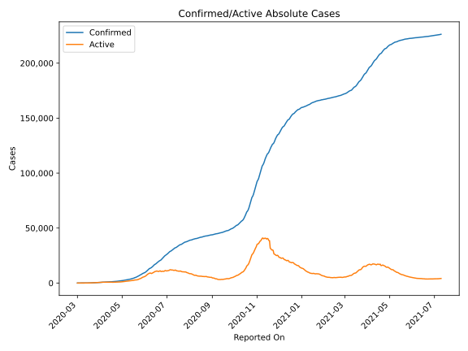
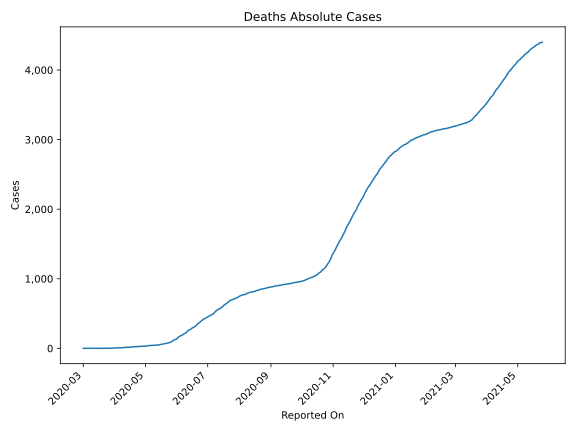
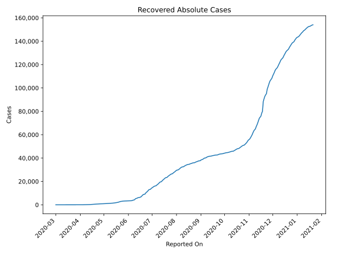
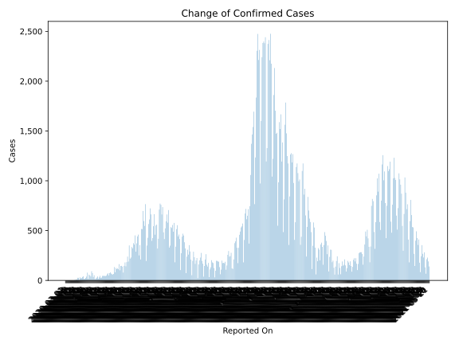
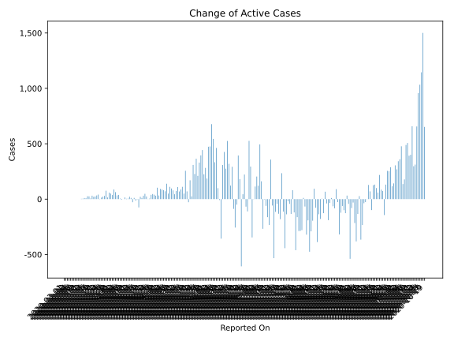
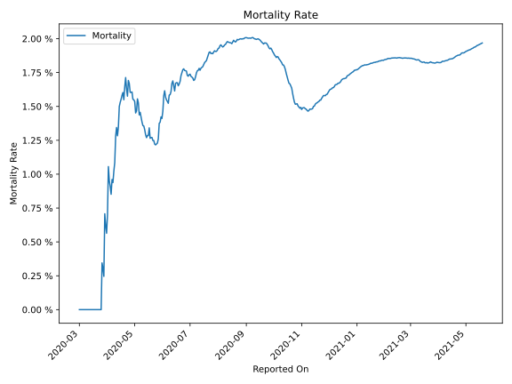

# Country Figures: Time Series for Armenia 

| Reported On | Confirmed | Deaths | Recovered | Active | Mortality | &Delta; Confirmed | &Delta; Deaths | &Delta; Recovered | &Delta; Active | % Active of Population |
|-------------|-----------|--------|-----------|--------|-----------|-------------------|----------------|-------------------|----------------|------------------------|
| 2020-04-28 | 1867 | 30 | 866 | 971 |  1.61 %  | 59 | 1 | 18 | 40 |  0.033 %  | 
| 2020-04-27 | 1808 | 29 | 848 | 931 |  1.60 %  | 62 | 1 | 15 | 46 |  0.032 %  | 
| 2020-04-26 | 1746 | 28 | 833 | 885 |  1.60 %  | 69 | 0 | 30 | 39 |  0.030 %  | 
| 2020-04-25 | 1677 | 28 | 803 | 846 |  1.67 %  | 81 | 1 | 75 | 5 |  0.029 %  | 
| 2020-04-24 | 1596 | 27 | 728 | 841 |  1.69 %  | 73 | 3 | 69 | 1 |  0.028 %  | 
| 2020-04-23 | 1523 | 24 | 659 | 840 |  1.58 %  | 50 | 0 | 26 | 24 |  0.028 %  | 
| 2020-04-22 | 1473 | 24 | 633 | 816 |  1.63 %  | 72 | 0 | 24 | 48 |  0.028 %  | 
| 2020-04-21 | 1401 | 24 | 609 | 768 |  1.71 %  | 62 | 2 | 29 | 31 |  0.026 %  | 
| 2020-04-20 | 1339 | 22 | 580 | 737 |  1.64 %  | 48 | 2 | 35 | 11 |  0.025 %  | 
| 2020-04-19 | 1291 | 20 | 545 | 726 |  1.55 %  | 43 | 0 | 22 | 21 |  0.025 %  | 
| 2020-04-18 | 1248 | 20 | 523 | 705 |  1.60 %  | 47 | 1 | 121 | -75 |  0.024 %  | 
| 2020-04-17 | 1201 | 19 | 402 | 780 |  1.58 %  | 42 | 1 | 44 | -3 |  0.026 %  | 
| 2020-04-16 | 1159 | 18 | 358 | 783 |  1.55 %  | 48 | 1 | 61 | -14 |  0.027 %  | 
| 2020-04-15 | 1111 | 17 | 297 | 797 |  1.53 %  | 44 | 1 | 32 | 11 |  0.027 %  | 
| 2020-04-14 | 1067 | 16 | 265 | 786 |  1.50 %  | 28 | 2 | 54 | -28 |  0.027 %  | 
| 2020-04-13 | 1039 | 14 | 211 | 814 |  1.35 %  | 26 | 1 | 14 | 11 |  0.028 %  | 
| 2020-04-12 | 1013 | 13 | 197 | 803 |  1.28 %  | 46 | 0 | 24 | 22 |  0.027 %  | 
| 2020-04-11 | 967 | 13 | 173 | 781 |  1.34 %  | 30 | 1 | 24 | 5 |  0.026 %  | 
| 2020-04-10 | 937 | 12 | 149 | 776 |  1.28 %  | 16 | 2 | 11 | 3 |  0.026 %  | 
| 2020-04-09 | 921 | 10 | 138 | 773 |  1.09 %  | 40 | 1 | 24 | 15 |  0.026 %  | 
| 2020-04-08 | 881 | 9 | 114 | 758 |  1.02 %  | 28 | 1 | 27 | 0 |  0.026 %  | 
| 2020-04-07 | 853 | 8 | 87 | 758 |  0.94 %  | 20 | 0 | 25 | -5 |  0.026 %  | 
| 2020-04-06 | 833 | 8 | 62 | 763 |  0.96 %  | 11 | 1 | 5 | 5 |  0.026 %  | 
| 2020-04-05 | 822 | 7 | 57 | 758 |  0.85 %  | 52 | 0 | 14 | 38 |  0.026 %  | 
| 2020-04-04 | 770 | 7 | 43 | 720 |  0.91 %  | 34 | 0 | 0 | 34 |  0.024 %  | 
| 2020-04-03 | 736 | 7 | 43 | 686 |  0.95 %  | 73 | 0 | 10 | 63 |  0.023 %  | 
| 2020-04-02 | 663 | 7 | 33 | 623 |  1.06 %  | 92 | 3 | 2 | 87 |  0.021 %  | 
| 2020-04-01 | 571 | 4 | 31 | 536 |  0.70 %  | 39 | 1 | 1 | 37 |  0.018 %  | 
| 2020-03-31 | 532 | 3 | 30 | 499 |  0.56 %  | 50 | 0 | 0 | 50 |  0.017 %  | 
| 2020-03-30 | 482 | 3 | 30 | 449 |  0.62 %  | 58 | 0 | 0 | 58 |  0.015 %  | 
| 2020-03-29 | 424 | 3 | 30 | 391 |  0.71 %  | 17 | 2 | 0 | 15 |  0.013 %  | 
| 2020-03-28 | 407 | 1 | 30 | 376 |  0.25 %  | 78 | 0 | 2 | 76 |  0.013 %  | 
| 2020-03-27 | 329 | 1 | 28 | 300 |  0.30 %  | 39 | 0 | 10 | 29 |  0.010 %  | 
| 2020-03-26 | 290 | 1 | 18 | 271 |  0.34 %  | 25 | 1 | 2 | 22 |  0.009 %  | 
| 2020-03-25 | 265 | 0 | 16 | 249 |  None  | 16 | 0 | 2 | 14 |  0.008 %  | 
| 2020-03-24 | 249 | 0 | 14 | 235 |  None  | 14 | 0 | 12 | 2 |  0.008 %  | 
| 2020-03-23 | 235 | 0 | 2 | 233 |  None  | 41 | 0 | 0 | 41 |  0.008 %  | 
| 2020-03-22 | 194 | 0 | 2 | 192 |  None  | 34 | 0 | 1 | 33 |  0.007 %  | 
| 2020-03-21 | 160 | 0 | 1 | 159 |  None  | 24 | 0 | 0 | 24 |  0.005 %  | 
| 2020-03-20 | 136 | 0 | 1 | 135 |  None  | 21 | 0 | 0 | 21 |  0.005 %  | 
| 2020-03-19 | 115 | 0 | 1 | 114 |  None  | 31 | 0 | 0 | 31 |  0.004 %  | 
| 2020-03-18 | 84 | 0 | 1 | 83 |  None  | 6 | 0 | 0 | 6 |  0.003 %  | 
| 2020-03-17 | 78 | 0 | 1 | 77 |  None  | 26 | 0 | 1 | 25 |  0.003 %  | 
| 2020-03-16 | 52 | 0 | 0 | 52 |  None  | 26 | 0 | 0 | 26 |  0.002 %  | 
| 2020-03-15 | 26 | 0 | 0 | 26 |  None  | 8 | 0 | 0 | 8 |  0.001 %  | 
| 2020-03-14 | 18 | 0 | 0 | 18 |  None  | 10 | 0 | 0 | 10 |  0.001 %  | 
| 2020-03-13 | 8 | 0 | 0 | 8 |  None  | 4 | 0 | 0 | 4 |  0.000 %  | 
| 2020-03-12 | 4 | 0 | 0 | 4 |  None  | 3 | 0 | 0 | 3 |  0.000 %  | 
| 2020-03-11 | 1 | 0 | 0 | 1 |  None  | 0 | 0 | 0 | 0 |  0.000 %  | 
| 2020-03-10 | 1 | 0 | 0 | 1 |  None  | 0 | 0 | 0 | 0 |  0.000 %  | 
| 2020-03-09 | 1 | 0 | 0 | 1 |  None  | 0 | 0 | 0 | 0 |  0.000 %  | 
| 2020-03-08 | 1 | 0 | 0 | 1 |  None  | 0 | 0 | 0 | 0 |  0.000 %  | 
| 2020-03-07 | 1 | 0 | 0 | 1 |  None  | 0 | 0 | 0 | 0 |  0.000 %  | 
| 2020-03-06 | 1 | 0 | 0 | 1 |  None  | 0 | 0 | 0 | 0 |  0.000 %  | 
| 2020-03-05 | 1 | 0 | 0 | 1 |  None  | 0 | 0 | 0 | 0 |  0.000 %  | 
| 2020-03-04 | 1 | 0 | 0 | 1 |  None  | 0 | 0 | 0 | 0 |  0.000 %  | 
| 2020-03-03 | 1 | 0 | 0 | 1 |  None  | 0 | 0 | 0 | 0 |  0.000 %  | 
| 2020-03-02 | 1 | 0 | 0 | 1 |  None  | 0 | 0 | 0 | 0 |  0.000 %  | 
| 2020-03-01 | 1 | 0 | 0 | 1 |  None  | None | None | None | None |  0.000 %  | 

