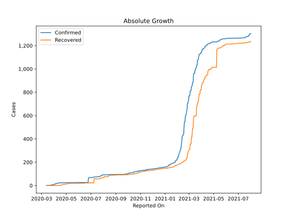
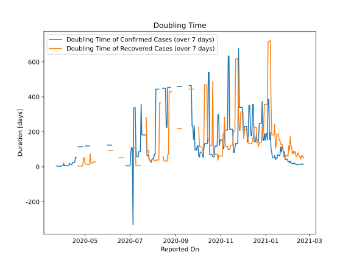

# Country Figures: Doubling Time of Infections for Antiguaand Barbuda 

The doubling time below are calculated based on
* an exponential growth assumption
* for time difference of past seven (7) days.
The doubling time's unit is "days".

The first doubling time indicates the increase of confirmed (infected)
cases. There, the *higher* the number is, the better is to take control
of the disease.

The second doubling time indicates the increase of recovered (healed)
cases. There, the *lower* the number is, the better it is to take
control of the disease.

| Reported On | Confirmed | Doubling Time (Confirmed) | Recovered | Doubling Time (Recovered) |
|-------------|-----------|---------------------------|-----------|---------------------------|
| 2020-04-26 | 24 |  114.4 days  | 11 |  4.1 days  | 
| 2020-04-25 | 24 |  114.4 days  | 11 |  4.1 days  | 
| 2020-04-24 | 24 |  114.4 days  | 11 |  4.1 days  | 
| 2020-04-23 | 24 |  114.4 days  | 10 |  4.4 days  | 
| 2020-04-22 | 24 |  114.4 days  | 10 |  4.4 days  | 
| 2020-04-21 | 23 |  None  | 7 |  6.1 days  | 
| 2020-04-20 | 23 |  None  | 3 |  None  | 
| 2020-04-19 | 23 |  53.7 days  | 3 |  None  | 
| 2020-04-18 | 23 |  53.7 days  | 3 |  None  | 
| 2020-04-17 | 23 |  25.7 days  | 3 |  None  | 
| 2020-04-16 | 23 |  25.7 days  | 3 |  None  | 
| 2020-04-15 | 23 |  25.7 days  | 3 |  None  | 
| 2020-04-14 | 23 |  25.7 days  | 3 |  None  | 
| 2020-04-13 | 23 |  11.7 days  | 0 |  None  | 
| 2020-04-12 | 21 |  14.8 days  | 0 |  None  | 
| 2020-04-11 | 21 |  14.8 days  | 0 |  None  | 
| 2020-04-10 | 19 |  20.9 days  | 0 |  None  | 
| 2020-04-09 | 19 |  6.8 days  | 0 |  None  | 
| 2020-04-08 | 19 |  5.2 days  | 0 |  None  | 
| 2020-04-07 | 19 |  5.2 days  | 0 |  None  | 
| 2020-04-06 | 15 |  6.7 days  | 0 |  None  | 
| 2020-04-05 | 15 |  6.7 days  | 0 |  None  | 
| 2020-04-04 | 15 |  6.7 days  | 0 |  None  | 
| 2020-04-03 | 15 |  6.7 days  | 0 |  None  | 
| 2020-04-02 | 9 |  19.7 days  | 0 |  None  | 
| 2020-04-01 | 7 |  6.1 days  | 0 |  None  | 
| 2020-03-31 | 7 |  6.1 days  | 0 |  None  | 
| 2020-03-30 | 7 |  6.1 days  | 0 |  None  | 
| 2020-03-29 | 7 |  2.8 days  | 0 |  None  | 
| 2020-03-28 | 7 |  2.8 days  | 0 |  None  | 
| 2020-03-27 | 7 |  2.8 days  | 0 |  None  | 
| 2020-03-26 | 7 |  2.8 days  | 0 |  None  | 
| 2020-03-25 | 3 |  4.8 days  | 0 |  None  | 
| 2020-03-24 | 3 |  4.8 days  | 0 |  None  | 
| 2020-03-23 | 3 |  4.8 days  | 0 |  None  | 
| 2020-03-22 | 1 |  None  | 0 |  None  | 
| 2020-03-21 | 1 |  None  | 0 |  None  | 
| 2020-03-20 | 1 |  None  | 0 |  None  | 
| 2020-03-19 | 1 |  None  | 0 |  None  | 
| 2020-03-18 | 1 |  None  | 0 |  None  | 
| 2020-03-17 | 1 |  None  | 0 |  None  | 
| 2020-03-16 | 1 |  None  | 0 |  None  | 
| 2020-03-15 | 1 |  None  | 0 |  None  | 
| 2020-03-14 | 1 |  None  | 0 |  None  | 
| 2020-03-13 | 1 |  None  | 0 |  None  | 

