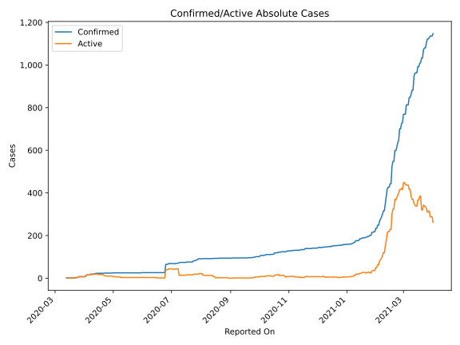
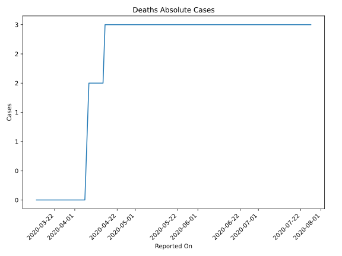
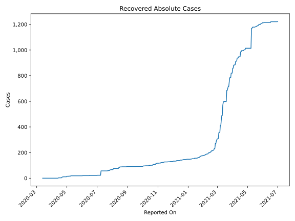
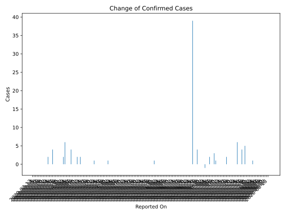
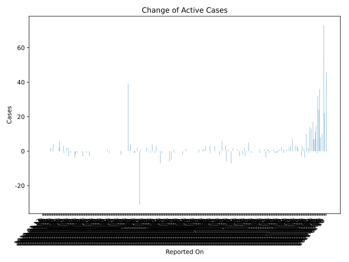
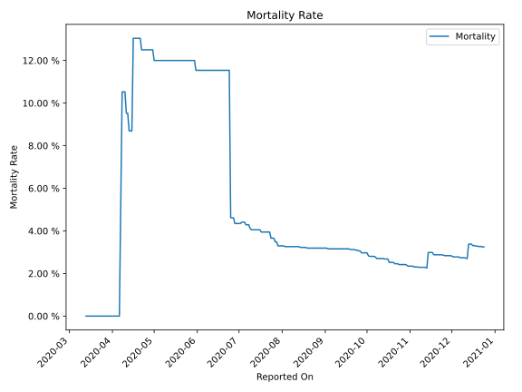

# Country Figures: Time Series for Antiguaand Barbuda 

| Reported On | Confirmed | Deaths | Recovered | Active | Mortality | &Delta; Confirmed | &Delta; Deaths | &Delta; Active | % Active of Population |
|-------------|-----------|--------|-----------|--------|-----------|-------------------|----------------|----------------|------------------------|
| 2020-03-23 | 3 | 0 | 0 | 3 |  None  | 2 | 0 | 2 |  0.003 %  | 
| 2020-03-22 | 1 | 0 | 0 | 1 |  None  | 0 | 0 | 0 |  0.001 %  | 
| 2020-03-21 | 1 | 0 | 0 | 1 |  None  | 0 | 0 | 0 |  0.001 %  | 
| 2020-03-20 | 1 | 0 | 0 | 1 |  None  | 0 | 0 | 0 |  0.001 %  | 
| 2020-03-19 | 1 | 0 | 0 | 1 |  None  | 0 | 0 | 0 |  0.001 %  | 
| 2020-03-18 | 1 | 0 | 0 | 1 |  None  | 0 | 0 | 0 |  0.001 %  | 
| 2020-03-17 | 1 | 0 | 0 | 1 |  None  | 0 | 0 | 0 |  0.001 %  | 
| 2020-03-16 | 1 | 0 | 0 | 1 |  None  | 0 | 0 | 0 |  0.001 %  | 
| 2020-03-15 | 1 | 0 | 0 | 1 |  None  | 0 | 0 | 0 |  0.001 %  | 
| 2020-03-14 | 1 | 0 | 0 | 1 |  None  | 0 | 0 | 0 |  0.001 %  | 
| 2020-03-13 | 1 | 0 | 0 | 1 |  None  | None | None | None |  0.001 %  | 

