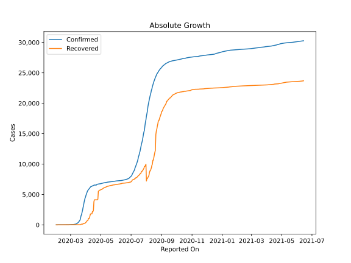
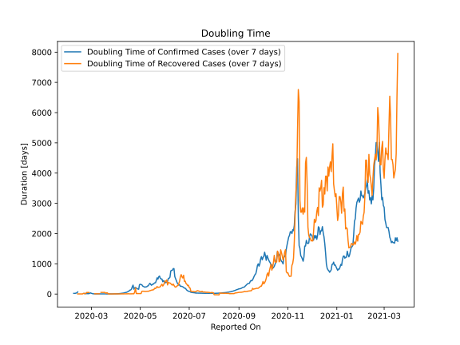

# Country Figures: Doubling Time of Infections for Australia 

The doubling time below are calculated based on
* an exponential growth assumption
* for time difference of past seven (7) days.
The doubling time's unit is "days".

The first doubling time indicates the increase of confirmed (infected)
cases. There, the *higher* the number is, the better is to take control
of the disease.

The second doubling time indicates the increase of recovered (healed)
cases. There, the *lower* the number is, the better it is to take
control of the disease.

| Reported On | Confirmed | Doubling Time (Confirmed) | Recovered | Doubling Time (Recovered) |
|-------------|-----------|---------------------------|-----------|---------------------------|
| 2020-04-07 | 5895 |  19.2 days  | 1080 |  4.7 days  | 
| 2020-04-06 | 5797 |  17.4 days  | 1080 |  3.7 days  | 
| 2020-04-05 | 5687 |  14.0 days  | 757 |  4.6 days  | 
| 2020-04-04 | 5550 |  11.8 days  | 701 |  4.9 days  | 
| 2020-04-03 | 5330 |  9.5 days  | 649 |  4.4 days  | 
| 2020-04-02 | 5116 |  8.4 days  | 520 |  4.7 days  | 
| 2020-04-01 | 4862 |  7.1 days  | 422 |  4.2 days  | 
| 2020-03-31 | 4559 |  6.4 days  | 358 |  4.7 days  | 
| 2020-03-30 | 4361 |  5.4 days  | 257 |  6.6 days  | 
| 2020-03-29 | 3984 |  5.3 days  | 244 |  5.3 days  | 
| 2020-03-28 | 3640 |  4.3 days  | 244 |  2.5 days  | 
| 2020-03-27 | 3143 |  3.9 days  | 194 |  2.7 days  | 
| 2020-03-26 | 2810 |  3.8 days  | 172 |  2.9 days  | 
| 2020-03-25 | 2364 |  3.7 days  | 119 |  3.3 days  | 
| 2020-03-24 | 2044 |  3.6 days  | 119 |  3.3 days  | 
| 2020-03-23 | 1682 |  3.6 days  | 119 |  3.3 days  | 
| 2020-03-22 | 1490 |  3.3 days  | 92 |  3.8 days  | 
| 2020-03-21 | 1071 |  3.7 days  | 26 |  39.9 days  | 
| 2020-03-20 | 791 |  3.9 days  | 26 |  39.9 days  | 
| 2020-03-19 | 681 |  3.2 days  | 26 |  23.1 days  | 
| 2020-03-18 | 568 |  3.6 days  | 23 |  53.7 days  | 
| 2020-03-17 | 452 |  3.7 days  | 23 |  53.7 days  | 
| 2020-03-16 | 377 |  3.7 days  | 23 |  53.7 days  | 
| 2020-03-15 | 297 |  3.9 days  | 23 |  53.7 days  | 
| 2020-03-14 | 250 |  3.9 days  | 23 |  53.7 days  | 
| 2020-03-13 | 200 |  4.4 days  | 23 |  53.7 days  | 
| 2020-03-12 | 128 |  6.1 days  | 21 |  None  | 
| 2020-03-11 | 128 |  5.7 days  | 21 |  7.8 days  | 
| 2020-03-10 | 107 |  5.1 days  | 21 |  7.8 days  | 
| 2020-03-09 | 91 |  4.7 days  | 21 |  7.8 days  | 
| 2020-03-08 | 76 |  5.0 days  | 21 |  7.8 days  | 
| 2020-03-07 | 63 |  5.6 days  | 21 |  7.8 days  | 
| 2020-03-06 | 60 |  5.4 days  | 21 |  7.8 days  | 
| 2020-03-05 | 55 |  5.9 days  | 21 |  7.8 days  | 
| 2020-03-04 | 52 |  6.0 days  | 11 |  None  | 
| 2020-03-03 | 39 |  8.8 days  | 11 |  None  | 
| 2020-03-02 | 30 |  16.0 days  | 11 |  None  | 
| 2020-03-01 | 27 |  24.0 days  | 11 |  None  | 
| 2020-02-29 | 25 |  38.3 days  | 11 |  None  | 
| 2020-02-28 | 23 |  25.7 days  | 11 |  None  | 
| 2020-02-27 | 23 |  11.7 days  | 11 |  51.3 days  | 
| 2020-02-26 | 22 |  13.0 days  | 11 |  51.3 days  | 
| 2020-02-25 | 22 |  13.0 days  | 11 |  51.3 days  | 
| 2020-02-24 | 22 |  13.0 days  | 11 |  51.3 days  | 
| 2020-02-23 | 22 |  13.0 days  | 11 |  15.6 days  | 
| 2020-02-22 | 22 |  13.0 days  | 11 |  15.6 days  | 
| 2020-02-21 | 19 |  20.9 days  | 11 |  15.6 days  | 
| 2020-02-20 | 15 |  None  | 10 |  22.1 days  | 
| 2020-02-19 | 15 |  None  | 10 |  3.3 days  | 
| 2020-02-18 | 15 |  None  | 10 |  3.3 days  | 
| 2020-02-17 | 15 |  None  | 10 |  3.3 days  | 
| 2020-02-16 | 15 |  None  | 8 |  3.8 days  | 
| 2020-02-15 | 15 |  None  | 8 |  3.8 days  | 
| 2020-02-14 | 15 |  None  | 8 |  3.8 days  | 
| 2020-02-13 | 15 |  70.7 days  | 8 |  3.8 days  | 
| 2020-02-12 | 15 |  34.3 days  | 2 |  None  | 
| 2020-02-11 | 15 |  34.3 days  | 2 |  None  | 
| 2020-02-10 | 15 |  22.1 days  | 2 |  None  | 
| 2020-02-09 | 15 |  22.1 days  | 2 |  None  | 
| 2020-02-08 | 15 |  22.1 days  | 2 |  None  | 
| 2020-02-07 | 15 |  None  | 2 |  None  | 
| 2020-02-06 | 14 |  None  | 2 |  None  | 
| 2020-02-05 | 13 |  None  | 2 |  None  | 
| 2020-02-04 | 13 |  None  | 2 |  None  | 
| 2020-02-03 | 12 |  None  | 2 |  None  | 
| 2020-02-02 | 12 |  None  | 2 |  None  | 
| 2020-02-01 | 12 |  None  | 2 |  None  | 

