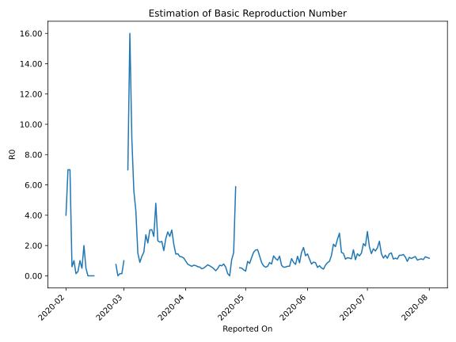

# Country Figures: Time Series for Basic Reproduction Number of Australia 

| Reported On | &Delta; Confirmed | Total &Delta; Confirmed First Interval | Total &Delta; Confirmed Second Interval | Estimated Basic Reproduction Number R0 | 
|-------------|-------------------|----------------------------------------|-----------------------------------------|---------------------------------------------------|
| 2020-05-01 | 12 |  52  |  167  |  0.31  | 
| 2020-04-30 | 14 |  58  |  147  |  0.39  | 
| 2020-04-29 | 8 |  67  |  130  |  0.52  | 
| 2020-04-28 | 23 |  60  |  114  |  0.53  | 
| 2020-04-27 | 7 |  167  |  None  |  None  | 
| 2020-04-26 | 20 |  147  |  25  |  5.88  | 
| 2020-04-25 | 17 |  130  |  85  |  1.53  | 
| 2020-04-24 | 16 |  114  |  107  |  1.07  | 
| 2020-04-23 | 114 |  None  |  132  |  None  | 
| 2020-04-22 | 0 |  25  |  171  |  0.15  | 
| 2020-04-21 | 0 |  85  |  147  |  0.58  | 
| 2020-04-20 | 0 |  107  |  137  |  0.78  | 
| 2020-04-19 | 0 |  132  |  200  |  0.66  | 
| 2020-04-18 | 25 |  171  |  243  |  0.70  | 
| 2020-04-17 | 60 |  147  |  305  |  0.48  | 
| 2020-04-16 | 22 |  137  |  408  |  0.34  | 
| 2020-04-15 | 25 |  200  |  418  |  0.48  | 
| 2020-04-14 | 64 |  243  |  421  |  0.58  | 
| 2020-04-13 | 36 |  305  |  460  |  0.66  | 
| 2020-04-12 | 12 |  408  |  565  |  0.72  | 
| 2020-04-11 | 88 |  418  |  681  |  0.61  | 
| 2020-04-10 | 107 |  421  |  825  |  0.51  | 
| 2020-04-09 | 98 |  460  |  991  |  0.46  | 
| 2020-04-08 | 115 |  565  |  969  |  0.58  | 
| 2020-04-07 | 98 |  681  |  1132  |  0.60  | 
| 2020-04-06 | 110 |  825  |  1222  |  0.68  | 
| 2020-04-05 | 137 |  991  |  1416  |  0.70  | 
| 2020-04-04 | 220 |  969  |  1551  |  0.62  | 
| 2020-04-03 | 214 |  1132  |  1620  |  0.70  | 
| 2020-04-02 | 254 |  1222  |  1596  |  0.77  | 
| 2020-04-01 | 303 |  1416  |  1461  |  0.97  | 
| 2020-03-31 | 198 |  1551  |  1320  |  1.18  | 
| 2020-03-30 | 377 |  1620  |  1293  |  1.25  | 
| 2020-03-29 | 344 |  1596  |  1253  |  1.27  | 
| 2020-03-28 | 497 |  1461  |  1001  |  1.46  | 
| 2020-03-27 | 333 |  1320  |  922  |  1.43  | 
| 2020-03-26 | 446 |  1293  |  619  |  2.09  | 
| 2020-03-25 | 320 |  1253  |  414  |  3.03  | 
| 2020-03-24 | 362 |  1001  |  384  |  2.61  | 
| 2020-03-23 | 192 |  922  |  318  |  2.90  | 
| 2020-03-22 | 419 |  619  |  252  |  2.46  | 
| 2020-03-21 | 280 |  414  |  249  |  1.66  | 
| 2020-03-20 | 110 |  384  |  169  |  2.27  | 
| 2020-03-19 | 113 |  318  |  143  |  2.22  | 
| 2020-03-18 | 116 |  252  |  109  |  2.31  | 
| 2020-03-17 | 75 |  249  |  52  |  4.79  | 
| 2020-03-16 | 80 |  169  |  65  |  2.60  | 
| 2020-03-15 | 47 |  143  |  47  |  3.04  | 
| 2020-03-14 | 50 |  109  |  36  |  3.03  | 
| 2020-03-13 | 72 |  52  |  24  |  2.17  | 
| 2020-03-12 | 0 |  65  |  24  |  2.71  | 
| 2020-03-11 | 21 |  47  |  30  |  1.57  | 
| 2020-03-10 | 16 |  36  |  28  |  1.29  | 
| 2020-03-09 | 15 |  24  |  27  |  0.89  | 
| 2020-03-08 | 13 |  24  |  16  |  1.50  | 
| 2020-03-07 | 3 |  30  |  7  |  4.29  | 
| 2020-03-06 | 5 |  28  |  5  |  5.60  | 
| 2020-03-05 | 3 |  27  |  3  |  9.00  | 
| 2020-03-04 | 13 |  16  |  1  |  16.00  | 
| 2020-03-03 | 9 |  7  |  1  |  7.00  | 
| 2020-03-02 | 3 |  5  |  None  |  None  | 
| 2020-03-01 | 2 |  3  |  3  |  1.00  | 
| 2020-02-29 | 2 |  1  |  7  |  0.14  | 
| 2020-02-28 | 0 |  1  |  7  |  0.14  | 
| 2020-02-27 | 1 |  None  |  7  |  None  | 
| 2020-02-26 | 0 |  3  |  4  |  0.75  | 
| 2020-02-25 | 0 |  7  |  None  |  None  | 
| 2020-02-24 | 0 |  7  |  None  |  None  | 
| 2020-02-23 | 0 |  7  |  None  |  None  | 
| 2020-02-22 | 3 |  4  |  None  |  None  | 
| 2020-02-21 | 4 |  None  |  None  |  None  | 
| 2020-02-20 | 0 |  None  |  None  |  None  | 
| 2020-02-19 | 0 |  None  |  None  |  None  | 
| 2020-02-18 | 0 |  None  |  None  |  None  | 
| 2020-02-17 | 0 |  None  |  None  |  None  | 
| 2020-02-16 | 0 |  None  |  None  |  None  | 
| 2020-02-15 | 0 |  None  |  1  |  None  | 
| 2020-02-14 | 0 |  None  |  2  |  None  | 
| 2020-02-13 | 0 |  None  |  2  |  None  | 
| 2020-02-12 | 0 |  None  |  3  |  None  | 
| 2020-02-11 | 0 |  1  |  2  |  0.50  | 
| 2020-02-10 | 0 |  2  |  1  |  2.00  | 
| 2020-02-09 | 0 |  2  |  4  |  0.50  | 
| 2020-02-08 | 0 |  3  |  3  |  1.00  | 
| 2020-02-07 | 1 |  2  |  7  |  0.29  | 
| 2020-02-06 | 1 |  1  |  7  |  0.14  | 
| 2020-02-05 | 0 |  4  |  4  |  1.00  | 
| 2020-02-04 | 1 |  3  |  5  |  0.60  | 
| 2020-02-03 | 0 |  7  |  1  |  7.00  | 
| 2020-02-02 | 0 |  7  |  1  |  7.00  | 
| 2020-02-01 | 3 |  4  |  1  |  4.00  | 
| 2020-01-31 | 0 |  5  |  None  |  None  | 
| 2020-01-30 | 4 |  1  |  None  |  None  | 
| 2020-01-29 | 0 |  1  |  None  |  None  | 
| 2020-01-28 | 0 |  1  |  None  |  None  | 
| 2020-01-27 | 1 |  None  |  None  |  None  | 
| 2020-01-26 | 0 |  None  |  None  |  None  | 
| 2020-01-25 | None |  None  |  None  |  None  | 
| 2020-01-23 | None |  None  |  None  |  None  | 

