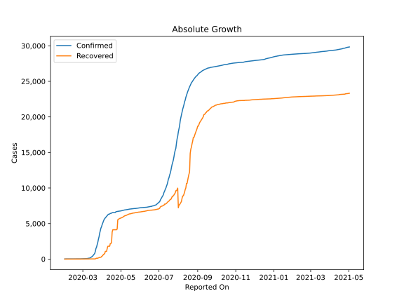
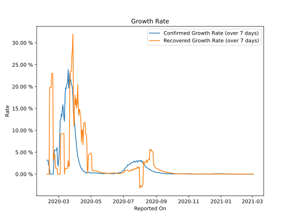

# Country Figures: Growth Rate for Australia 

The growth rates below are calculated based on
* an exponential growth assumption
* for time difference of past seven (7) days.
The growth rate is to be understood as on "growth per day".

The first growth rate indicates the increase of confirmed (infected) cases.

The second growth rate indicates the increase of recovered (healed) cases.

| Reported On | Confirmed | Growth Rate (Confirmed) | Recovered | Growth Rate (Recovered) |
|-------------|-----------|-------------------------|-----------|-------------------------|
| 2020-05-05 | 6875 |  0.27 %  | 5975 |  0.761 %  | 
| 2020-05-04 | 6847 |  0.27 %  | 5887 |  0.745 %  | 
| 2020-05-03 | 6822 |  0.23 %  | 5849 |  0.773 %  | 
| 2020-05-02 | 6799 |  0.22 %  | 5814 |  4.567 %  | 
| 2020-05-01 | 6778 |  0.21 %  | 5775 |  4.810 %  | 
| 2020-04-30 | 6766 |  0.22 %  | 5742 |  4.728 %  | 
| 2020-04-29 | 6752 |  0.44 %  | 5715 |  4.661 %  | 
| 2020-04-28 | 6744 |  0.42 %  | 5665 |  4.535 %  | 
| 2020-04-27 | 6721 |  0.37 %  | 5588 |  4.340 %  | 
| 2020-04-26 | 6714 |  0.36 %  | 5541 |  4.219 %  | 
| 2020-04-25 | 6694 |  0.32 %  | 4223 |  0.339 %  | 
| 2020-04-24 | 6677 |  0.34 %  | 4124 |  1.139 %  | 
| 2020-04-23 | 6661 |  0.43 %  | 4124 |  8.004 %  | 
| 2020-04-22 | 6547 |  0.24 %  | 4124 |  9.068 %  | 
| 2020-04-21 | 6547 |  0.29 %  | 4124 |  9.068 %  | 
| 2020-04-20 | 6547 |  0.43 %  | 4124 |  11.796 %  | 
| 2020-04-19 | 6547 |  0.52 %  | 4124 |  11.796 %  | 
| 2020-04-18 | 6547 |  0.54 %  | 4124 |  11.796 %  | 
| 2020-04-17 | 6522 |  0.69 %  | 3808 |  10.760 %  | 
| 2020-04-16 | 6462 |  0.80 %  | 2355 |  6.713 %  | 
| 2020-04-15 | 6440 |  0.99 %  | 2186 |  10.073 %  | 
| 2020-04-14 | 6415 |  1.21 %  | 2186 |  10.073 %  | 
| 2020-04-13 | 6351 |  1.30 %  | 1806 |  7.345 %  | 
| 2020-04-12 | 6315 |  1.50 %  | 1806 |  12.422 %  | 
| 2020-04-11 | 6303 |  1.82 %  | 1806 |  13.519 %  | 
| 2020-04-10 | 6215 |  2.19 %  | 1793 |  14.517 %  | 
| 2020-04-09 | 6108 |  2.53 %  | 1472 |  14.865 %  | 
| 2020-04-08 | 6010 |  3.03 %  | 1080 |  13.424 %  | 
| 2020-04-07 | 5895 |  3.67 %  | 1080 |  15.774 %  | 
| 2020-04-06 | 5797 |  4.07 %  | 1080 |  20.509 %  | 
| 2020-04-05 | 5687 |  5.08 %  | 757 |  16.174 %  | 
| 2020-04-04 | 5550 |  6.03 %  | 701 |  15.076 %  | 
| 2020-04-03 | 5330 |  7.55 %  | 649 |  17.251 %  | 
| 2020-04-02 | 5116 |  8.56 %  | 520 |  15.805 %  | 
| 2020-04-01 | 4862 |  10.30 %  | 422 |  18.084 %  | 
| 2020-03-31 | 4559 |  11.46 %  | 358 |  15.734 %  | 
| 2020-03-30 | 4361 |  13.61 %  | 257 |  10.999 %  | 
| 2020-03-29 | 3984 |  14.05 %  | 244 |  13.934 %  | 
| 2020-03-28 | 3640 |  17.48 %  | 244 |  31.987 %  | 
| 2020-03-27 | 3143 |  19.71 %  | 194 |  28.711 %  | 
| 2020-03-26 | 2810 |  20.25 %  | 172 |  26.991 %  | 
| 2020-03-25 | 2364 |  20.37 %  | 119 |  23.480 %  | 
| 2020-03-24 | 2044 |  21.56 %  | 119 |  23.480 %  | 
| 2020-03-23 | 1682 |  21.36 %  | 119 |  23.480 %  | 
| 2020-03-22 | 1490 |  23.04 %  | 92 |  19.804 %  | 
| 2020-03-21 | 1071 |  20.78 %  | 26 |  1.751 %  | 
| 2020-03-20 | 791 |  19.64 %  | 26 |  1.751 %  | 
| 2020-03-19 | 681 |  23.88 %  | 26 |  3.051 %  | 
| 2020-03-18 | 568 |  21.29 %  | 23 |  1.300 %  | 
| 2020-03-17 | 452 |  20.58 %  | 23 |  1.300 %  | 
| 2020-03-16 | 377 |  20.31 %  | 23 |  1.300 %  | 
| 2020-03-15 | 297 |  19.47 %  | 23 |  1.300 %  | 
| 2020-03-14 | 250 |  19.69 %  | 23 |  1.300 %  | 
| 2020-03-13 | 200 |  17.20 %  | 23 |  1.300 %  | 
| 2020-03-12 | 128 |  12.07 %  | 21 |  None  | 
| 2020-03-11 | 128 |  12.87 %  | 21 |  9.238 %  | 
| 2020-03-10 | 107 |  14.42 %  | 21 |  9.238 %  | 
| 2020-03-09 | 91 |  15.85 %  | 21 |  9.238 %  | 
| 2020-03-08 | 76 |  14.78 %  | 21 |  9.238 %  | 
| 2020-03-07 | 63 |  13.20 %  | 21 |  9.238 %  | 
| 2020-03-06 | 60 |  13.70 %  | 21 |  9.238 %  | 
| 2020-03-05 | 55 |  12.45 %  | 21 |  9.238 %  | 
| 2020-03-04 | 52 |  12.29 %  | 11 |  None  | 
| 2020-03-03 | 39 |  8.18 %  | 11 |  None  | 
| 2020-03-02 | 30 |  4.43 %  | 11 |  None  | 
| 2020-03-01 | 27 |  2.93 %  | 11 |  None  | 
| 2020-02-29 | 25 |  1.83 %  | 11 |  None  | 
| 2020-02-28 | 23 |  2.73 %  | 11 |  None  | 
| 2020-02-27 | 23 |  6.11 %  | 11 |  1.362 %  | 
| 2020-02-26 | 22 |  5.47 %  | 11 |  1.362 %  | 
| 2020-02-25 | 22 |  5.47 %  | 11 |  1.362 %  | 
| 2020-02-24 | 22 |  5.47 %  | 11 |  1.362 %  | 
| 2020-02-23 | 22 |  5.47 %  | 11 |  4.549 %  | 
| 2020-02-22 | 22 |  5.47 %  | 11 |  4.549 %  | 
| 2020-02-21 | 19 |  3.38 %  | 11 |  4.549 %  | 
| 2020-02-20 | 15 |  None  | 10 |  3.188 %  | 
| 2020-02-19 | 15 |  None  | 10 |  22.992 %  | 
| 2020-02-18 | 15 |  None  | 10 |  22.992 %  | 
| 2020-02-17 | 15 |  None  | 10 |  22.992 %  | 
| 2020-02-16 | 15 |  None  | 8 |  19.804 %  | 
| 2020-02-15 | 15 |  None  | 8 |  19.804 %  | 
| 2020-02-14 | 15 |  None  | 8 |  19.804 %  | 
| 2020-02-13 | 15 |  0.99 %  | 8 |  19.804 %  | 
| 2020-02-12 | 15 |  2.04 %  | 2 |  None  | 
| 2020-02-11 | 15 |  2.04 %  | 2 |  None  | 
| 2020-02-10 | 15 |  3.19 %  | 2 |  None  | 
| 2020-02-09 | 15 |  3.19 %  | 2 |  None  | 
| 2020-02-08 | 15 |  3.19 %  | 2 |  None  | 
| 2020-02-07 | 15 |  None  | 2 |  None  | 
| 2020-02-06 | 14 |  None  | 2 |  None  | 
| 2020-02-05 | 13 |  None  | 2 |  None  | 
| 2020-02-04 | 13 |  None  | 2 |  None  | 
| 2020-02-03 | 12 |  None  | 2 |  None  | 
| 2020-02-02 | 12 |  None  | 2 |  None  | 
| 2020-02-01 | 12 |  None  | 2 |  None  | 

