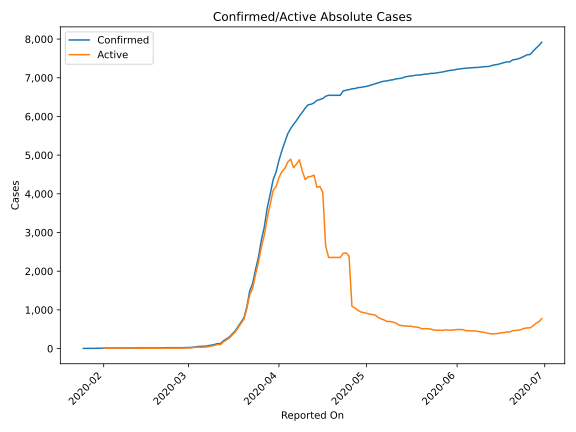
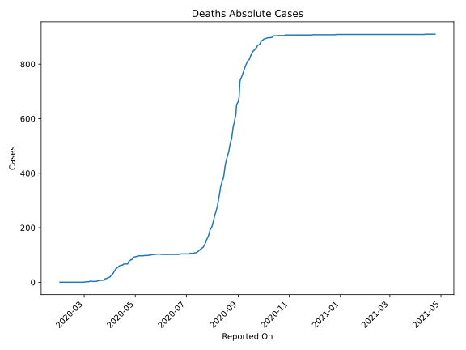
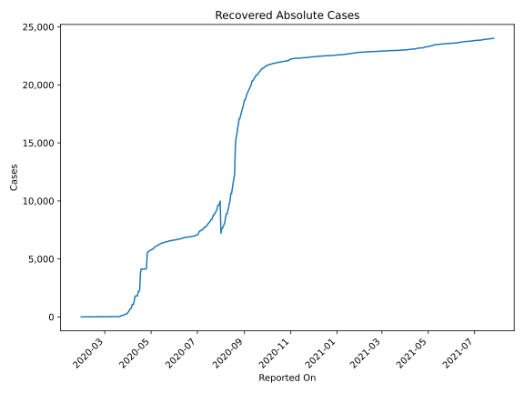
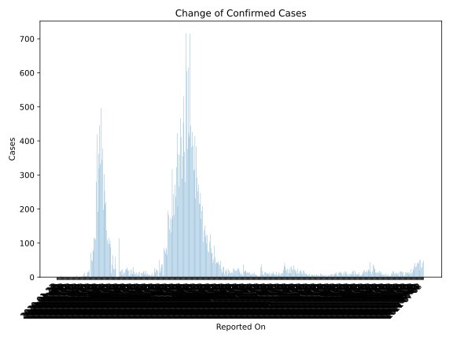
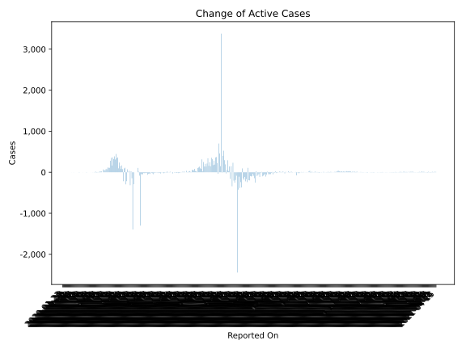
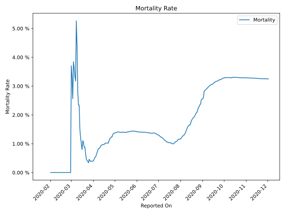

# Country Figures: Time Series for Australia 

| Reported On | Confirmed | Deaths | Recovered | Active | Mortality | &Delta; Confirmed | &Delta; Deaths | &Delta; Active | % Active of Population |
|-------------|-----------|--------|-----------|--------|-----------|-------------------|----------------|----------------|------------------------|
| 2020-04-05 | 5687 | 35 | 757 | 4895 |  0.62 %  | 137 | 5 | 76 |  0.020 %  | 
| 2020-04-04 | 5550 | 30 | 701 | 4819 |  0.54 %  | 220 | 2 | 166 |  0.019 %  | 
| 2020-04-03 | 5330 | 28 | 649 | 4653 |  0.53 %  | 214 | 4 | 81 |  0.019 %  | 
| 2020-04-02 | 5116 | 24 | 520 | 4572 |  0.47 %  | 254 | 4 | 152 |  0.018 %  | 
| 2020-04-01 | 4862 | 20 | 422 | 4420 |  0.41 %  | 303 | 2 | 237 |  0.018 %  | 
| 2020-03-31 | 4559 | 18 | 358 | 4183 |  0.39 %  | 198 | 1 | 96 |  0.017 %  | 
| 2020-03-30 | 4361 | 17 | 257 | 4087 |  0.39 %  | 377 | 1 | 363 |  0.016 %  | 
| 2020-03-29 | 3984 | 16 | 244 | 3724 |  0.40 %  | 344 | 2 | 342 |  0.015 %  | 
| 2020-03-28 | 3640 | 14 | 244 | 3382 |  0.38 %  | 497 | 1 | 446 |  0.014 %  | 
| 2020-03-27 | 3143 | 13 | 194 | 2936 |  0.41 %  | 333 | 0 | 311 |  0.012 %  | 
| 2020-03-26 | 2810 | 13 | 172 | 2625 |  0.46 %  | 446 | 5 | 388 |  0.011 %  | 
| 2020-03-25 | 2364 | 8 | 119 | 2237 |  0.34 %  | 320 | 0 | 320 |  0.009 %  | 
| 2020-03-24 | 2044 | 8 | 119 | 1917 |  0.39 %  | 362 | 1 | 361 |  0.008 %  | 
| 2020-03-23 | 1682 | 7 | 119 | 1556 |  0.42 %  | 192 | 0 | 165 |  0.006 %  | 
| 2020-03-22 | 1490 | 7 | 92 | 1391 |  0.47 %  | 419 | 0 | 353 |  0.006 %  | 
| 2020-03-21 | 1071 | 7 | 26 | 1038 |  0.65 %  | 280 | 0 | 280 |  0.004 %  | 
| 2020-03-20 | 791 | 7 | 26 | 758 |  0.88 %  | 110 | 1 | 109 |  0.003 %  | 
| 2020-03-19 | 681 | 6 | 26 | 649 |  0.88 %  | 113 | 0 | 110 |  0.003 %  | 
| 2020-03-18 | 568 | 6 | 23 | 539 |  1.06 %  | 116 | 1 | 115 |  0.002 %  | 
| 2020-03-17 | 452 | 5 | 23 | 424 |  1.11 %  | 75 | 2 | 73 |  0.002 %  | 
| 2020-03-16 | 377 | 3 | 23 | 351 |  0.80 %  | 80 | 0 | 80 |  0.001 %  | 
| 2020-03-15 | 297 | 3 | 23 | 271 |  1.01 %  | 47 | 0 | 47 |  0.001 %  | 
| 2020-03-14 | 250 | 3 | 23 | 224 |  1.20 %  | 50 | 0 | 50 |  0.001 %  | 
| 2020-03-13 | 200 | 3 | 23 | 174 |  1.50 %  | 72 | 0 | 70 |  0.001 %  | 
| 2020-03-12 | 128 | 3 | 21 | 104 |  2.34 %  | 0 | 0 | 0 |  0.000 %  | 
| 2020-03-11 | 128 | 3 | 21 | 104 |  2.34 %  | 21 | 0 | 21 |  0.000 %  | 
| 2020-03-10 | 107 | 3 | 21 | 83 |  2.80 %  | 16 | -1 | 17 |  0.000 %  | 
| 2020-03-09 | 91 | 4 | 21 | 66 |  4.40 %  | 15 | 0 | 15 |  0.000 %  | 
| 2020-03-08 | 76 | 4 | 21 | 51 |  5.26 %  | 13 | 2 | 11 |  0.000 %  | 
| 2020-03-07 | 63 | 2 | 21 | 40 |  3.17 %  | 3 | 0 | 3 |  0.000 %  | 
| 2020-03-06 | 60 | 2 | 21 | 37 |  3.33 %  | 5 | 0 | 5 |  0.000 %  | 
| 2020-03-05 | 55 | 2 | 21 | 32 |  3.64 %  | 3 | 0 | -7 |  0.000 %  | 
| 2020-03-04 | 52 | 2 | 11 | 39 |  3.85 %  | 13 | 1 | 12 |  0.000 %  | 
| 2020-03-03 | 39 | 1 | 11 | 27 |  2.56 %  | 9 | 0 | 9 |  0.000 %  | 
| 2020-03-02 | 30 | 1 | 11 | 18 |  3.33 %  | 3 | 0 | 3 |  0.000 %  | 
| 2020-03-01 | 27 | 1 | 11 | 15 |  3.70 %  | 2 | 1 | 1 |  0.000 %  | 
| 2020-02-29 | 25 | 0 | 11 | 14 |  None  | 2 | 0 | 2 |  0.000 %  | 
| 2020-02-28 | 23 | 0 | 11 | 12 |  None  | 0 | 0 | 0 |  0.000 %  | 
| 2020-02-27 | 23 | 0 | 11 | 12 |  None  | 1 | 0 | 1 |  0.000 %  | 
| 2020-02-26 | 22 | 0 | 11 | 11 |  None  | 0 | 0 | 0 |  0.000 %  | 
| 2020-02-25 | 22 | 0 | 11 | 11 |  None  | 0 | 0 | 0 |  0.000 %  | 
| 2020-02-24 | 22 | 0 | 11 | 11 |  None  | 0 | 0 | 0 |  0.000 %  | 
| 2020-02-23 | 22 | 0 | 11 | 11 |  None  | 0 | 0 | 0 |  0.000 %  | 
| 2020-02-22 | 22 | 0 | 11 | 11 |  None  | 3 | 0 | 3 |  0.000 %  | 
| 2020-02-21 | 19 | 0 | 11 | 8 |  None  | 4 | 0 | 3 |  0.000 %  | 
| 2020-02-20 | 15 | 0 | 10 | 5 |  None  | 0 | 0 | 0 |  0.000 %  | 
| 2020-02-19 | 15 | 0 | 10 | 5 |  None  | 0 | 0 | 0 |  0.000 %  | 
| 2020-02-18 | 15 | 0 | 10 | 5 |  None  | 0 | 0 | 0 |  0.000 %  | 
| 2020-02-17 | 15 | 0 | 10 | 5 |  None  | 0 | 0 | -2 |  0.000 %  | 
| 2020-02-16 | 15 | 0 | 8 | 7 |  None  | 0 | 0 | 0 |  0.000 %  | 
| 2020-02-15 | 15 | 0 | 8 | 7 |  None  | 0 | 0 | 0 |  0.000 %  | 
| 2020-02-14 | 15 | 0 | 8 | 7 |  None  | 0 | 0 | 0 |  0.000 %  | 
| 2020-02-13 | 15 | 0 | 8 | 7 |  None  | 0 | 0 | -6 |  0.000 %  | 
| 2020-02-12 | 15 | 0 | 2 | 13 |  None  | 0 | 0 | 0 |  0.000 %  | 
| 2020-02-11 | 15 | 0 | 2 | 13 |  None  | 0 | 0 | 0 |  0.000 %  | 
| 2020-02-10 | 15 | 0 | 2 | 13 |  None  | 0 | 0 | 0 |  0.000 %  | 
| 2020-02-09 | 15 | 0 | 2 | 13 |  None  | 0 | 0 | 0 |  0.000 %  | 
| 2020-02-08 | 15 | 0 | 2 | 13 |  None  | 0 | 0 | 0 |  0.000 %  | 
| 2020-02-07 | 15 | 0 | 2 | 13 |  None  | 1 | 0 | 1 |  0.000 %  | 
| 2020-02-06 | 14 | 0 | 2 | 12 |  None  | 1 | 0 | 1 |  0.000 %  | 
| 2020-02-05 | 13 | 0 | 2 | 11 |  None  | 0 | 0 | 0 |  0.000 %  | 
| 2020-02-04 | 13 | 0 | 2 | 11 |  None  | 1 | 0 | 1 |  0.000 %  | 
| 2020-02-03 | 12 | 0 | 2 | 10 |  None  | 0 | 0 | 0 |  0.000 %  | 
| 2020-02-02 | 12 | 0 | 2 | 10 |  None  | 0 | 0 | 0 |  0.000 %  | 
| 2020-02-01 | 12 | 0 | 2 | 10 |  None  | 3 | None | None |  0.000 %  | 
| 2020-01-31 | 9 | None | 2 | None |  None  | 0 | None | None |  n/a  | 
| 2020-01-30 | 9 | None | 2 | None |  None  | 4 | None | None |  n/a  | 
| 2020-01-29 | 5 | None | None | None |  None  | 0 | None | None |  n/a  | 
| 2020-01-28 | 5 | None | None | None |  None  | 0 | None | None |  n/a  | 
| 2020-01-27 | 5 | None | None | None |  None  | 1 | None | None |  n/a  | 
| 2020-01-26 | 4 | None | None | None |  None  | 0 | None | None |  n/a  | 
| 2020-01-25 | 4 | None | None | None |  None  | None | None | None |  n/a  | 
| 2020-01-23 | None | None | None | None |  None  | None | None | None |  n/a  | 

