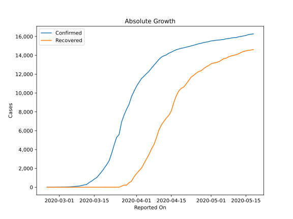
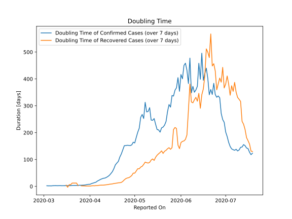

# Country Figures: Doubling Time of Infections for Austria 

The doubling time below are calculated based on
* an exponential growth assumption
* for time difference of past seven (7) days.
The doubling time's unit is "days".

The first doubling time indicates the increase of confirmed (infected)
cases. There, the *higher* the number is, the better is to take control
of the disease.

The second doubling time indicates the increase of recovered (healed)
cases. There, the *lower* the number is, the better it is to take
control of the disease.

| Reported On | Confirmed | Doubling Time (Confirmed) | Recovered | Doubling Time (Recovered) |
|-------------|-----------|---------------------------|-----------|---------------------------|
| 2020-04-13 | 14041 |  36.9 days  | 7343 |  6.8 days  | 
| 2020-04-12 | 13945 |  33.6 days  | 6987 |  6.1 days  | 
| 2020-04-11 | 13806 |  30.9 days  | 6604 |  5.3 days  | 
| 2020-04-10 | 13555 |  30.2 days  | 6064 |  4.8 days  | 
| 2020-04-09 | 13244 |  28.2 days  | 5240 |  4.8 days  | 
| 2020-04-08 | 12942 |  26.0 days  | 4512 |  4.6 days  | 
| 2020-04-07 | 12639 |  22.8 days  | 4046 |  4.0 days  | 
| 2020-04-06 | 12297 |  20.1 days  | 3463 |  3.2 days  | 
| 2020-04-05 | 12051 |  15.7 days  | 2998 |  3.0 days  | 
| 2020-04-04 | 11781 |  14.1 days  | 2507 |  2.3 days  | 
| 2020-04-03 | 11524 |  12.2 days  | 2022 |  2.5 days  | 
| 2020-04-02 | 11129 |  10.5 days  | 1749 |  2.1 days  | 
| 2020-04-01 | 10711 |  7.8 days  | 1436 |  1.3 days  | 
| 2020-03-31 | 10180 |  7.7 days  | 1095 |  1.3 days  | 
| 2020-03-30 | 9618 |  6.7 days  | 636 |  1.5 days  | 
| 2020-03-29 | 8788 |  5.7 days  | 479 |  1.5 days  | 
| 2020-03-28 | 8271 |  4.8 days  | 225 |  1.8 days  | 
| 2020-03-27 | 7657 |  4.5 days  | 225 |  1.8 days  | 
| 2020-03-26 | 6909 |  4.3 days  | 112 |  2.3 days  | 
| 2020-03-25 | 5588 |  4.3 days  | 9 |  None  | 
| 2020-03-24 | 5283 |  3.9 days  | 9 |  2.5 days  | 
| 2020-03-23 | 4474 |  3.6 days  | 9 |  12.3 days  | 
| 2020-03-22 | 3580 |  3.7 days  | 9 |  12.3 days  | 
| 2020-03-21 | 2814 |  3.7 days  | 9 |  12.3 days  | 
| 2020-03-20 | 2388 |  3.5 days  | 9 |  12.3 days  | 
| 2020-03-19 | 2013 |  2.9 days  | 9 |  6.3 days  | 
| 2020-03-18 | 1646 |  2.9 days  | 9 |  6.3 days  | 
| 2020-03-17 | 1332 |  2.8 days  | 1 |  -3.1 days  | 
| 2020-03-16 | 1018 |  2.7 days  | 6 |  4.8 days  | 
| 2020-03-15 | 860 |  2.6 days  | 6 |  None  | 
| 2020-03-14 | 655 |  2.6 days  | 6 |  None  | 
| 2020-03-13 | 504 |  2.5 days  | 6 |  None  | 
| 2020-03-12 | 302 |  2.8 days  | 4 |  None  | 
| 2020-03-11 | 246 |  2.6 days  | 4 |  None  | 
| 2020-03-10 | 182 |  2.6 days  | 4 |  None  | 
| 2020-03-09 | 131 |  2.8 days  | 2 |  None  | 
| 2020-03-08 | 104 |  2.8 days  | 0 |  None  | 
| 2020-03-07 | 79 |  2.6 days  | 0 |  None  | 
| 2020-03-06 | 55 |  2.0 days  | 0 |  None  | 
| 2020-03-05 | 41 |  2.2 days  | 0 |  None  | 
| 2020-03-04 | 29 |  2.1 days  | 0 |  None  | 
| 2020-03-03 | 21 |  2.4 days  | 0 |  None  | 
| 2020-03-02 | 18 |  None  | 0 |  None  | 
| 2020-03-01 | 14 |  None  | 0 |  None  | 
| 2020-02-29 | 9 |  None  | 0 |  None  | 
| 2020-02-28 | 3 |  None  | 0 |  None  | 
| 2020-02-27 | 3 |  None  | 0 |  None  | 
| 2020-02-26 | 2 |  None  | 0 |  None  | 
| 2020-02-25 | 2 |  None  | 0 |  None  | 

