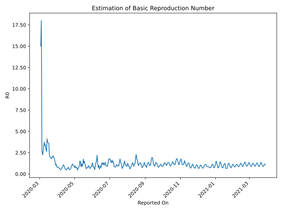

# Country Figures: Time Series for Basic Reproduction Number of Austria 

| Reported On | &Delta; Confirmed | Total &Delta; Confirmed First Interval | Total &Delta; Confirmed Second Interval | Estimated Basic Reproduction Number R0 | 
|-------------|-------------------|----------------------------------------|-----------------------------------------|---------------------------------------------------|
| 2020-05-04 | 24 |  195  |  254  |  0.77  | 
| 2020-05-03 | 39 |  201  |  286  |  0.70  | 
| 2020-05-02 | 27 |  257  |  272  |  0.94  | 
| 2020-05-01 | 79 |  227  |  300  |  0.76  | 
| 2020-04-30 | 50 |  254  |  275  |  0.92  | 
| 2020-04-29 | 45 |  286  |  276  |  1.04  | 
| 2020-04-28 | 83 |  272  |  253  |  1.08  | 
| 2020-04-27 | 49 |  300  |  254  |  1.18  | 
| 2020-04-26 | 77 |  275  |  278  |  0.99  | 
| 2020-04-25 | 77 |  276  |  319  |  0.87  | 
| 2020-04-24 | 69 |  253  |  413  |  0.61  | 
| 2020-04-23 | 77 |  254  |  445  |  0.57  | 
| 2020-04-22 | 52 |  278  |  554  |  0.50  | 
| 2020-04-21 | 78 |  319  |  531  |  0.60  | 
| 2020-04-20 | 46 |  413  |  530  |  0.78  | 
| 2020-04-19 | 78 |  445  |  671  |  0.66  | 
| 2020-04-18 | 76 |  554  |  797  |  0.70  | 
| 2020-04-17 | 119 |  531  |  1003  |  0.53  | 
| 2020-04-16 | 140 |  530  |  1167  |  0.45  | 
| 2020-04-15 | 110 |  671  |  1258  |  0.53  | 
| 2020-04-14 | 185 |  797  |  1193  |  0.67  | 
| 2020-04-13 | 96 |  1003  |  1161  |  0.86  | 
| 2020-04-12 | 139 |  1167  |  1115  |  1.05  | 
| 2020-04-11 | 251 |  1258  |  1168  |  1.08  | 
| 2020-04-10 | 311 |  1193  |  1340  |  0.89  | 
| 2020-04-09 | 302 |  1161  |  1601  |  0.73  | 
| 2020-04-08 | 303 |  1115  |  1906  |  0.58  | 
| 2020-04-07 | 342 |  1168  |  2341  |  0.50  | 
| 2020-04-06 | 246 |  1340  |  2440  |  0.55  | 
| 2020-04-05 | 270 |  1601  |  2523  |  0.63  | 
| 2020-04-04 | 257 |  1906  |  2709  |  0.70  | 
| 2020-04-03 | 395 |  2341  |  3200  |  0.73  | 
| 2020-04-02 | 418 |  2440  |  2988  |  0.82  | 
| 2020-04-01 | 531 |  2523  |  3183  |  0.79  | 
| 2020-03-31 | 562 |  2709  |  3329  |  0.81  | 
| 2020-03-30 | 830 |  3200  |  2774  |  1.15  | 
| 2020-03-29 | 517 |  2988  |  2895  |  1.03  | 
| 2020-03-28 | 614 |  3183  |  2461  |  1.29  | 
| 2020-03-27 | 748 |  3329  |  1934  |  1.72  | 
| 2020-03-26 | 1321 |  2774  |  1482  |  1.87  | 
| 2020-03-25 | 305 |  2895  |  1370  |  2.11  | 
| 2020-03-24 | 809 |  2461  |  1153  |  2.13  | 
| 2020-03-23 | 894 |  1934  |  991  |  1.95  | 
| 2020-03-22 | 766 |  1482  |  828  |  1.79  | 
| 2020-03-21 | 426 |  1370  |  716  |  1.91  | 
| 2020-03-20 | 375 |  1153  |  614  |  1.88  | 
| 2020-03-19 | 367 |  991  |  473  |  2.10  | 
| 2020-03-18 | 314 |  828  |  373  |  2.22  | 
| 2020-03-17 | 314 |  716  |  198  |  3.62  | 
| 2020-03-16 | 158 |  614  |  167  |  3.68  | 
| 2020-03-15 | 205 |  473  |  127  |  3.72  | 
| 2020-03-14 | 151 |  373  |  90  |  4.14  | 
| 2020-03-13 | 202 |  198  |  75  |  2.64  | 
| 2020-03-12 | 56 |  167  |  58  |  2.88  | 
| 2020-03-11 | 64 |  127  |  37  |  3.43  | 
| 2020-03-10 | 51 |  90  |  27  |  3.33  | 
| 2020-03-09 | 27 |  75  |  20  |  3.75  | 
| 2020-03-08 | 25 |  58  |  18  |  3.22  | 
| 2020-03-07 | 24 |  37  |  15  |  2.47  | 
| 2020-03-06 | 14 |  27  |  12  |  2.25  | 
| 2020-03-05 | 12 |  20  |  7  |  2.86  | 
| 2020-03-04 | 8 |  18  |  1  |  18.00  | 
| 2020-03-03 | 3 |  15  |  1  |  15.00  | 
| 2020-03-02 | 4 |  12  |  None  |  None  | 
| 2020-03-01 | 5 |  7  |  None  |  None  | 
| 2020-02-29 | 6 |  1  |  None  |  None  | 
| 2020-02-28 | 0 |  1  |  None  |  None  | 
| 2020-02-27 | 1 |  None  |  None  |  None  | 
| 2020-02-26 | 0 |  None  |  None  |  None  | 
| 2020-02-25 | None |  None  |  None  |  None  | 

