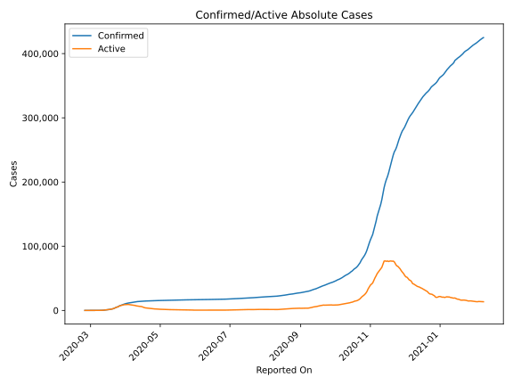
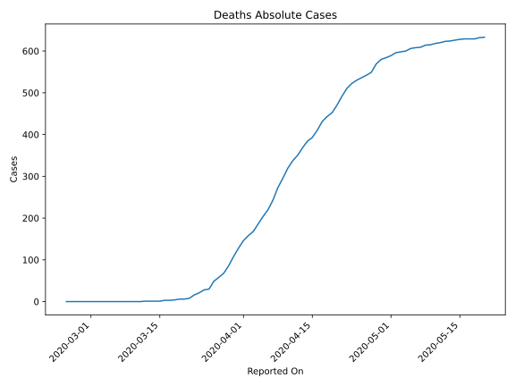
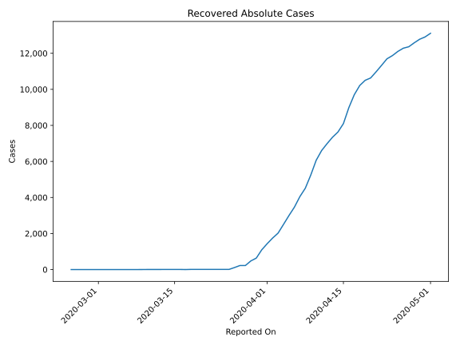
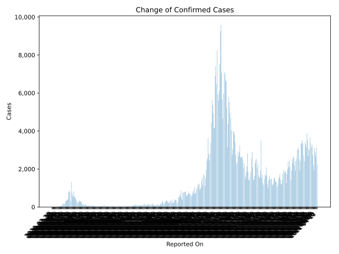
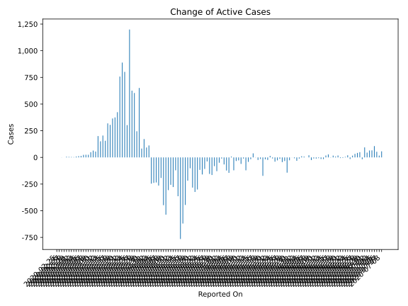
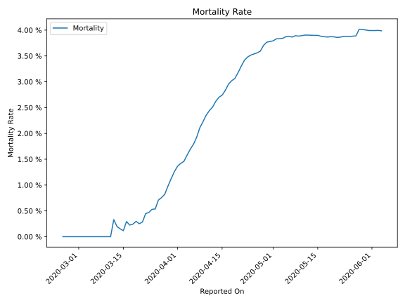

# Country Figures: Time Series for Austria 

| Reported On | Confirmed | Deaths | Recovered | Active | Mortality | &Delta; Confirmed | &Delta; Deaths | &Delta; Recovered | &Delta; Active | % Active of Population |
|-------------|-----------|--------|-----------|--------|-----------|-------------------|----------------|-------------------|----------------|------------------------|
| 2020-05-07 | 15752 | 609 | 13698 | 1445 |  3.87 %  | 68 | 1 | 59 | 8 |  0.016 %  | 
| 2020-05-06 | 15684 | 608 | 13639 | 1437 |  3.88 %  | 34 | 2 | 177 | -145 |  0.016 %  | 
| 2020-05-05 | 15650 | 606 | 13462 | 1582 |  3.87 %  | 29 | 6 | 146 | -123 |  0.018 %  | 
| 2020-05-04 | 15621 | 600 | 13316 | 1705 |  3.84 %  | 24 | 2 | 88 | -66 |  0.019 %  | 
| 2020-05-03 | 15597 | 598 | 13228 | 1771 |  3.83 %  | 39 | 2 | 48 | -11 |  0.020 %  | 
| 2020-05-02 | 15558 | 596 | 13180 | 1782 |  3.83 %  | 27 | 7 | 70 | -50 |  0.020 %  | 
| 2020-05-01 | 15531 | 589 | 13110 | 1832 |  3.79 %  | 79 | 5 | 203 | -129 |  0.021 %  | 
| 2020-04-30 | 15452 | 584 | 12907 | 1961 |  3.78 %  | 50 | 4 | 128 | -82 |  0.022 %  | 
| 2020-04-29 | 15402 | 580 | 12779 | 2043 |  3.77 %  | 45 | 11 | 199 | -165 |  0.023 %  | 
| 2020-04-28 | 15357 | 569 | 12580 | 2208 |  3.71 %  | 83 | 20 | 218 | -155 |  0.025 %  | 
| 2020-04-27 | 15274 | 549 | 12362 | 2363 |  3.59 %  | 49 | 7 | 80 | -38 |  0.027 %  | 
| 2020-04-26 | 15225 | 542 | 12282 | 2401 |  3.56 %  | 77 | 6 | 179 | -108 |  0.027 %  | 
| 2020-04-25 | 15148 | 536 | 12103 | 2509 |  3.54 %  | 77 | 6 | 231 | -160 |  0.028 %  | 
| 2020-04-24 | 15071 | 530 | 11872 | 2669 |  3.52 %  | 69 | 8 | 178 | -117 |  0.030 %  | 
| 2020-04-23 | 15002 | 522 | 11694 | 2786 |  3.48 %  | 77 | 12 | 366 | -301 |  0.031 %  | 
| 2020-04-22 | 14925 | 510 | 11328 | 3087 |  3.42 %  | 52 | 19 | 357 | -324 |  0.035 %  | 
| 2020-04-21 | 14873 | 491 | 10971 | 3411 |  3.30 %  | 78 | 21 | 340 | -283 |  0.039 %  | 
| 2020-04-20 | 14795 | 470 | 10631 | 3694 |  3.18 %  | 46 | 18 | 130 | -102 |  0.042 %  | 
| 2020-04-19 | 14749 | 452 | 10501 | 3796 |  3.06 %  | 78 | 9 | 287 | -218 |  0.043 %  | 
| 2020-04-18 | 14671 | 443 | 10214 | 4014 |  3.02 %  | 76 | 12 | 510 | -446 |  0.045 %  | 
| 2020-04-17 | 14595 | 431 | 9704 | 4460 |  2.95 %  | 119 | 21 | 718 | -620 |  0.050 %  | 
| 2020-04-16 | 14476 | 410 | 8986 | 5080 |  2.83 %  | 140 | 17 | 888 | -765 |  0.057 %  | 
| 2020-04-15 | 14336 | 393 | 8098 | 5845 |  2.74 %  | 110 | 9 | 465 | -364 |  0.066 %  | 
| 2020-04-14 | 14226 | 384 | 7633 | 6209 |  2.70 %  | 185 | 16 | 290 | -121 |  0.070 %  | 
| 2020-04-13 | 14041 | 368 | 7343 | 6330 |  2.62 %  | 96 | 18 | 356 | -278 |  0.072 %  | 
| 2020-04-12 | 13945 | 350 | 6987 | 6608 |  2.51 %  | 139 | 13 | 383 | -257 |  0.075 %  | 
| 2020-04-11 | 13806 | 337 | 6604 | 6865 |  2.44 %  | 251 | 18 | 540 | -307 |  0.078 %  | 
| 2020-04-10 | 13555 | 319 | 6064 | 7172 |  2.35 %  | 311 | 24 | 824 | -537 |  0.081 %  | 
| 2020-04-09 | 13244 | 295 | 5240 | 7709 |  2.23 %  | 302 | 22 | 728 | -448 |  0.087 %  | 
| 2020-04-08 | 12942 | 273 | 4512 | 8157 |  2.11 %  | 303 | 30 | 466 | -193 |  0.092 %  | 
| 2020-04-07 | 12639 | 243 | 4046 | 8350 |  1.92 %  | 342 | 23 | 583 | -264 |  0.094 %  | 
| 2020-04-06 | 12297 | 220 | 3463 | 8614 |  1.79 %  | 246 | 16 | 465 | -235 |  0.097 %  | 
| 2020-04-05 | 12051 | 204 | 2998 | 8849 |  1.69 %  | 270 | 18 | 491 | -239 |  0.100 %  | 
| 2020-04-04 | 11781 | 186 | 2507 | 9088 |  1.58 %  | 257 | 18 | 485 | -246 |  0.103 %  | 
| 2020-04-03 | 11524 | 168 | 2022 | 9334 |  1.46 %  | 395 | 10 | 273 | 112 |  0.106 %  | 
| 2020-04-02 | 11129 | 158 | 1749 | 9222 |  1.42 %  | 418 | 12 | 313 | 93 |  0.104 %  | 
| 2020-04-01 | 10711 | 146 | 1436 | 9129 |  1.36 %  | 531 | 18 | 341 | 172 |  0.103 %  | 
| 2020-03-31 | 10180 | 128 | 1095 | 8957 |  1.26 %  | 562 | 20 | 459 | 83 |  0.101 %  | 
| 2020-03-30 | 9618 | 108 | 636 | 8874 |  1.12 %  | 830 | 22 | 157 | 651 |  0.100 %  | 
| 2020-03-29 | 8788 | 86 | 479 | 8223 |  0.98 %  | 517 | 18 | 254 | 245 |  0.093 %  | 
| 2020-03-28 | 8271 | 68 | 225 | 7978 |  0.82 %  | 614 | 10 | 0 | 604 |  0.090 %  | 
| 2020-03-27 | 7657 | 58 | 225 | 7374 |  0.76 %  | 748 | 9 | 113 | 626 |  0.083 %  | 
| 2020-03-26 | 6909 | 49 | 112 | 6748 |  0.71 %  | 1321 | 19 | 103 | 1199 |  0.076 %  | 
| 2020-03-25 | 5588 | 30 | 9 | 5549 |  0.54 %  | 305 | 2 | 0 | 303 |  0.063 %  | 
| 2020-03-24 | 5283 | 28 | 9 | 5246 |  0.53 %  | 809 | 7 | 0 | 802 |  0.059 %  | 
| 2020-03-23 | 4474 | 21 | 9 | 4444 |  0.47 %  | 894 | 5 | 0 | 889 |  0.050 %  | 
| 2020-03-22 | 3580 | 16 | 9 | 3555 |  0.45 %  | 766 | 8 | 0 | 758 |  0.040 %  | 
| 2020-03-21 | 2814 | 8 | 9 | 2797 |  0.28 %  | 426 | 2 | 0 | 424 |  0.032 %  | 
| 2020-03-20 | 2388 | 6 | 9 | 2373 |  0.25 %  | 375 | 0 | 0 | 375 |  0.027 %  | 
| 2020-03-19 | 2013 | 6 | 9 | 1998 |  0.30 %  | 367 | 2 | 0 | 365 |  0.023 %  | 
| 2020-03-18 | 1646 | 4 | 9 | 1633 |  0.24 %  | 314 | 1 | 8 | 305 |  0.018 %  | 
| 2020-03-17 | 1332 | 3 | 1 | 1328 |  0.23 %  | 314 | 0 | -5 | 319 |  0.015 %  | 
| 2020-03-16 | 1018 | 3 | 6 | 1009 |  0.29 %  | 158 | 2 | 0 | 156 |  0.011 %  | 
| 2020-03-15 | 860 | 1 | 6 | 853 |  0.12 %  | 205 | 0 | 0 | 205 |  0.010 %  | 
| 2020-03-14 | 655 | 1 | 6 | 648 |  0.15 %  | 151 | 0 | 0 | 151 |  0.007 %  | 
| 2020-03-13 | 504 | 1 | 6 | 497 |  0.20 %  | 202 | 0 | 2 | 200 |  0.006 %  | 
| 2020-03-12 | 302 | 1 | 4 | 297 |  0.33 %  | 56 | 1 | 0 | 55 |  0.003 %  | 
| 2020-03-11 | 246 | 0 | 4 | 242 |  None  | 64 | 0 | 0 | 64 |  0.003 %  | 
| 2020-03-10 | 182 | 0 | 4 | 178 |  None  | 51 | 0 | 2 | 49 |  0.002 %  | 
| 2020-03-09 | 131 | 0 | 2 | 129 |  None  | 27 | 0 | 2 | 25 |  0.001 %  | 
| 2020-03-08 | 104 | 0 | 0 | 104 |  None  | 25 | 0 | 0 | 25 |  0.001 %  | 
| 2020-03-07 | 79 | 0 | 0 | 79 |  None  | 24 | 0 | 0 | 24 |  0.001 %  | 
| 2020-03-06 | 55 | 0 | 0 | 55 |  None  | 14 | 0 | 0 | 14 |  0.001 %  | 
| 2020-03-05 | 41 | 0 | 0 | 41 |  None  | 12 | 0 | 0 | 12 |  0.000 %  | 
| 2020-03-04 | 29 | 0 | 0 | 29 |  None  | 8 | 0 | 0 | 8 |  0.000 %  | 
| 2020-03-03 | 21 | 0 | 0 | 21 |  None  | 3 | 0 | 0 | 3 |  0.000 %  | 
| 2020-03-02 | 18 | 0 | 0 | 18 |  None  | 4 | 0 | 0 | 4 |  0.000 %  | 
| 2020-03-01 | 14 | 0 | 0 | 14 |  None  | 5 | 0 | 0 | 5 |  0.000 %  | 
| 2020-02-29 | 9 | 0 | 0 | 9 |  None  | 6 | 0 | 0 | 6 |  0.000 %  | 
| 2020-02-28 | 3 | 0 | 0 | 3 |  None  | 0 | 0 | 0 | 0 |  0.000 %  | 
| 2020-02-27 | 3 | 0 | 0 | 3 |  None  | 1 | 0 | 0 | 1 |  0.000 %  | 
| 2020-02-26 | 2 | 0 | 0 | 2 |  None  | 0 | 0 | 0 | 0 |  0.000 %  | 
| 2020-02-25 | 2 | 0 | 0 | 2 |  None  | None | None | None | None |  0.000 %  | 

