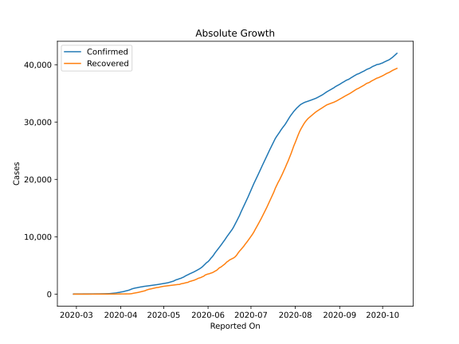
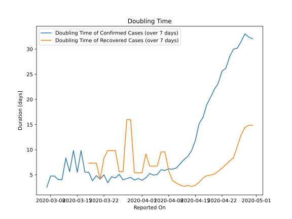

# Country Figures: Doubling Time of Infections for Azerbaijan 

The doubling time below are calculated based on
* an exponential growth assumption
* for time difference of past seven (7) days.
The doubling time's unit is "days".

The first doubling time indicates the increase of confirmed (infected)
cases. There, the *higher* the number is, the better is to take control
of the disease.

The second doubling time indicates the increase of recovered (healed)
cases. There, the *lower* the number is, the better it is to take
control of the disease.

| Reported On | Confirmed | Doubling Time (Confirmed) | Recovered | Doubling Time (Recovered) |
|-------------|-----------|---------------------------|-----------|---------------------------|
| 2020-04-10 | 991 |  6.4 days  | 159 |  3.4 days  | 
| 2020-04-09 | 926 |  6.1 days  | 101 |  3.9 days  | 
| 2020-04-08 | 822 |  6.2 days  | 63 |  5.8 days  | 
| 2020-04-07 | 717 |  5.9 days  | 44 |  9.6 days  | 
| 2020-04-06 | 641 |  6.0 days  | 44 |  9.6 days  | 
| 2020-04-05 | 584 |  5.1 days  | 32 |  6.7 days  | 
| 2020-04-04 | 521 |  5.0 days  | 32 |  6.7 days  | 
| 2020-04-03 | 443 |  5.3 days  | 32 |  6.7 days  | 
| 2020-04-02 | 400 |  4.4 days  | 26 |  9.2 days  | 
| 2020-04-01 | 359 |  3.9 days  | 26 |  5.4 days  | 
| 2020-03-31 | 298 |  4.3 days  | 26 |  5.4 days  | 
| 2020-03-30 | 273 |  4.0 days  | 26 |  5.4 days  | 
| 2020-03-29 | 209 |  4.5 days  | 15 |  16.0 days  | 
| 2020-03-28 | 182 |  4.3 days  | 15 |  16.0 days  | 
| 2020-03-27 | 165 |  4.0 days  | 15 |  5.6 days  | 
| 2020-03-26 | 122 |  5.1 days  | 15 |  5.6 days  | 
| 2020-03-25 | 93 |  4.4 days  | 10 |  9.8 days  | 
| 2020-03-24 | 87 |  4.6 days  | 10 |  9.8 days  | 
| 2020-03-23 | 72 |  3.4 days  | 10 |  9.8 days  | 
| 2020-03-22 | 65 |  5.0 days  | 11 |  8.3 days  | 
| 2020-03-21 | 53 |  4.2 days  | 11 |  4.1 days  | 
| 2020-03-20 | 44 |  4.8 days  | 6 |  7.3 days  | 
| 2020-03-19 | 44 |  3.8 days  | 6 |  7.3 days  | 
| 2020-03-18 | 28 |  5.5 days  | 6 |  7.3 days  | 
| 2020-03-17 | 28 |  5.5 days  | 6 |  None  | 
| 2020-03-16 | 15 |  9.8 days  | 6 |  None  | 
| 2020-03-15 | 23 |  5.5 days  | 6 |  None  | 
| 2020-03-14 | 15 |  9.8 days  | 3 |  None  | 
| 2020-03-13 | 15 |  5.6 days  | 3 |  None  | 
| 2020-03-12 | 11 |  8.3 days  | 3 |  None  | 
| 2020-03-11 | 11 |  4.1 days  | 3 |  None  | 
| 2020-03-10 | 11 |  4.1 days  | 0 |  None  | 
| 2020-03-09 | 9 |  4.8 days  | 0 |  None  | 
| 2020-03-08 | 9 |  4.8 days  | 0 |  None  | 
| 2020-03-07 | 9 |  2.5 days  | 0 |  None  | 
| 2020-03-06 | 6 |  None  | 0 |  None  | 
| 2020-03-05 | 6 |  None  | 0 |  None  | 
| 2020-03-04 | 3 |  None  | 0 |  None  | 
| 2020-03-03 | 3 |  None  | 0 |  None  | 
| 2020-03-02 | 3 |  None  | 0 |  None  | 
| 2020-03-01 | 3 |  None  | 0 |  None  | 
| 2020-02-28 | 1 |  None  | 0 |  None  | 

