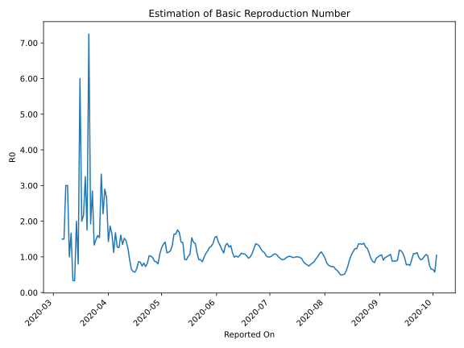

# Country Figures: Time Series for Basic Reproduction Number of Azerbaijan 

| Reported On | &Delta; Confirmed | Total &Delta; Confirmed First Interval | Total &Delta; Confirmed Second Interval | Estimated Basic Reproduction Number R0 | 
|-------------|-------------------|----------------------------------------|-----------------------------------------|---------------------------------------------------|
| 2020-05-06 | 67 |  206  |  176  |  1.17  | 
| 2020-05-05 | 76 |  180  |  159  |  1.13  | 
| 2020-05-04 | 52 |  166  |  149  |  1.11  | 
| 2020-05-03 | 38 |  177  |  125  |  1.42  | 
| 2020-05-02 | 40 |  176  |  130  |  1.35  | 
| 2020-05-01 | 50 |  159  |  127  |  1.25  | 
| 2020-04-30 | 38 |  149  |  137  |  1.09  | 
| 2020-04-29 | 49 |  125  |  156  |  0.80  | 
| 2020-04-28 | 39 |  130  |  150  |  0.87  | 
| 2020-04-27 | 33 |  127  |  145  |  0.88  | 
| 2020-04-26 | 28 |  137  |  140  |  0.98  | 
| 2020-04-25 | 25 |  156  |  153  |  1.02  | 
| 2020-04-24 | 44 |  150  |  145  |  1.03  | 
| 2020-04-23 | 30 |  145  |  176  |  0.82  | 
| 2020-04-22 | 38 |  140  |  192  |  0.73  | 
| 2020-04-21 | 44 |  153  |  185  |  0.83  | 
| 2020-04-20 | 38 |  145  |  195  |  0.74  | 
| 2020-04-19 | 25 |  176  |  206  |  0.85  | 
| 2020-04-18 | 33 |  192  |  222  |  0.86  | 
| 2020-04-17 | 57 |  185  |  276  |  0.67  | 
| 2020-04-16 | 30 |  195  |  341  |  0.57  | 
| 2020-04-15 | 56 |  206  |  350  |  0.59  | 
| 2020-04-14 | 49 |  222  |  342  |  0.65  | 
| 2020-04-13 | 50 |  276  |  301  |  0.92  | 
| 2020-04-12 | 40 |  341  |  274  |  1.24  | 
| 2020-04-11 | 67 |  350  |  241  |  1.45  | 
| 2020-04-10 | 65 |  342  |  225  |  1.52  | 
| 2020-04-09 | 104 |  301  |  223  |  1.35  | 
| 2020-04-08 | 105 |  274  |  170  |  1.61  | 
| 2020-04-07 | 76 |  241  |  191  |  1.26  | 
| 2020-04-06 | 57 |  225  |  177  |  1.27  | 
| 2020-04-05 | 63 |  223  |  133  |  1.68  | 
| 2020-04-04 | 78 |  170  |  151  |  1.13  | 
| 2020-04-03 | 43 |  191  |  116  |  1.65  | 
| 2020-04-02 | 41 |  177  |  95  |  1.86  | 
| 2020-04-01 | 61 |  133  |  93  |  1.43  | 
| 2020-03-31 | 25 |  151  |  57  |  2.65  | 
| 2020-03-30 | 64 |  116  |  40  |  2.90  | 
| 2020-03-29 | 27 |  95  |  43  |  2.21  | 
| 2020-03-28 | 17 |  93  |  28  |  3.32  | 
| 2020-03-27 | 43 |  57  |  37  |  1.54  | 
| 2020-03-26 | 29 |  40  |  25  |  1.60  | 
| 2020-03-25 | 6 |  43  |  29  |  1.48  | 
| 2020-03-24 | 15 |  28  |  21  |  1.33  | 
| 2020-03-23 | 7 |  37  |  13  |  2.85  | 
| 2020-03-22 | 12 |  25  |  13  |  1.92  | 
| 2020-03-21 | 9 |  29  |  4  |  7.25  | 
| 2020-03-20 | 0 |  21  |  12  |  1.75  | 
| 2020-03-19 | 16 |  13  |  4  |  3.25  | 
| 2020-03-18 | 0 |  13  |  6  |  2.17  | 
| 2020-03-17 | 13 |  4  |  2  |  2.00  | 
| 2020-03-16 | -8 |  12  |  2  |  6.00  | 
| 2020-03-15 | 8 |  4  |  5  |  0.80  | 
| 2020-03-14 | 0 |  6  |  3  |  2.00  | 
| 2020-03-13 | 4 |  2  |  6  |  0.33  | 
| 2020-03-12 | 0 |  2  |  6  |  0.33  | 
| 2020-03-11 | 0 |  5  |  3  |  1.67  | 
| 2020-03-10 | 2 |  3  |  3  |  1.00  | 
| 2020-03-09 | 0 |  6  |  2  |  3.00  | 
| 2020-03-08 | 0 |  6  |  2  |  3.00  | 
| 2020-03-07 | 3 |  3  |  2  |  1.50  | 
| 2020-03-06 | 0 |  3  |  2  |  1.50  | 
| 2020-03-05 | 3 |  2  |  None  |  None  | 
| 2020-03-04 | 0 |  2  |  None  |  None  | 
| 2020-03-03 | 0 |  2  |  None  |  None  | 
| 2020-03-02 | 0 |  2  |  None  |  None  | 
| 2020-03-01 | 2 |  None  |  None  |  None  | 
| 2020-02-28 | None |  None  |  None  |  None  | 

