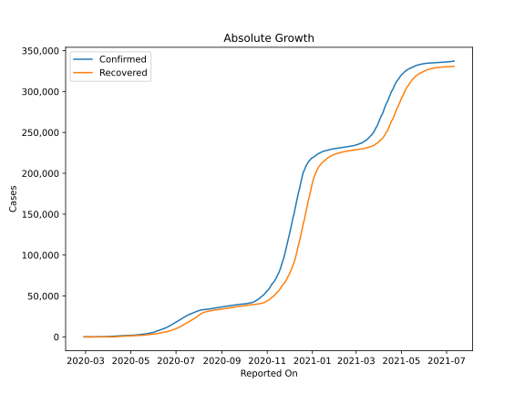
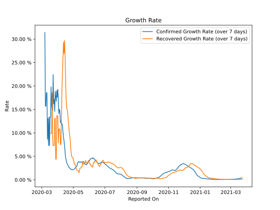

# Country Figures: Growth Rate for Azerbaijan 

The growth rates below are calculated based on
* an exponential growth assumption
* for time difference of past seven (7) days.
The growth rate is to be understood as on "growth per day".

The first growth rate indicates the increase of confirmed (infected) cases.

The second growth rate indicates the increase of recovered (healed) cases.

| Reported On | Confirmed | Growth Rate (Confirmed) | Recovered | Growth Rate (Recovered) |
|-------------|-----------|-------------------------|-----------|-------------------------|
| 2020-05-08 | 2279 |  2.95 %  | 1576 |  2.053 %  | 
| 2020-05-07 | 2204 |  2.86 %  | 1551 |  2.250 %  | 
| 2020-05-06 | 2127 |  2.66 %  | 1536 |  2.750 %  | 
| 2020-05-05 | 2060 |  2.60 %  | 1508 |  3.016 %  | 
| 2020-05-04 | 1984 |  2.39 %  | 1480 |  3.456 %  | 
| 2020-05-03 | 1932 |  2.30 %  | 1441 |  3.360 %  | 
| 2020-05-02 | 1894 |  2.26 %  | 1411 |  3.819 %  | 
| 2020-05-01 | 1854 |  2.18 %  | 1365 |  4.261 %  | 
| 2020-04-30 | 1804 |  2.19 %  | 1325 |  4.783 %  | 
| 2020-04-29 | 1766 |  2.16 %  | 1267 |  4.775 %  | 
| 2020-04-28 | 1717 |  2.12 %  | 1221 |  4.924 %  | 
| 2020-04-27 | 1678 |  2.22 %  | 1162 |  5.494 %  | 
| 2020-04-26 | 1645 |  2.32 %  | 1139 |  6.712 %  | 
| 2020-04-25 | 1617 |  2.34 %  | 1080 |  8.637 %  | 
| 2020-04-24 | 1592 |  2.46 %  | 1013 |  9.308 %  | 
| 2020-04-23 | 1548 |  2.68 %  | 948 |  10.330 %  | 
| 2020-04-22 | 1518 |  2.74 %  | 907 |  11.553 %  | 
| 2020-04-21 | 1480 |  3.03 %  | 865 |  12.885 %  | 
| 2020-04-20 | 1436 |  3.20 %  | 791 |  14.384 %  | 
| 2020-04-19 | 1398 |  3.45 %  | 712 |  14.952 %  | 
| 2020-04-18 | 1373 |  3.72 %  | 590 |  15.454 %  | 
| 2020-04-17 | 1340 |  4.31 %  | 528 |  17.146 %  | 
| 2020-04-16 | 1283 |  4.66 %  | 460 |  21.659 %  | 
| 2020-04-15 | 1253 |  6.02 %  | 404 |  26.547 %  | 
| 2020-04-14 | 1197 |  7.32 %  | 351 |  29.666 %  | 
| 2020-04-13 | 1148 |  8.32 %  | 289 |  26.889 %  | 
| 2020-04-12 | 1098 |  9.02 %  | 250 |  29.368 %  | 
| 2020-04-11 | 1058 |  10.12 %  | 200 |  26.180 %  | 
| 2020-04-10 | 991 |  11.50 %  | 159 |  22.902 %  | 
| 2020-04-09 | 926 |  11.99 %  | 101 |  19.386 %  | 
| 2020-04-08 | 822 |  11.83 %  | 63 |  12.643 %  | 
| 2020-04-07 | 717 |  12.54 %  | 44 |  7.516 %  | 
| 2020-04-06 | 641 |  12.19 %  | 44 |  7.516 %  | 
| 2020-04-05 | 584 |  14.68 %  | 32 |  10.824 %  | 
| 2020-04-04 | 521 |  15.02 %  | 32 |  10.824 %  | 
| 2020-04-03 | 443 |  14.11 %  | 32 |  10.824 %  | 
| 2020-04-02 | 400 |  16.96 %  | 26 |  7.858 %  | 
| 2020-04-01 | 359 |  19.30 %  | 26 |  13.650 %  | 
| 2020-03-31 | 298 |  17.59 %  | 26 |  13.650 %  | 
| 2020-03-30 | 273 |  19.04 %  | 26 |  13.650 %  | 
| 2020-03-29 | 209 |  16.68 %  | 15 |  4.431 %  | 
| 2020-03-28 | 182 |  17.62 %  | 15 |  4.431 %  | 
| 2020-03-27 | 165 |  18.88 %  | 15 |  13.090 %  | 
| 2020-03-26 | 122 |  14.57 %  | 15 |  13.090 %  | 
| 2020-03-25 | 93 |  17.15 %  | 10 |  7.298 %  | 
| 2020-03-24 | 87 |  16.20 %  | 10 |  7.298 %  | 
| 2020-03-23 | 72 |  22.41 %  | 10 |  7.298 %  | 
| 2020-03-22 | 65 |  14.84 %  | 11 |  8.659 %  | 
| 2020-03-21 | 53 |  18.03 %  | 11 |  18.561 %  | 
| 2020-03-20 | 44 |  15.37 %  | 6 |  9.902 %  | 
| 2020-03-19 | 44 |  19.80 %  | 6 |  9.902 %  | 
| 2020-03-18 | 28 |  13.35 %  | 6 |  9.902 %  | 
| 2020-03-17 | 28 |  13.35 %  | 6 |  None  | 
| 2020-03-16 | 15 |  7.30 %  | 6 |  None  | 
| 2020-03-15 | 23 |  13.40 %  | 6 |  None  | 
| 2020-03-14 | 15 |  7.30 %  | 3 |  None  | 
| 2020-03-13 | 15 |  13.09 %  | 3 |  None  | 
| 2020-03-12 | 11 |  8.66 %  | 3 |  None  | 
| 2020-03-11 | 11 |  18.56 %  | 3 |  None  | 
| 2020-03-10 | 11 |  18.56 %  | 0 |  None  | 
| 2020-03-09 | 9 |  15.69 %  | 0 |  None  | 
| 2020-03-08 | 9 |  15.69 %  | 0 |  None  | 
| 2020-03-07 | 9 |  31.39 %  | 0 |  None  | 
| 2020-03-06 | 6 |  None  | 0 |  None  | 
| 2020-03-05 | 6 |  None  | 0 |  None  | 
| 2020-03-04 | 3 |  None  | 0 |  None  | 
| 2020-03-03 | 3 |  None  | 0 |  None  | 
| 2020-03-02 | 3 |  None  | 0 |  None  | 
| 2020-03-01 | 3 |  None  | 0 |  None  | 
| 2020-02-28 | 1 |  None  | 0 |  None  | 

