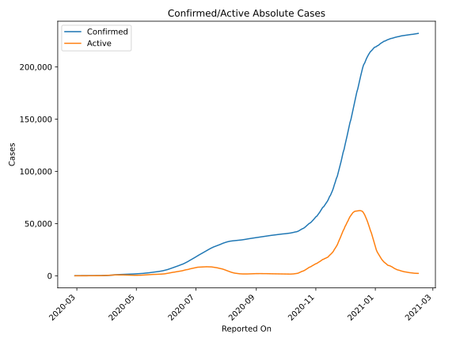
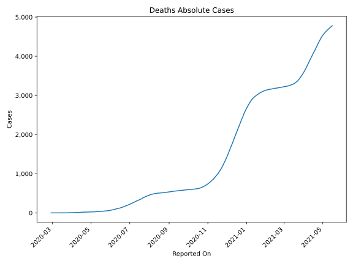
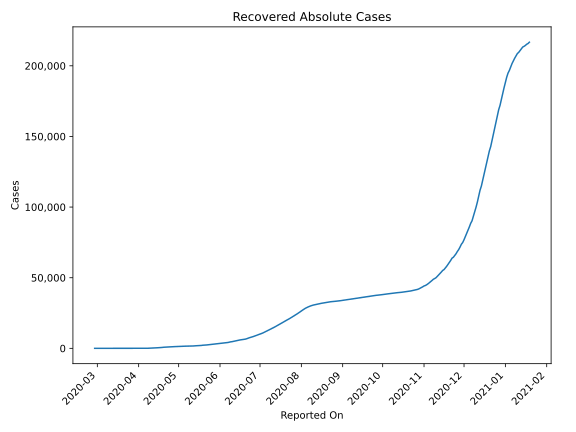
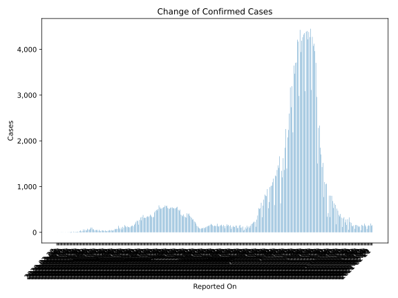
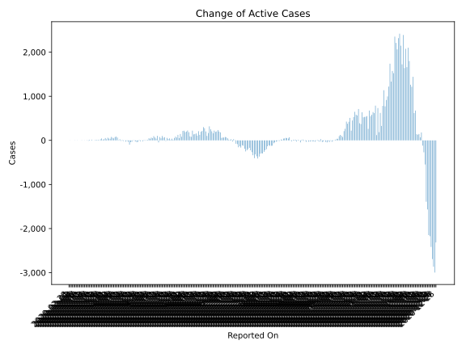
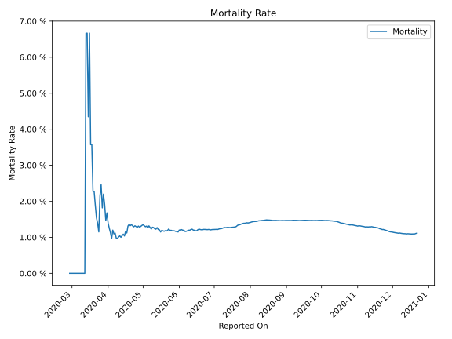

# Country Figures: Time Series for Azerbaijan 

| Reported On | Confirmed | Deaths | Recovered | Active | Mortality | &Delta; Confirmed | &Delta; Deaths | &Delta; Recovered | &Delta; Active | % Active of Population |
|-------------|-----------|--------|-----------|--------|-----------|-------------------|----------------|-------------------|----------------|------------------------|
| 2020-04-17 | 1340 | 15 | 528 | 797 |  1.12 %  | 57 | 0 | 68 | -11 |  0.008 %  | 
| 2020-04-16 | 1283 | 15 | 460 | 808 |  1.17 %  | 30 | 2 | 56 | -28 |  0.008 %  | 
| 2020-04-15 | 1253 | 13 | 404 | 836 |  1.04 %  | 56 | 0 | 53 | 3 |  0.008 %  | 
| 2020-04-14 | 1197 | 13 | 351 | 833 |  1.09 %  | 49 | 1 | 62 | -14 |  0.008 %  | 
| 2020-04-13 | 1148 | 12 | 289 | 847 |  1.05 %  | 50 | 1 | 39 | 10 |  0.009 %  | 
| 2020-04-12 | 1098 | 11 | 250 | 837 |  1.00 %  | 40 | 0 | 50 | -10 |  0.008 %  | 
| 2020-04-11 | 1058 | 11 | 200 | 847 |  1.04 %  | 67 | 1 | 41 | 25 |  0.009 %  | 
| 2020-04-10 | 991 | 10 | 159 | 822 |  1.01 %  | 65 | 1 | 58 | 6 |  0.008 %  | 
| 2020-04-09 | 926 | 9 | 101 | 816 |  0.97 %  | 104 | 1 | 38 | 65 |  0.008 %  | 
| 2020-04-08 | 822 | 8 | 63 | 751 |  0.97 %  | 105 | 0 | 19 | 86 |  0.008 %  | 
| 2020-04-07 | 717 | 8 | 44 | 665 |  1.12 %  | 76 | 1 | 0 | 75 |  0.007 %  | 
| 2020-04-06 | 641 | 7 | 44 | 590 |  1.09 %  | 57 | 0 | 12 | 45 |  0.006 %  | 
| 2020-04-05 | 584 | 7 | 32 | 545 |  1.20 %  | 63 | 2 | 0 | 61 |  0.005 %  | 
| 2020-04-04 | 521 | 5 | 32 | 484 |  0.96 %  | 78 | 0 | 0 | 78 |  0.005 %  | 
| 2020-04-03 | 443 | 5 | 32 | 406 |  1.13 %  | 43 | 0 | 6 | 37 |  0.004 %  | 
| 2020-04-02 | 400 | 5 | 26 | 369 |  1.25 %  | 41 | 0 | 0 | 41 |  0.004 %  | 
| 2020-04-01 | 359 | 5 | 26 | 328 |  1.39 %  | 61 | 0 | 0 | 61 |  0.003 %  | 
| 2020-03-31 | 298 | 5 | 26 | 267 |  1.68 %  | 25 | 1 | 0 | 24 |  0.003 %  | 
| 2020-03-30 | 273 | 4 | 26 | 243 |  1.47 %  | 64 | 0 | 11 | 53 |  0.002 %  | 
| 2020-03-29 | 209 | 4 | 15 | 190 |  1.91 %  | 27 | 0 | 0 | 27 |  0.002 %  | 
| 2020-03-28 | 182 | 4 | 15 | 163 |  2.20 %  | 17 | 1 | 0 | 16 |  0.002 %  | 
| 2020-03-27 | 165 | 3 | 15 | 147 |  1.82 %  | 43 | 0 | 0 | 43 |  0.001 %  | 
| 2020-03-26 | 122 | 3 | 15 | 104 |  2.46 %  | 29 | 1 | 5 | 23 |  0.001 %  | 
| 2020-03-25 | 93 | 2 | 10 | 81 |  2.15 %  | 6 | 1 | 0 | 5 |  0.001 %  | 
| 2020-03-24 | 87 | 1 | 10 | 76 |  1.15 %  | 15 | 0 | 0 | 15 |  0.001 %  | 
| 2020-03-23 | 72 | 1 | 10 | 61 |  1.39 %  | 7 | 0 | -1 | 8 |  0.001 %  | 
| 2020-03-22 | 65 | 1 | 11 | 53 |  1.54 %  | 12 | 0 | 0 | 12 |  0.001 %  | 
| 2020-03-21 | 53 | 1 | 11 | 41 |  1.89 %  | 9 | 0 | 5 | 4 |  0.000 %  | 
| 2020-03-20 | 44 | 1 | 6 | 37 |  2.27 %  | 0 | 0 | 0 | 0 |  0.000 %  | 
| 2020-03-19 | 44 | 1 | 6 | 37 |  2.27 %  | 16 | 0 | 0 | 16 |  0.000 %  | 
| 2020-03-18 | 28 | 1 | 6 | 21 |  3.57 %  | 0 | 0 | 0 | 0 |  0.000 %  | 
| 2020-03-17 | 28 | 1 | 6 | 21 |  3.57 %  | 13 | 0 | 0 | 13 |  0.000 %  | 
| 2020-03-16 | 15 | 1 | 6 | 8 |  6.67 %  | -8 | 0 | 0 | -8 |  0.000 %  | 
| 2020-03-15 | 23 | 1 | 6 | 16 |  4.35 %  | 8 | 0 | 3 | 5 |  0.000 %  | 
| 2020-03-14 | 15 | 1 | 3 | 11 |  6.67 %  | 0 | 0 | 0 | 0 |  0.000 %  | 
| 2020-03-13 | 15 | 1 | 3 | 11 |  6.67 %  | 4 | 1 | 0 | 3 |  0.000 %  | 
| 2020-03-12 | 11 | 0 | 3 | 8 |  None  | 0 | 0 | 0 | 0 |  0.000 %  | 
| 2020-03-11 | 11 | 0 | 3 | 8 |  None  | 0 | 0 | 3 | -3 |  0.000 %  | 
| 2020-03-10 | 11 | 0 | 0 | 11 |  None  | 2 | 0 | 0 | 2 |  0.000 %  | 
| 2020-03-09 | 9 | 0 | 0 | 9 |  None  | 0 | 0 | 0 | 0 |  0.000 %  | 
| 2020-03-08 | 9 | 0 | 0 | 9 |  None  | 0 | 0 | 0 | 0 |  0.000 %  | 
| 2020-03-07 | 9 | 0 | 0 | 9 |  None  | 3 | 0 | 0 | 3 |  0.000 %  | 
| 2020-03-06 | 6 | 0 | 0 | 6 |  None  | 0 | 0 | 0 | 0 |  0.000 %  | 
| 2020-03-05 | 6 | 0 | 0 | 6 |  None  | 3 | 0 | 0 | 3 |  0.000 %  | 
| 2020-03-04 | 3 | 0 | 0 | 3 |  None  | 0 | 0 | 0 | 0 |  0.000 %  | 
| 2020-03-03 | 3 | 0 | 0 | 3 |  None  | 0 | 0 | 0 | 0 |  0.000 %  | 
| 2020-03-02 | 3 | 0 | 0 | 3 |  None  | 0 | 0 | 0 | 0 |  0.000 %  | 
| 2020-03-01 | 3 | 0 | 0 | 3 |  None  | 2 | 0 | 0 | 2 |  0.000 %  | 
| 2020-02-28 | 1 | 0 | 0 | 1 |  None  | None | None | None | None |  0.000 %  | 

