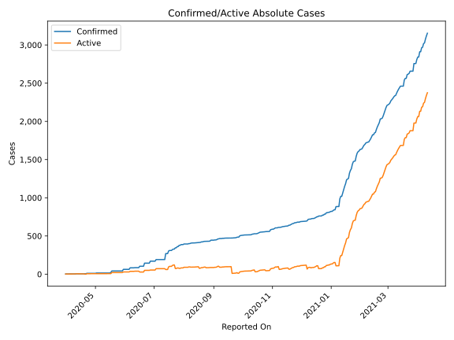
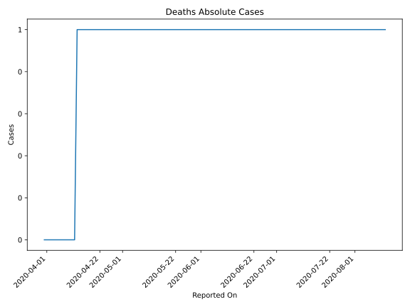
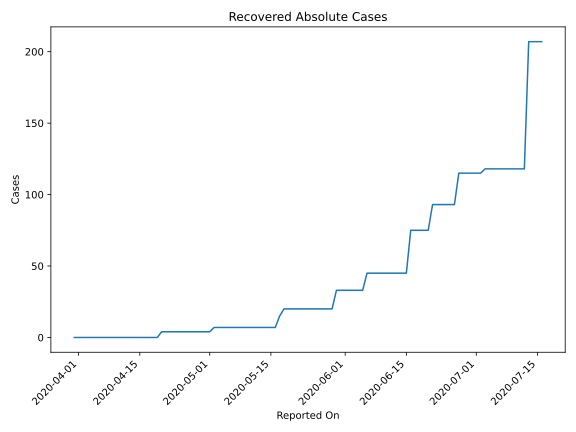
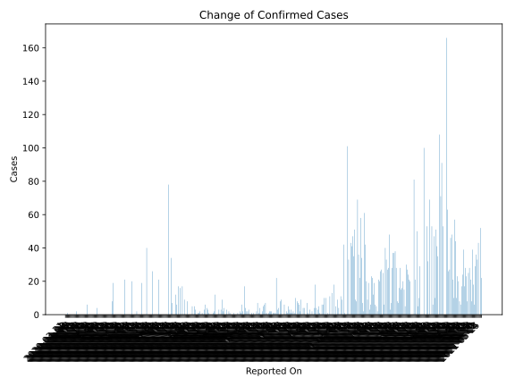
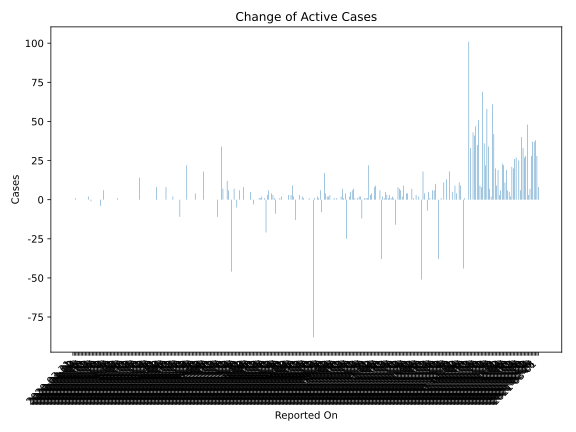
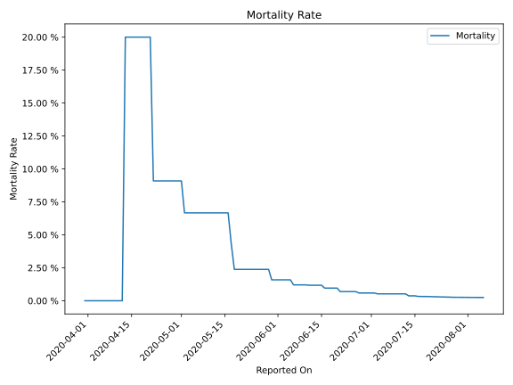

# Country Figures: Time Series for Burundi 

| Reported On | Confirmed | Deaths | Recovered | Active | Mortality | &Delta; Confirmed | &Delta; Deaths | &Delta; Recovered | &Delta; Active | % Active of Population |
|-------------|-----------|--------|-----------|--------|-----------|-------------------|----------------|-------------------|----------------|------------------------|
| 2020-05-08 | 15 | 1 | 7 | 7 |  6.67 %  | 0 | 0 | 0 | 0 |  0.000 %  | 
| 2020-05-07 | 15 | 1 | 7 | 7 |  6.67 %  | 0 | 0 | 0 | 0 |  0.000 %  | 
| 2020-05-06 | 15 | 1 | 7 | 7 |  6.67 %  | 0 | 0 | 0 | 0 |  0.000 %  | 
| 2020-05-05 | 15 | 1 | 7 | 7 |  6.67 %  | 0 | 0 | 0 | 0 |  0.000 %  | 
| 2020-05-04 | 15 | 1 | 7 | 7 |  6.67 %  | 0 | 0 | 0 | 0 |  0.000 %  | 
| 2020-05-03 | 15 | 1 | 7 | 7 |  6.67 %  | 0 | 0 | 0 | 0 |  0.000 %  | 
| 2020-05-02 | 15 | 1 | 7 | 7 |  6.67 %  | 4 | 0 | 3 | 1 |  0.000 %  | 
| 2020-05-01 | 11 | 1 | 4 | 6 |  9.09 %  | 0 | 0 | 0 | 0 |  0.000 %  | 
| 2020-04-30 | 11 | 1 | 4 | 6 |  9.09 %  | 0 | 0 | 0 | 0 |  0.000 %  | 
| 2020-04-29 | 11 | 1 | 4 | 6 |  9.09 %  | 0 | 0 | 0 | 0 |  0.000 %  | 
| 2020-04-28 | 11 | 1 | 4 | 6 |  9.09 %  | 0 | 0 | 0 | 0 |  0.000 %  | 
| 2020-04-27 | 11 | 1 | 4 | 6 |  9.09 %  | 0 | 0 | 0 | 0 |  0.000 %  | 
| 2020-04-26 | 11 | 1 | 4 | 6 |  9.09 %  | 0 | 0 | 0 | 0 |  0.000 %  | 
| 2020-04-25 | 11 | 1 | 4 | 6 |  9.09 %  | 0 | 0 | 0 | 0 |  0.000 %  | 
| 2020-04-24 | 11 | 1 | 4 | 6 |  9.09 %  | 0 | 0 | 0 | 0 |  0.000 %  | 
| 2020-04-23 | 11 | 1 | 4 | 6 |  9.09 %  | 0 | 0 | 0 | 0 |  0.000 %  | 
| 2020-04-22 | 11 | 1 | 4 | 6 |  9.09 %  | 6 | 0 | 0 | 6 |  0.000 %  | 
| 2020-04-21 | 5 | 1 | 4 | 0 |  20.00 %  | 0 | 0 | 0 | 0 |  n/a  | 
| 2020-04-20 | 5 | 1 | 4 | 0 |  20.00 %  | 0 | 0 | 4 | -4 |  n/a  | 
| 2020-04-19 | 5 | 1 | 0 | 4 |  20.00 %  | 0 | 0 | 0 | 0 |  0.000 %  | 
| 2020-04-18 | 5 | 1 | 0 | 4 |  20.00 %  | 0 | 0 | 0 | 0 |  0.000 %  | 
| 2020-04-17 | 5 | 1 | 0 | 4 |  20.00 %  | 0 | 0 | 0 | 0 |  0.000 %  | 
| 2020-04-16 | 5 | 1 | 0 | 4 |  20.00 %  | 0 | 0 | 0 | 0 |  0.000 %  | 
| 2020-04-15 | 5 | 1 | 0 | 4 |  20.00 %  | 0 | 0 | 0 | 0 |  0.000 %  | 
| 2020-04-14 | 5 | 1 | 0 | 4 |  20.00 %  | 0 | 0 | 0 | 0 |  0.000 %  | 
| 2020-04-13 | 5 | 1 | 0 | 4 |  20.00 %  | 0 | 1 | 0 | -1 |  0.000 %  | 
| 2020-04-12 | 5 | 0 | 0 | 5 |  None  | 0 | 0 | 0 | 0 |  0.000 %  | 
| 2020-04-11 | 5 | 0 | 0 | 5 |  None  | 2 | 0 | 0 | 2 |  0.000 %  | 
| 2020-04-10 | 3 | 0 | 0 | 3 |  None  | 0 | 0 | 0 | 0 |  0.000 %  | 
| 2020-04-09 | 3 | 0 | 0 | 3 |  None  | 0 | 0 | 0 | 0 |  0.000 %  | 
| 2020-04-08 | 3 | 0 | 0 | 3 |  None  | 0 | 0 | 0 | 0 |  0.000 %  | 
| 2020-04-07 | 3 | 0 | 0 | 3 |  None  | 0 | 0 | 0 | 0 |  0.000 %  | 
| 2020-04-06 | 3 | 0 | 0 | 3 |  None  | 0 | 0 | 0 | 0 |  0.000 %  | 
| 2020-04-05 | 3 | 0 | 0 | 3 |  None  | 0 | 0 | 0 | 0 |  0.000 %  | 
| 2020-04-04 | 3 | 0 | 0 | 3 |  None  | 0 | 0 | 0 | 0 |  0.000 %  | 
| 2020-04-03 | 3 | 0 | 0 | 3 |  None  | 0 | 0 | 0 | 0 |  0.000 %  | 
| 2020-04-02 | 3 | 0 | 0 | 3 |  None  | 1 | 0 | 0 | 1 |  0.000 %  | 
| 2020-04-01 | 2 | 0 | 0 | 2 |  None  | 0 | 0 | 0 | 0 |  0.000 %  | 
| 2020-03-31 | 2 | 0 | 0 | 2 |  None  | None | None | None | None |  0.000 %  | 

