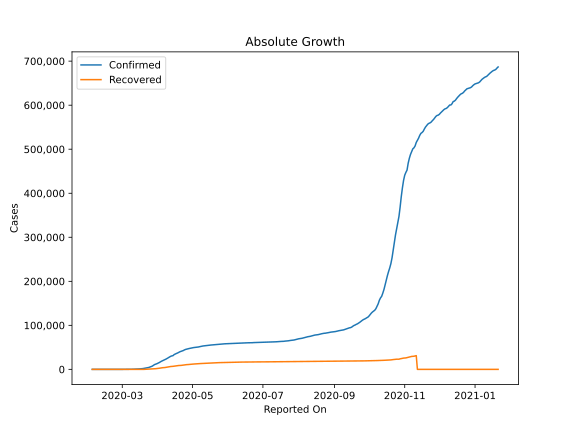
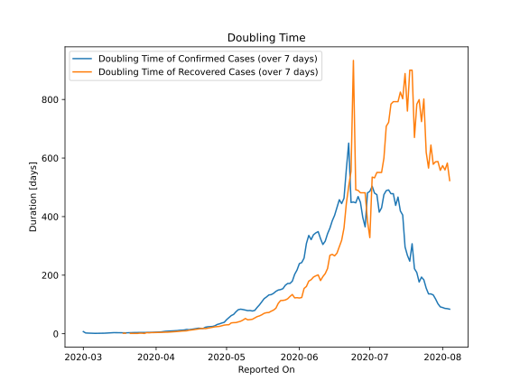

# Country Figures: Doubling Time of Infections for Belgium 

The doubling time below are calculated based on
* an exponential growth assumption
* for time difference of past seven (7) days.
The doubling time's unit is "days".

The first doubling time indicates the increase of confirmed (infected)
cases. There, the *higher* the number is, the better is to take control
of the disease.

The second doubling time indicates the increase of recovered (healed)
cases. There, the *lower* the number is, the better it is to take
control of the disease.

| Reported On | Confirmed | Doubling Time (Confirmed) | Recovered | Doubling Time (Recovered) |
|-------------|-----------|---------------------------|-----------|---------------------------|
| 2020-04-21 | 40956 |  18.0 days  | 9002 |  18.3 days  | 
| 2020-04-20 | 39983 |  18.5 days  | 8895 |  17.5 days  | 
| 2020-04-19 | 38496 |  18.9 days  | 8757 |  16.3 days  | 
| 2020-04-18 | 37183 |  17.5 days  | 8348 |  14.9 days  | 
| 2020-04-17 | 36138 |  16.3 days  | 7961 |  13.9 days  | 
| 2020-04-16 | 34809 |  15.0 days  | 7562 |  13.1 days  | 
| 2020-04-15 | 33573 |  13.8 days  | 7107 |  12.0 days  | 
| 2020-04-14 | 31119 |  14.7 days  | 6868 |  10.0 days  | 
| 2020-04-13 | 30589 |  12.9 days  | 6707 |  9.7 days  | 
| 2020-04-12 | 29647 |  12.2 days  | 6463 |  9.3 days  | 
| 2020-04-11 | 28018 |  11.9 days  | 5986 |  8.3 days  | 
| 2020-04-10 | 26667 |  10.8 days  | 5568 |  7.7 days  | 
| 2020-04-09 | 24983 |  10.3 days  | 5164 |  7.0 days  | 
| 2020-04-08 | 23403 |  9.7 days  | 4681 |  6.5 days  | 
| 2020-04-07 | 22194 |  9.1 days  | 4157 |  5.8 days  | 
| 2020-04-06 | 20814 |  9.0 days  | 3986 |  5.4 days  | 
| 2020-04-05 | 19691 |  8.5 days  | 3751 |  5.1 days  | 
| 2020-04-04 | 18431 |  7.3 days  | 3247 |  4.7 days  | 
| 2020-04-03 | 16770 |  6.2 days  | 2872 |  4.4 days  | 
| 2020-04-02 | 15348 |  5.7 days  | 2495 |  4.0 days  | 
| 2020-04-01 | 13964 |  5.0 days  | 2132 |  3.9 days  | 
| 2020-03-31 | 12775 |  4.8 days  | 1696 |  4.1 days  | 
| 2020-03-30 | 11899 |  4.5 days  | 1527 |  4.0 days  | 
| 2020-03-29 | 10836 |  4.5 days  | 1359 |  3.3 days  | 
| 2020-03-28 | 9134 |  4.5 days  | 1063 |  3.8 days  | 
| 2020-03-27 | 7284 |  4.5 days  | 858 |  1.0 days  | 
| 2020-03-26 | 6235 |  4.2 days  | 675 |  1.9 days  | 
| 2020-03-25 | 4937 |  4.4 days  | 547 |  2.0 days  | 
| 2020-03-24 | 4269 |  4.3 days  | 461 |  1.1 days  | 
| 2020-03-23 | 3743 |  4.2 days  | 401 |  1.1 days  | 
| 2020-03-22 | 3401 |  3.9 days  | 263 |  1.2 days  | 
| 2020-03-21 | 2815 |  3.8 days  | 263 |  1.2 days  | 
| 2020-03-20 | 2257 |  3.8 days  | 1 |  None  | 
| 2020-03-19 | 1795 |  3.1 days  | 31 |  1.7 days  | 
| 2020-03-18 | 1486 |  3.5 days  | 31 |  1.7 days  | 
| 2020-03-17 | 1243 |  3.5 days  | 1 |  None  | 
| 2020-03-16 | 1058 |  3.6 days  | 1 |  None  | 
| 2020-03-15 | 886 |  3.6 days  | 1 |  None  | 
| 2020-03-14 | 689 |  3.8 days  | 1 |  None  | 
| 2020-03-13 | 559 |  3.3 days  | 1 |  None  | 
| 2020-03-12 | 314 |  3.0 days  | 1 |  None  | 
| 2020-03-11 | 314 |  2.2 days  | 1 |  None  | 
| 2020-03-10 | 267 |  1.9 days  | 1 |  None  | 
| 2020-03-09 | 239 |  1.8 days  | 1 |  None  | 
| 2020-03-08 | 200 |  1.4 days  | 1 |  None  | 
| 2020-03-07 | 169 |  1.3 days  | 1 |  None  | 
| 2020-03-06 | 109 |  1.4 days  | 1 |  None  | 
| 2020-03-05 | 50 |  1.6 days  | 1 |  None  | 
| 2020-03-04 | 23 |  1.9 days  | 1 |  None  | 
| 2020-03-03 | 13 |  2.2 days  | 1 |  None  | 
| 2020-03-02 | 8 |  2.7 days  | 1 |  None  | 
| 2020-03-01 | 2 |  7.3 days  | 1 |  None  | 
| 2020-02-16 | 1 |  None  | 0 |  None  | 
| 2020-02-15 | 1 |  None  | 0 |  None  | 
| 2020-02-14 | 1 |  None  | 0 |  None  | 
| 2020-02-13 | 1 |  None  | 0 |  None  | 
| 2020-02-12 | 1 |  None  | 0 |  None  | 
| 2020-02-11 | 1 |  None  | 0 |  None  | 
| 2020-02-10 | 1 |  None  | 0 |  None  | 
| 2020-02-09 | 1 |  None  | 0 |  None  | 
| 2020-02-08 | 1 |  None  | 0 |  None  | 
| 2020-02-07 | 1 |  None  | 0 |  None  | 
| 2020-02-06 | 1 |  None  | 0 |  None  | 
| 2020-02-05 | 1 |  None  | 0 |  None  | 
| 2020-02-04 | 1 |  None  | 0 |  None  | 

