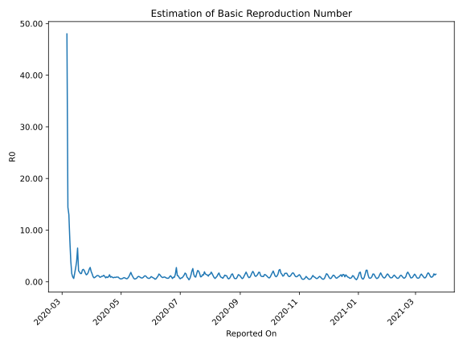

# Country Figures: Time Series for Basic Reproduction Number of Belgium 

| Reported On | &Delta; Confirmed | Total &Delta; Confirmed First Interval | Total &Delta; Confirmed Second Interval | Estimated Basic Reproduction Number R0 | 
|-------------|-------------------|----------------------------------------|-----------------------------------------|---------------------------------------------------|
| 2020-05-02 | 485 |  2345  |  3890  |  0.60  | 
| 2020-05-01 | 513 |  2385  |  4245  |  0.56  | 
| 2020-04-30 | 660 |  2534  |  4369  |  0.58  | 
| 2020-04-29 | 525 |  3041  |  4310  |  0.71  | 
| 2020-04-28 | 647 |  3890  |  4301  |  0.90  | 
| 2020-04-27 | 553 |  4245  |  4706  |  0.90  | 
| 2020-04-26 | 809 |  4369  |  4818  |  0.91  | 
| 2020-04-25 | 1032 |  4310  |  5174  |  0.83  | 
| 2020-04-24 | 1496 |  4301  |  4923  |  0.87  | 
| 2020-04-23 | 908 |  4706  |  6064  |  0.78  | 
| 2020-04-22 | 933 |  4818  |  5549  |  0.87  | 
| 2020-04-21 | 973 |  5174  |  5162  |  1.00  | 
| 2020-04-20 | 1487 |  4923  |  5555  |  0.89  | 
| 2020-04-19 | 1313 |  6064  |  4452  |  1.36  | 
| 2020-04-18 | 1045 |  5549  |  5606  |  0.99  | 
| 2020-04-17 | 1329 |  5162  |  6244  |  0.83  | 
| 2020-04-16 | 1236 |  5555  |  5824  |  0.95  | 
| 2020-04-15 | 2454 |  4452  |  5853  |  0.76  | 
| 2020-04-14 | 530 |  5606  |  5292  |  1.06  | 
| 2020-04-13 | 942 |  6244  |  4972  |  1.26  | 
| 2020-04-12 | 1629 |  5824  |  5424  |  1.07  | 
| 2020-04-11 | 1351 |  5853  |  5466  |  1.07  | 
| 2020-04-10 | 1684 |  5292  |  5727  |  0.92  | 
| 2020-04-09 | 1580 |  4972  |  5656  |  0.88  | 
| 2020-04-08 | 1209 |  5424  |  4871  |  1.11  | 
| 2020-04-07 | 1380 |  5466  |  4512  |  1.21  | 
| 2020-04-06 | 1123 |  5727  |  4830  |  1.19  | 
| 2020-04-05 | 1260 |  5656  |  5491  |  1.03  | 
| 2020-04-04 | 1661 |  4871  |  5664  |  0.86  | 
| 2020-04-03 | 1422 |  4512  |  5899  |  0.76  | 
| 2020-04-02 | 1384 |  4830  |  4865  |  0.99  | 
| 2020-04-01 | 1189 |  5491  |  3541  |  1.55  | 
| 2020-03-31 | 876 |  5664  |  2834  |  2.00  | 
| 2020-03-30 | 1063 |  5899  |  2122  |  2.78  | 
| 2020-03-29 | 1702 |  4865  |  2012  |  2.42  | 
| 2020-03-28 | 1850 |  3541  |  1948  |  1.82  | 
| 2020-03-27 | 1049 |  2834  |  1915  |  1.48  | 
| 2020-03-26 | 1298 |  2122  |  1572  |  1.35  | 
| 2020-03-25 | 668 |  2012  |  1199  |  1.68  | 
| 2020-03-24 | 526 |  1948  |  909  |  2.14  | 
| 2020-03-23 | 342 |  1915  |  797  |  2.40  | 
| 2020-03-22 | 586 |  1572  |  684  |  2.30  | 
| 2020-03-21 | 558 |  1199  |  744  |  1.61  | 
| 2020-03-20 | 462 |  909  |  572  |  1.59  | 
| 2020-03-19 | 309 |  797  |  422  |  1.89  | 
| 2020-03-18 | 243 |  684  |  320  |  2.14  | 
| 2020-03-17 | 185 |  744  |  114  |  6.53  | 
| 2020-03-16 | 172 |  572  |  145  |  3.94  | 
| 2020-03-15 | 197 |  422  |  158  |  2.67  | 
| 2020-03-14 | 130 |  320  |  189  |  1.69  | 
| 2020-03-13 | 245 |  114  |  177  |  0.64  | 
| 2020-03-12 | 0 |  145  |  156  |  0.93  | 
| 2020-03-11 | 47 |  158  |  101  |  1.56  | 
| 2020-03-10 | 28 |  189  |  48  |  3.94  | 
| 2020-03-09 | 39 |  177  |  22  |  8.05  | 
| 2020-03-08 | 31 |  156  |  12  |  13.00  | 
| 2020-03-07 | 60 |  101  |  7  |  14.43  | 
| 2020-03-06 | 59 |  48  |  1  |  48.00  | 
| 2020-03-05 | 27 |  22  |  None  |  None  | 
| 2020-03-04 | 10 |  12  |  None  |  None  | 
| 2020-03-03 | 5 |  7  |  None  |  None  | 
| 2020-03-02 | 6 |  1  |  None  |  None  | 
| 2020-03-01 | 1 |  None  |  None  |  None  | 
| 2020-02-29 | 0 |  None  |  None  |  None  | 
| 2020-02-28 | 0 |  None  |  None  |  None  | 
| 2020-02-27 | 0 |  None  |  None  |  None  | 
| 2020-02-26 | 0 |  None  |  None  |  None  | 
| 2020-02-25 | 0 |  None  |  None  |  None  | 
| 2020-02-24 | 0 |  None  |  None  |  None  | 
| 2020-02-23 | 0 |  None  |  None  |  None  | 
| 2020-02-22 | 0 |  None  |  None  |  None  | 
| 2020-02-21 | 0 |  None  |  None  |  None  | 
| 2020-02-20 | 0 |  None  |  None  |  None  | 
| 2020-02-19 | 0 |  None  |  None  |  None  | 
| 2020-02-18 | 0 |  None  |  None  |  None  | 
| 2020-02-17 | 0 |  None  |  None  |  None  | 
| 2020-02-16 | 0 |  None  |  None  |  None  | 
| 2020-02-15 | 0 |  None  |  None  |  None  | 
| 2020-02-14 | 0 |  None  |  None  |  None  | 
| 2020-02-13 | 0 |  None  |  None  |  None  | 
| 2020-02-12 | 0 |  None  |  None  |  None  | 
| 2020-02-11 | 0 |  None  |  None  |  None  | 
| 2020-02-10 | 0 |  None  |  None  |  None  | 
| 2020-02-09 | 0 |  None  |  None  |  None  | 
| 2020-02-08 | 0 |  None  |  None  |  None  | 
| 2020-02-07 | 0 |  None  |  None  |  None  | 
| 2020-02-06 | 0 |  None  |  None  |  None  | 
| 2020-02-05 | 0 |  None  |  None  |  None  | 
| 2020-02-04 | None |  None  |  None  |  None  | 

