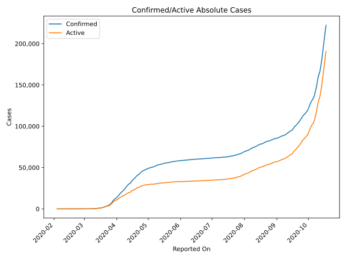
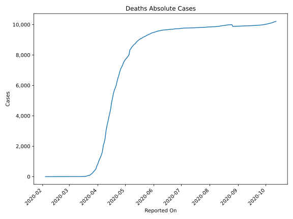
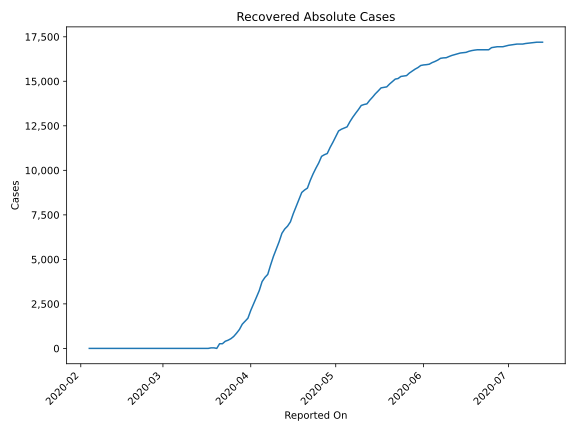
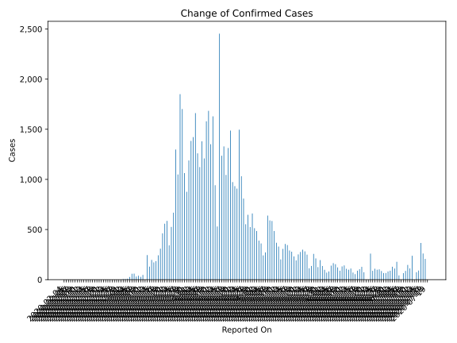
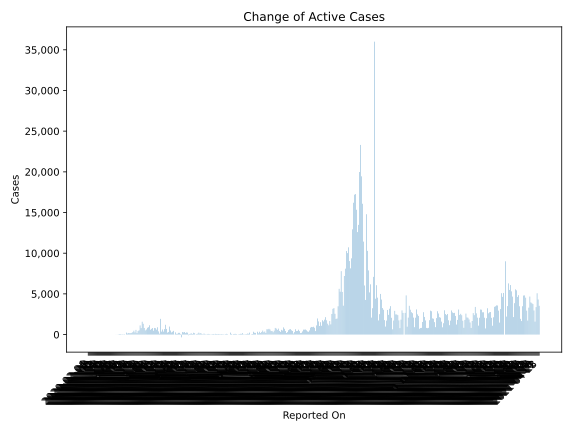
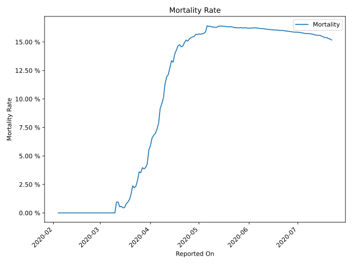

# Country Figures: Time Series for Belgium 

| Reported On | Confirmed | Deaths | Recovered | Active | Mortality | &Delta; Confirmed | &Delta; Deaths | &Delta; Active | % Active of Population |
|-------------|-----------|--------|-----------|--------|-----------|-------------------|----------------|----------------|------------------------|
| 2020-03-23 | 3743 | 88 | 401 | 3254 |  2.35 %  | 342 | 13 | 191 |  0.028 %  | 
| 2020-03-22 | 3401 | 75 | 263 | 3063 |  2.21 %  | 586 | 8 | 578 |  0.027 %  | 
| 2020-03-21 | 2815 | 67 | 263 | 2485 |  2.38 %  | 558 | 30 | 266 |  0.022 %  | 
| 2020-03-20 | 2257 | 37 | 1 | 2219 |  1.64 %  | 462 | 16 | 476 |  0.019 %  | 
| 2020-03-19 | 1795 | 21 | 31 | 1743 |  1.17 %  | 309 | 7 | 302 |  0.015 %  | 
| 2020-03-18 | 1486 | 14 | 31 | 1441 |  0.94 %  | 243 | 4 | 209 |  0.013 %  | 
| 2020-03-17 | 1243 | 10 | 1 | 1232 |  0.80 %  | 185 | 5 | 180 |  0.011 %  | 
| 2020-03-16 | 1058 | 5 | 1 | 1052 |  0.47 %  | 172 | 1 | 171 |  0.009 %  | 
| 2020-03-15 | 886 | 4 | 1 | 881 |  0.45 %  | 197 | 0 | 197 |  0.008 %  | 
| 2020-03-14 | 689 | 4 | 1 | 684 |  0.58 %  | 130 | 1 | 129 |  0.006 %  | 
| 2020-03-13 | 559 | 3 | 1 | 555 |  0.54 %  | 245 | 0 | 245 |  0.005 %  | 
| 2020-03-12 | 314 | 3 | 1 | 310 |  0.96 %  | 0 | 0 | 0 |  0.003 %  | 
| 2020-03-11 | 314 | 3 | 1 | 310 |  0.96 %  | 47 | 3 | 44 |  0.003 %  | 
| 2020-03-10 | 267 | 0 | 1 | 266 |  None  | 28 | 0 | 28 |  0.002 %  | 
| 2020-03-09 | 239 | 0 | 1 | 238 |  None  | 39 | 0 | 39 |  0.002 %  | 
| 2020-03-08 | 200 | 0 | 1 | 199 |  None  | 31 | 0 | 31 |  0.002 %  | 
| 2020-03-07 | 169 | 0 | 1 | 168 |  None  | 60 | 0 | 60 |  0.001 %  | 
| 2020-03-06 | 109 | 0 | 1 | 108 |  None  | 59 | 0 | 59 |  0.001 %  | 
| 2020-03-05 | 50 | 0 | 1 | 49 |  None  | 27 | 0 | 27 |  0.000 %  | 
| 2020-03-04 | 23 | 0 | 1 | 22 |  None  | 10 | 0 | 10 |  0.000 %  | 
| 2020-03-03 | 13 | 0 | 1 | 12 |  None  | 5 | 0 | 5 |  0.000 %  | 
| 2020-03-02 | 8 | 0 | 1 | 7 |  None  | 6 | 0 | 6 |  0.000 %  | 
| 2020-03-01 | 2 | 0 | 1 | 1 |  None  | 1 | 0 | 1 |  0.000 %  | 
| 2020-02-29 | 1 | 0 | 1 | 0 |  None  | 0 | 0 | 0 |  n/a  | 
| 2020-02-28 | 1 | 0 | 1 | 0 |  None  | 0 | 0 | 0 |  n/a  | 
| 2020-02-27 | 1 | 0 | 1 | 0 |  None  | 0 | 0 | 0 |  n/a  | 
| 2020-02-26 | 1 | 0 | 1 | 0 |  None  | 0 | 0 | 0 |  n/a  | 
| 2020-02-25 | 1 | 0 | 1 | 0 |  None  | 0 | 0 | 0 |  n/a  | 
| 2020-02-24 | 1 | 0 | 1 | 0 |  None  | 0 | 0 | 0 |  n/a  | 
| 2020-02-23 | 1 | 0 | 1 | 0 |  None  | 0 | 0 | 0 |  n/a  | 
| 2020-02-22 | 1 | 0 | 1 | 0 |  None  | 0 | 0 | 0 |  n/a  | 
| 2020-02-21 | 1 | 0 | 1 | 0 |  None  | 0 | 0 | 0 |  n/a  | 
| 2020-02-20 | 1 | 0 | 1 | 0 |  None  | 0 | 0 | 0 |  n/a  | 
| 2020-02-19 | 1 | 0 | 1 | 0 |  None  | 0 | 0 | 0 |  n/a  | 
| 2020-02-18 | 1 | 0 | 1 | 0 |  None  | 0 | 0 | 0 |  n/a  | 
| 2020-02-17 | 1 | 0 | 1 | 0 |  None  | 0 | 0 | -1 |  n/a  | 
| 2020-02-16 | 1 | 0 | 0 | 1 |  None  | 0 | 0 | 0 |  0.000 %  | 
| 2020-02-15 | 1 | 0 | 0 | 1 |  None  | 0 | 0 | 0 |  0.000 %  | 
| 2020-02-14 | 1 | 0 | 0 | 1 |  None  | 0 | 0 | 0 |  0.000 %  | 
| 2020-02-13 | 1 | 0 | 0 | 1 |  None  | 0 | 0 | 0 |  0.000 %  | 
| 2020-02-12 | 1 | 0 | 0 | 1 |  None  | 0 | 0 | 0 |  0.000 %  | 
| 2020-02-11 | 1 | 0 | 0 | 1 |  None  | 0 | 0 | 0 |  0.000 %  | 
| 2020-02-10 | 1 | 0 | 0 | 1 |  None  | 0 | 0 | 0 |  0.000 %  | 
| 2020-02-09 | 1 | 0 | 0 | 1 |  None  | 0 | 0 | 0 |  0.000 %  | 
| 2020-02-08 | 1 | 0 | 0 | 1 |  None  | 0 | 0 | 0 |  0.000 %  | 
| 2020-02-07 | 1 | 0 | 0 | 1 |  None  | 0 | 0 | 0 |  0.000 %  | 
| 2020-02-06 | 1 | 0 | 0 | 1 |  None  | 0 | 0 | 0 |  0.000 %  | 
| 2020-02-05 | 1 | 0 | 0 | 1 |  None  | 0 | 0 | 0 |  0.000 %  | 
| 2020-02-04 | 1 | 0 | 0 | 1 |  None  | None | None | None |  0.000 %  | 

