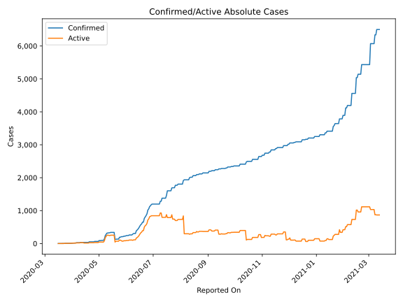
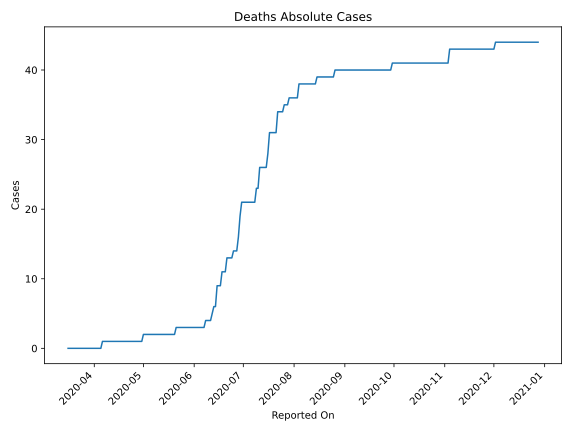
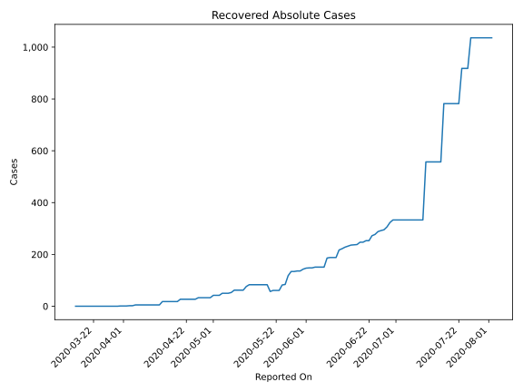
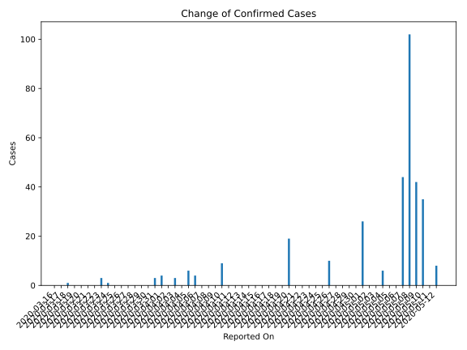
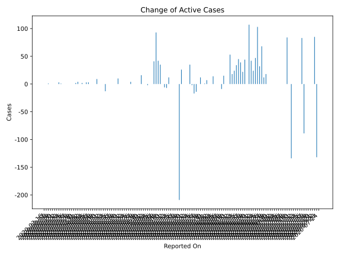
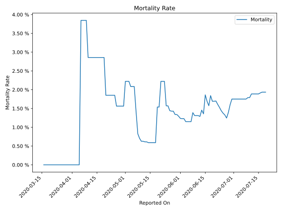

# Country Figures: Time Series for Benin 

| Reported On | Confirmed | Deaths | Recovered | Active | Mortality | &Delta; Confirmed | &Delta; Deaths | &Delta; Recovered | &Delta; Active | % Active of Population |
|-------------|-----------|--------|-----------|--------|-----------|-------------------|----------------|-------------------|----------------|------------------------|
| 2020-05-03 | 90 | 2 | 42 | 46 |  2.22 %  | 0 | 0 | 0 | 0 |  0.000 %  | 
| 2020-05-02 | 90 | 2 | 42 | 46 |  2.22 %  | 0 | 0 | 0 | 0 |  0.000 %  | 
| 2020-05-01 | 90 | 2 | 42 | 46 |  2.22 %  | 26 | 1 | 9 | 16 |  0.000 %  | 
| 2020-04-30 | 64 | 1 | 33 | 30 |  1.56 %  | 0 | 0 | 0 | 0 |  0.000 %  | 
| 2020-04-29 | 64 | 1 | 33 | 30 |  1.56 %  | 0 | 0 | 0 | 0 |  0.000 %  | 
| 2020-04-28 | 64 | 1 | 33 | 30 |  1.56 %  | 0 | 0 | 0 | 0 |  0.000 %  | 
| 2020-04-27 | 64 | 1 | 33 | 30 |  1.56 %  | 0 | 0 | 0 | 0 |  0.000 %  | 
| 2020-04-26 | 64 | 1 | 33 | 30 |  1.56 %  | 10 | 0 | 6 | 4 |  0.000 %  | 
| 2020-04-25 | 54 | 1 | 27 | 26 |  1.85 %  | 0 | 0 | 0 | 0 |  0.000 %  | 
| 2020-04-24 | 54 | 1 | 27 | 26 |  1.85 %  | 0 | 0 | 0 | 0 |  0.000 %  | 
| 2020-04-23 | 54 | 1 | 27 | 26 |  1.85 %  | 0 | 0 | 0 | 0 |  0.000 %  | 
| 2020-04-22 | 54 | 1 | 27 | 26 |  1.85 %  | 0 | 0 | 0 | 0 |  0.000 %  | 
| 2020-04-21 | 54 | 1 | 27 | 26 |  1.85 %  | 0 | 0 | 0 | 0 |  0.000 %  | 
| 2020-04-20 | 54 | 1 | 27 | 26 |  1.85 %  | 19 | 0 | 9 | 10 |  0.000 %  | 
| 2020-04-19 | 35 | 1 | 18 | 16 |  2.86 %  | 0 | 0 | 0 | 0 |  0.000 %  | 
| 2020-04-18 | 35 | 1 | 18 | 16 |  2.86 %  | 0 | 0 | 0 | 0 |  0.000 %  | 
| 2020-04-17 | 35 | 1 | 18 | 16 |  2.86 %  | 0 | 0 | 0 | 0 |  0.000 %  | 
| 2020-04-16 | 35 | 1 | 18 | 16 |  2.86 %  | 0 | 0 | 0 | 0 |  0.000 %  | 
| 2020-04-15 | 35 | 1 | 18 | 16 |  2.86 %  | 0 | 0 | 0 | 0 |  0.000 %  | 
| 2020-04-14 | 35 | 1 | 18 | 16 |  2.86 %  | 0 | 0 | 13 | -13 |  0.000 %  | 
| 2020-04-13 | 35 | 1 | 5 | 29 |  2.86 %  | 0 | 0 | 0 | 0 |  0.000 %  | 
| 2020-04-12 | 35 | 1 | 5 | 29 |  2.86 %  | 0 | 0 | 0 | 0 |  0.000 %  | 
| 2020-04-11 | 35 | 1 | 5 | 29 |  2.86 %  | 0 | 0 | 0 | 0 |  0.000 %  | 
| 2020-04-10 | 35 | 1 | 5 | 29 |  2.86 %  | 9 | 0 | 0 | 9 |  0.000 %  | 
| 2020-04-09 | 26 | 1 | 5 | 20 |  3.85 %  | 0 | 0 | 0 | 0 |  0.000 %  | 
| 2020-04-08 | 26 | 1 | 5 | 20 |  3.85 %  | 0 | 0 | 0 | 0 |  0.000 %  | 
| 2020-04-07 | 26 | 1 | 5 | 20 |  3.85 %  | 0 | 0 | 0 | 0 |  0.000 %  | 
| 2020-04-06 | 26 | 1 | 5 | 20 |  3.85 %  | 4 | 1 | 0 | 3 |  0.000 %  | 
| 2020-04-05 | 22 | 0 | 5 | 17 |  None  | 6 | 0 | 3 | 3 |  0.000 %  | 
| 2020-04-04 | 16 | 0 | 2 | 14 |  None  | 0 | 0 | 0 | 0 |  0.000 %  | 
| 2020-04-03 | 16 | 0 | 2 | 14 |  None  | 3 | 0 | 1 | 2 |  0.000 %  | 
| 2020-04-02 | 13 | 0 | 1 | 12 |  None  | 0 | 0 | 0 | 0 |  0.000 %  | 
| 2020-04-01 | 13 | 0 | 1 | 12 |  None  | 4 | 0 | 0 | 4 |  0.000 %  | 
| 2020-03-31 | 9 | 0 | 1 | 8 |  None  | 3 | 0 | 1 | 2 |  0.000 %  | 
| 2020-03-30 | 6 | 0 | 0 | 6 |  None  | 0 | 0 | 0 | 0 |  0.000 %  | 
| 2020-03-29 | 6 | 0 | 0 | 6 |  None  | 0 | 0 | 0 | 0 |  0.000 %  | 
| 2020-03-28 | 6 | 0 | 0 | 6 |  None  | 0 | 0 | 0 | 0 |  0.000 %  | 
| 2020-03-27 | 6 | 0 | 0 | 6 |  None  | 0 | 0 | 0 | 0 |  0.000 %  | 
| 2020-03-26 | 6 | 0 | 0 | 6 |  None  | 0 | 0 | 0 | 0 |  0.000 %  | 
| 2020-03-25 | 6 | 0 | 0 | 6 |  None  | 0 | 0 | 0 | 0 |  0.000 %  | 
| 2020-03-24 | 6 | 0 | 0 | 6 |  None  | 1 | 0 | 0 | 1 |  0.000 %  | 
| 2020-03-23 | 5 | 0 | 0 | 5 |  None  | 3 | 0 | 0 | 3 |  0.000 %  | 
| 2020-03-22 | 2 | 0 | 0 | 2 |  None  | 0 | 0 | 0 | 0 |  0.000 %  | 
| 2020-03-21 | 2 | 0 | 0 | 2 |  None  | 0 | 0 | 0 | 0 |  0.000 %  | 
| 2020-03-20 | 2 | 0 | 0 | 2 |  None  | 0 | 0 | 0 | 0 |  0.000 %  | 
| 2020-03-19 | 2 | 0 | 0 | 2 |  None  | 0 | 0 | 0 | 0 |  0.000 %  | 
| 2020-03-18 | 2 | 0 | 0 | 2 |  None  | 1 | 0 | 0 | 1 |  0.000 %  | 
| 2020-03-17 | 1 | 0 | 0 | 1 |  None  | 0 | 0 | 0 | 0 |  0.000 %  | 
| 2020-03-16 | 1 | 0 | 0 | 1 |  None  | None | None | None | None |  0.000 %  | 

